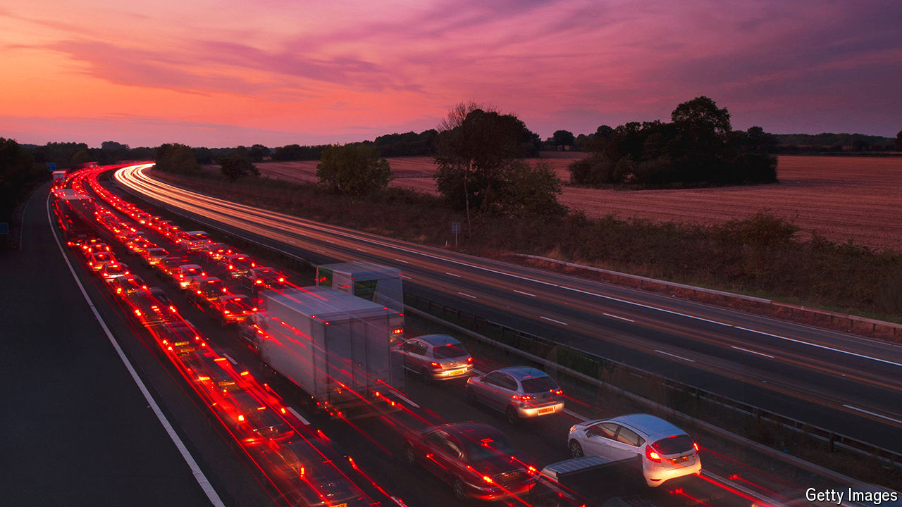

###### Road to hell

# Britain’s dimmed love affair with motorways 

##### Britons found the M25 even more irritating shut than open 

 

> Mar 21st 2024 

By 9pm on March 15th, atop a boring-looking bridge above the M25, a small crowd has gathered. Junction 11 is rarely a popular choice for a Friday night out. Indeed the M25 is rarely popular at all. The road—which encircles London and is Britain’s busiest—is also one of its most loathed. Chris Rea, a musician, wrote a song called “Road to Hell” about it; Terry Pratchett, an author, argued that its mere existence was evidence of Satan’s own. The news that it was—for the first time ever—going to close during the daytime so that a bridge could be demolished was received by many as just the sort of irritating thing that the M25 would do. 

The M25 annoys because it is too big (its 117 miles received thousands of planning objections before it opened in 1986) and because it is too small (it promptly became known as “Britain’s biggest car park”). It irritates because it is too prominent (embankments were dug and 2m trees were planted to try to screen it) and because it is too recessed (drivers cannot relish the rolling English countryside but snake through an endless cutting). The phrase “within the M25” is used to denote smug metropolitans; smug metropolitans, in turn, say “beyond the M25” to signify “there be monsters” (or at least no decent flat whites). It is not, in short, a particularly well-liked road.

It is, though, an important one. For its construction helps mark the moment when Britain fell out of love with motorways. As multi-lane roads started to unspool across the country, Britons were initially delighted. When the M1, Britain’s first intercity motorway, opened in 1959 Britons took day trips on it. Postcards were sold of such appealing bits of tarmac as “The M1 near Newport Pagnell”, “A40 Traffic” and “The Underpass, Croydon”.

There were some sceptics. One transport minister warned, to later smirking, that by travelling at such speed “senses may be numbed and judgment warped” (anyone who has ever wondered who pays to sit in the massage chairs at Thurrock services might agree with him). But mostly Britons were thrilled. 

By the 1970s Britain had 1,000 miles of modern motorways. Or modernish. In his book “On Roads”, Joe Moran points out that Britain’s roads are part transport system, part palimpsest. The runway on which Neville Chamberlain landed when returning from Munich was incorporated into a strikingly straight section of the M4; a map of Britain’s motorways is an uncanny echo of the Antonine Itinerary, a third-century road book.

By the time work on the M25 began, the ardour had not gone but it was dimming: at its opening Margaret Thatcher complained at those who “carp and criticise”. “The Hitchhiker’s Guide to the Galaxy”, first broadcast as a radio play in 1978, opens as the hero, Arthur Dent, learns that Earth is to be demolished for a hyperspace bypass. He lies in front of a digger, refuses to move and tells the builders to “Go away, and take your bloody bypass with you.” Thanks in part to such objections Britain’s too-narrow roads often don’t see much movement either. 

Which is why the M25, always too small, is being closed several times this year to allow bridges to be demolished and lanes to be widened. Among the gaggle watching this month’s first closure at Junction 11 there is carping and criticism aplenty: the closure is later and duller than expected, the temperature colder. By the time the last cone is in place and the massive motorway emptied, it is almost 11pm. A spectator turns to head home. That, he says, was “rather underwhelming”. ■


