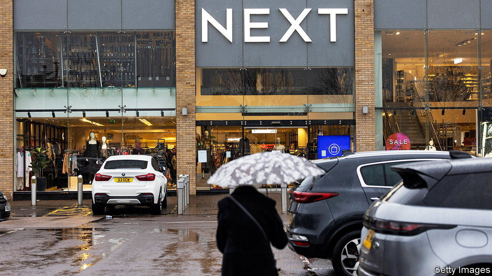
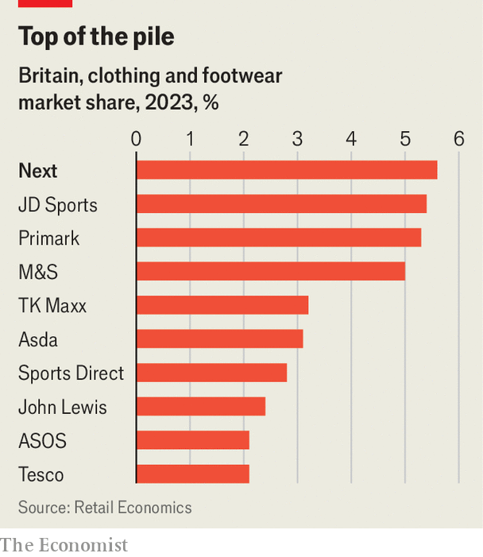

###### Wolfson prized

# Next, Britain’s retail superstar 

##### You might yawn at its clothing, but not at its results 

 

> Mar 19th 2024 

Next is a boring brand and an exciting business. Launched in 1982 to plug a gap in the market between lines for younger shoppers and items for richer, older folk, the British clothing retailer has since stuck to its briefs. On high streets and in retail parks, and increasingly online, it sells garments that are unlikely to grace the runway or go viral on TikTok. Lord Wolfson, Next’s unassuming boss, eschews mega-yachts and parties in favour of gardening and economics; he sponsors the £250,000 ($320,000) Wolfson prize, the most valuable economics award after the Nobel. 

Middle-of-the-road retailers can yield high-end results. Next is the country’s largest clothing retailer (see chart), patronised by around one in four British households. Its shares have risen by more than a quarter in the past year; on March 21st it announced record pre-tax profits for 2023. It has continued to thrive as others have languished. Debenhams, House of Fraser and Topshop have collapsed.  has been struggling. Shares in Boohoo and ASOS, two online fast-fashion retailers, are down by over 90% from their peaks. On March 19th the American owner of Ted Baker said that the chain would be going into administration. 

 


Next’s success rests partly on investment. The company has invested heavily in logistics, shelling out £310m over the past five years on its existing warehouses and another £170m on a new automated facility, Elmsall 3, in Yorkshire. Overall spending on technology has grown, too. Next is pumping £53m into upgrading its systems this year, up from £8m in 2020. Rather than outsourcing software for its website, stock allocation and other core operations, most of its coding takes place in-house. It employs more people in technology than it does in its products teams. 

Sales on Next’s website have increased from £1.5bn in 2017 to just over £3bn in 2023; more than half of its purchases now take place online. Greater use of automation has pushed the cut-off time for next-day delivery from 6pm to 11pm. Delivery times are speedier, too. The number of items delivered late fell from 11% in June 2022 to 6% a year later; the proportion of sale items which took longer than a fortnight to deliver fell from 24% to 3% over the same period. 

This kind of expertise is valued by others. The firm offers smaller retailers its proprietary software for warehousing, delivery, returns and other back-end operations, tasks that Lord Wolfson recently called the “less interesting side” of the business. This has echoes of other retailers. Ocado, a British online supermarket, provides fulfilment services to other online grocers such as Morrisons in Britain, Kroger in America and Sobey’s in Canada. Walmart, an American retailer, is pushing into services such as delivery software. Amazon’s cloud-computing arm, , has long been a cash cow for the business. 

Next has branched out in other ways, too. It offers an array of third-party brands like Nike and Birkenstock, as well as furniture, beauty products, food and flowers. A streak of acquisitions in the past few years includes rescues from administration of retailers such as Cath Kidston, Joules and Made.com. It has snapped up stakes in JoJo Maman Bébé, a baby-clothing brand, and the ailing British arms of Victoria’s Secret, a lingerie brand, and Gap, a fashion retailer. Last year it raised its stake in Reiss, an upmarket fashion chain, to 72%, and bought FatFace, a clothing firm. A growing stable of brands, products and services means that Next is transforming itself from a retailer into a conglomerate. 

The retail graveyard is full of failed conglomerates. Sears, once America’s largest retail chain, declared bankruptcy in 2018; Arcadia, Sir Philip Green’s empire, collapsed into administration in 2020. New business lines and multiple acquisitions tend to add complexity; Next has already admitted it paid too much for Joules. Britain’s slow-growing economy is another worry. Around 60% of Next’s customer base is made up of 25- to 54-year-olds, a group that is heavily exposed to the lagged impact of higher mortgage rates, according to RBC Capital Markets, an investment bank. A growing number of foreign customers, who account for roughly a quarter of all sales, offers some protection.

Questions about succession also persist. Lord Wolfson, the longest-serving CEO of a FTSE 100 business, has been in charge since 2001; in that time the firm’s market value has climbed by around 250% and its share price (helped by buy-backs) by 800%. But he is also still a stripling, at just 56. And perhaps the biggest threat faced by clothing retailers—losing their lustre among trendsetters—is less of a risk for a middle-of-the-road brand. Next’s lines may elicit yawns among the fashionistas. For shareholders, boring is best. ■


