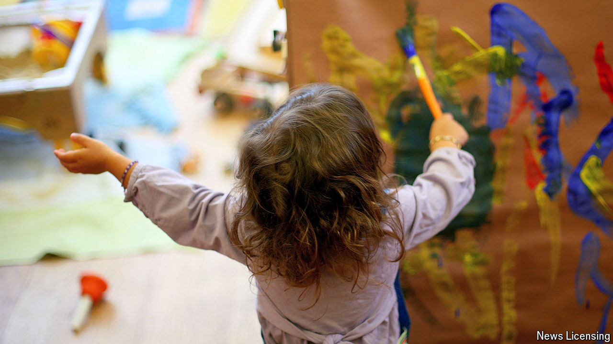

###### Totting it up

# Parents in Britain are getting more government-funded child care 

##### The biggest expansion of the welfare state in many years 

 

> Mar 21st 2024 

When Jeremy Hunt set out his first budget as chancellor a year ago, the rabbit he pulled from the hat was not a tax cut but an expansion of the welfare state. Mr Hunt announced last March that the government would spend an extra £1bn ($1.3bn; 0.1% of GDP) per year on  in the years up to 2027-28. The introduction of that support is imminent. 

Currently the government pays for up to 30 hours of child care a week for most three- and four-year-olds. From April 1st parents of most two-year-olds will be offered 15 hours per week; in time the full 30 hours will be extended to tots as young as nine months. The child-care budget will roughly double, in the biggest extension of welfare provision in many years. The change reflects shifting attitudes. Parents have grown keener on state support. Politicians fuss less about traditional family roles and more about labour supply. 

The new system will be an odd hybrid. Most child care will still be delivered privately: almost half of the 30,000 child-care providers in England (elsewhere, child-care policy is the responsibility of devolved governments) are profitmaking. But ministers in Whitehall will set the price of some 80% of pre-school care by hours. The government’s hope, according to Christine Farquharson of the Institute for Fiscal Studies (IFS), a think-tank, is that by setting the rate at the right level it can drive less efficient providers out of the market. Set it too low, however, and the whole sector could shrink, leaving parents unable to claim their free hours.

The government’s initial salvo looks fairly generous. The education department has decided to offer well above the current market rate for two-year-olds and (from later this year) under-twos, partly to make up for the fact that nurseries say the subsidy for three- to four-year-olds does not cover their costs. In his latest budget, on March 6th, Mr Hunt also guaranteed that these rates will rise in line with costs for the next two years in order to give providers a degree of certainty. That commitment is likely to require another £350m per year by 2025-26. 

The new system is complex. As well as varying subsidies by age, the government’s offer covers only 38 weeks of the year; most working parents want more. The level of support also depends on whether parents are in work or on a low income; it is abruptly removed for top earners. Little of this is well understood by parents. Nurseries, for their part, have had to come up with creative ways of topping up the subsidy for older children. At Tadpoles in Chelsea, a well-heeled part of west London, parents seem happy enough to pay more for things like singing, swimming and baby yoga. 

Some nurseries have found it impossible to get parents to pay extra or to make savings of their own. There were around 650 net closures in England in the year to March 2023. The new system may drive more smaller providers out of business, particularly in poorer areas; big chains like Busy Bees and Bright Horizons may expand further. It is partly a case of wait and see, says Ms Farquharson, since the system is so new. Like its young charges, the child-care sector is bound to see big changes. ■


