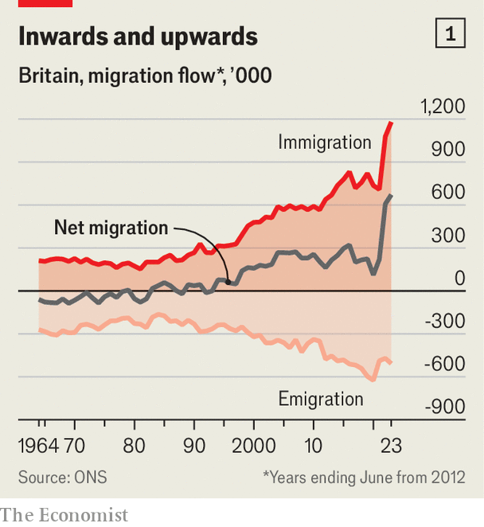
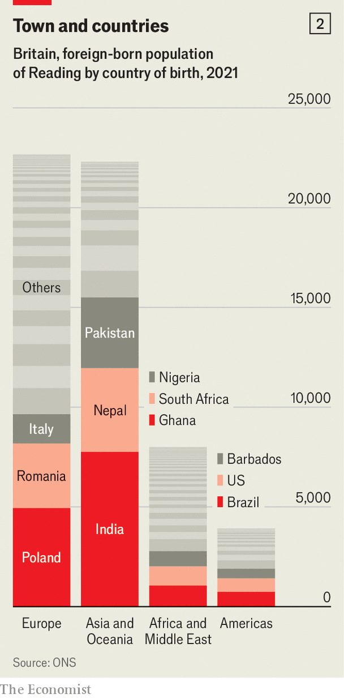
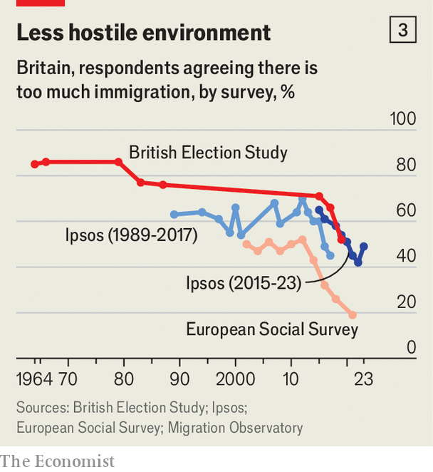
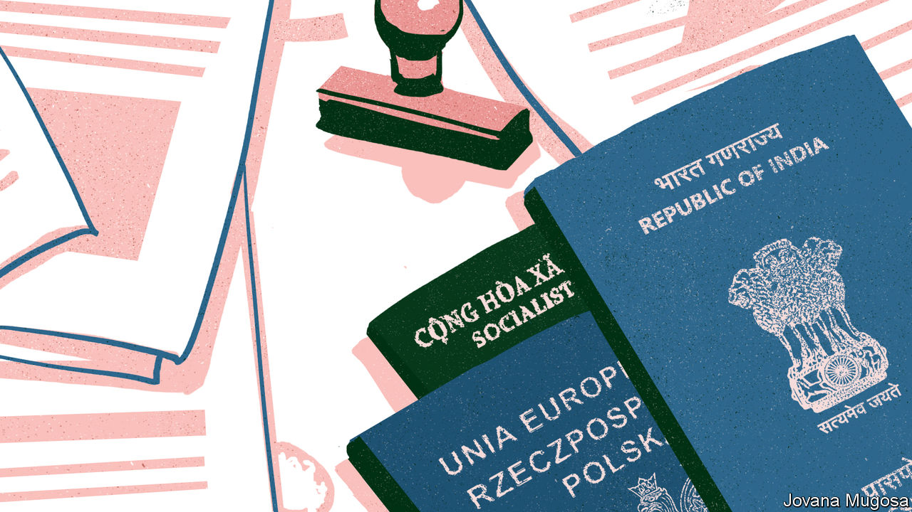

###### Migration and society

# Without realising it, Britain has become a nation of immigrants 

##### Another surprise: it’s very good at assimilating people 

 

> Mar 18th 2024 

In 2013 lifespring church moved from the suburbs into a former cinema near the centre of Reading. At the time, its congregation was small and not varied. “We moved in as a white middle-class church,” says Neville Hollands, a senior pastor. These days Lifespring has members born in more than 40 countries. The diversity of its congregation is reflected in the thicket of flags on both sides of the stage during Sunday services, where 300-odd people praise Jesus to the accompaniment of drums and power chords. 

Immigration has transformed Lifespring Church, Reading and Britain itself. The 2021 census of England and Wales showed that 10m people, one-sixth of the population, were born outside the United Kingdom. That was a higher share than in America or any large European country except Germany. The proportion is almost certainly higher still today. The census took place near the beginning of a huge increase in net migration—immigration minus emigration—which quickly reached a record level (see chart 1). 

 


This is a neuralgic political issue, particularly on the right. Polls by YouGov show that Conservative voters cite immigration and asylum as an important issue more often than they mention anything else, including the economy. Politicians and the public alike fret about asylum-seekers—a small but highly visible, and visibly uncontrolled, part of the overall flow. Though he is the successful son of immigrants, the prime minister, Rishi Sunak, issues warnings about its effect on society. To his right, would-be successors like Suella Braverman, a former home secretary, say that multiculturalism has failed. 

But the fact is that, asylum excepted, Britain handles immigration very well. The country manages to attract people from a large and ever-growing range of countries. Although the popular image of a migrant is a desperate young man floating across the English Channel, Britain’s foreign-born residents are frequently middle-class and slightly more female than male. They quickly get up to speed economically, and their children do strikingly well in school. The government makes no effort to disperse immigrants from ghettos, as, say, the Danish government does. Yet they disperse themselves anyway. 

When fretting about immigration and integration, Britons often have places like Rochdale in mind. That poor town near Manchester contains just one sizeable foreign-born group, from Pakistan, which has not always rubbed along well with the white British majority. Last month George Galloway, a fedora-sporting firebrand, won a by-election there after mobilising ; an anxious speech from Mr Sunak followed. But Rochdale is atypical. To understand Britain’s present—and future—as a nation of immigrants, it is better to look elsewhere. 

 


Somewhere like Reading, a town of 174,000 inhabitants about 60km (38 miles) west of central London. It has a hugely diverse foreign-born population, amounting to one-third of the total (see chart 2). Of more than 330 local authorities in England and Wales, only six saw larger percentage-point increases in their foreign-born populations in the decade to 2021. Like many other places in Britain, Reading has experienced three major waves of settlement since the second world war. Immigrants have transformed the town, but they have barely troubled it. 

People move to Reading partly because of where it is: close enough to the capital to allow for quick commuting, when the trains are running properly at least, but distant enough to make it cheaper and more relaxed. “People here don’t walk as fast, and they’re not afraid to make eye contact,” says Belén Ballesteros, a Spanish-born receptionist who moved to Reading from London. She found that she could rent half of a four-bedroom house, with a garden, for the price of a room in the big city. Another draw is the local economy. Reading has a large hospital (the Royal Berkshire), a growing university and a clutch of it firms, which benefit from the town’s proximity to Heathrow airport and the m4 motorway. 

Wave machine

“There was always work here,” says Cyrilene Small-Tollafield, who arrived in Reading from Barbados in 1965, aged 11. Her family was part of the first great post-war migration, from Ireland and the Commonwealth. They were not always welcome. Looking for a room to rent as a young woman, Ms Small-Tollafield knocked on many houses with signs in the windows, only to be told that nothing was available. “You ended up renting from other black people,” she says. 

But Reading never suffered racist violence of the kind seen in London, which marked large areas as unsafe for Commonwealth immigrants. In July 1967 Courtney Tulloch, a Jamaica-born civic activist, investigated race relations in the town. He reported that most parts contained “at least one immigrant house”, yet few streets contained lots. Schools were fairly integrated and there were no “twilight areas”. Prejudice in Reading was stealthy rather than overt and violent. Compared with Notting Hill, the west London neighbourhood that Tulloch knew well, “it is heaven”. 

The tendency of migrants to scatter has only increased over the years. “It’s not like, if you want to meet Kenyans, go over there. They’re dispersed,” says Alice Mpofu-Coles, who arrived in Britain as an asylum-seeker from Zimbabwe and now works at the University of Reading. The town is unusual in having many Nepalis, who were drawn there partly because of its proximity to military bases that trained Gurkhas, a regiment of the British army for Nepali recruits. At first many settled in a neighbourhood of terraced houses called Newtown. But Bharat Paudyal, a software engineer, says they are leaving in search of larger houses, better schools and easier parking for their cars. 

Too little research has been done on where foreign-born people live in Britain and how the pattern is changing. But much work has been done on ethnic-minority groups, and the results are striking. Gemma Catney, a geographer at Queen’s University in Belfast, has shown that every ethnic group in England and Wales became less segregated in the decade before the 2021 census (and also in the decades before the 2011 and 2001 censuses). Some places, such as the London boroughs of Brent and Newham, contain few white Britons. But they do not contain huge populations of one other group. Rather, they are diverse. In Newham no ethnic group accounts for more than one-sixth of the population. 

The second big wave of post-war migration to Britain was of continental Europeans. This picked up in 2004, when the residents of eight Baltic and eastern European countries joined the eu, and jumped again in 2014 when restrictions on Bulgarians and Romanians were lifted. Poles are now the second-biggest foreign-born group in England and Wales (after Indians), Romanians are the fourth-biggest and Italians are the sixth-biggest. 

Like those who came before, eastern Europeans are rapidly being absorbed into British life. Magdalena Rucinska, who teaches at Akademia Motyli, a Polish-language Saturday school in Reading, says that many of her pupils have one Polish and one British parent, and they speak English at home. “They go to Poland, and the child doesn’t understand grandma,” she says. At that point the embarrassed parents bring them to her school. 

After Britain left the eu in 2020, its immigration rules changed. Continental Europeans, who had been able to move and work freely, were henceforth treated like everyone else. Salary thresholds for work visas were lowered, making it easier for non-Europeans to get them. The result has been a rise in overall immigration and a big shift in direction. If the first wave of post-war immigration came from the Commonwealth and the second from Europe, the . 

New groups are growing, some of them familiar to the natives, others not. In 2023 Filipinos were issued with 27,800 work visas (three times higher than the number ten years earlier), Zimbabweans with 46,200 and Indians with 163,500. Poles, who once accounted for a large share of economic migrants to Britain, obtained just 1,500. The number of international students enrolling in British universities has tripled since the turn of the century, reaching 380,000 in the 2021-22 academic year. More than half come from China, India and Nigeria.

One magnet can be seen in the centre of Reading, in the jumble of buildings that make up the Royal Berkshire hospital. The hospital and its associated nhs trust employ 1,800 non-Britons, with Filipinos, Indians, Nigerians, Kenyans and Portuguese the largest groups. It relies heavily on foreign-born nurses, because Britain does not produce enough. “Where are our nurses coming from if they’re not coming from abroad?” asks Arran Rogers, who works on non-medical recruitment. Half of the people who joined the English nurses’ register in the year to April 2023 were trained outside Britain. 

Mr Rogers says that hospitals in America and elsewhere can offer much higher wages than the nhs. What employers like the Royal Berkshire can offer is a cosmopolitan town and an opportunity to build a family life in Britain. Spooked by soaring net migration, the government has recently made it harder for many immigrant workers to bring their families with them. But nhs workers are exempt from the new restrictions—a case of the state creating one set of rules for business and another, more liberal set of rules for itself. 

Foreign-born men have a slightly higher employment rate than British-born ones, foreign-born women a slightly lower one. Jonathan Portes, an economist at King’s College London, has shown that workers from outside the eu earn about 5% less than natives a year after arriving, but overtake them in the next year. They seem to start on a higher rung of the earnings ladder every year. eu migrants also catch up, albeit more slowly. 

Meanwhile their children outdo the natives at school. In Reading pupils whose first language is not English are about as likely to obtain at least a grade 5 in English and Maths at gcse (exams normally taken at 16) as pupils who speak English first. In England as a whole, English-learners do even better. The pisa tests run by the oecd, a club of mostly rich countries, show that in many European countries the children of immigrants score far worse than natives; the gaps in Germany and Sweden are huge. In Britain, immigrants’ children are a shade behind in reading and a shade ahead in maths. 

Part of the explanation is that immigrants’ children are less poor in Britain than elsewhere in Europe. Another possibility is that many people migrate to Britain from countries like India, where university is essential for obtaining middle-class jobs, and have passed that assumption to their progeny. In Britain 77% of children from immigrant backgrounds expect to go to university, compared with 62% of other children; in France and Germany the natives are more confident. 

Reading’s population continues to grow more diverse as new groups arrive, including Ukrainians and Hong Kongers, who benefit from special visas. It can be discombobulating. Aisha Malik of the Reading Community Learning Centre, a charity for ethnic-minority women, says that her clientele has become far more varied over the past decade. Staff at the centre speak six languages, which is not nearly enough. They get by with “a lot of smiles, a lot of body language” and Google Translate. Some shops on Oxford Road, Reading’s traditional immigrant thoroughfare, seem to have capitulated in the face of overwhelming diversity. One, Amazing Grace, advertises “Afro-Caribbean, Asian, European groceries”. 

Britons as a whole are cool, verging on unenthusiastic, about all this. Polls tend to show that substantially more people would prefer to see less immigration than more of it. In September 2023 Ipsos put the proportions at 48% and 22%, while another 22% thought the level should stay as it is. The population divides more or less evenly on the question of whether immigration has been good or bad for Britain. 

 


The long-term trend is towards greater acceptance, though. Between the 1960s and the 1980s, when immigration was low by modern standards, huge majorities felt it was too high (see chart 3). Attitudes softened gradually, then more rapidly after the Brexit vote in 2016. And although Britons are sceptical of immigration in general, they are keen on some common types of migrant, such as nurses and care-home workers. 

People seem to grow calmer about immigrants (and whites grow calmer about ethnic minorities) the more they bump into them, although some studies find that people in homogeneous places go through an anxious phase when newcomers first arrive. The young are relaxed partly because they went to . The University of Reading is certainly diverse. One-fifth of the students are international; among British students more than one-third of those admitted in 2023 are black, Asian or mixed-race. 

 


Given this nonchalant drift, it might seem odd that conservative politicians so often strive to appear more restrictive than their rivals. They do it because they know something of voters’ passions. Alexander Kustov, who studies the politics of immigration at the University of North Carolina, has shown that voters who are relaxed about immigration do not care much about the issue. People who loathe immigration, by contrast, are highly motivated by it. A tough line can sway these voters while leaving liberals unmoved. 

Banging on about immigration can hurt conservatives, however. Over the past few years Ms Braverman and Mr Sunak have shown exactly how. The Conservative government has focused on asylum, the bit of the immigration system that is least susceptible to policy changes. And ministers have promised not to exert more control over Channel crossings or to reduce their number, but to “stop the boats” altogether by shipping . 

As a result, the government has been unable to take credit for some useful changes, such as a deal struck with Albania in 2023 that makes it easier to return asylum claimants from that country. Nor does it get much credit for tightening the requirements for work and family visas, which will probably lead to an overall drop in net migration over the next few years. Stopping the boats was the promise. By that measure, the result has been failure. 

But failing to keep an unrealistic promise to terminate a kind of migration that is especially hard to control is not the same as failing on immigration in general. Conservative mps seem determined to argue that Britain cannot cope with its foreign-born residents; Robert Jenrick, formerly the immigration minister, wrote on March 2nd of “the age of careless and naive mass immigration to the uk”, which he said had led to “people living parallel lives in segregated neighbourhoods”. He should come to Reading. If the town is a failure, it would be nice to know what success looks like.■


