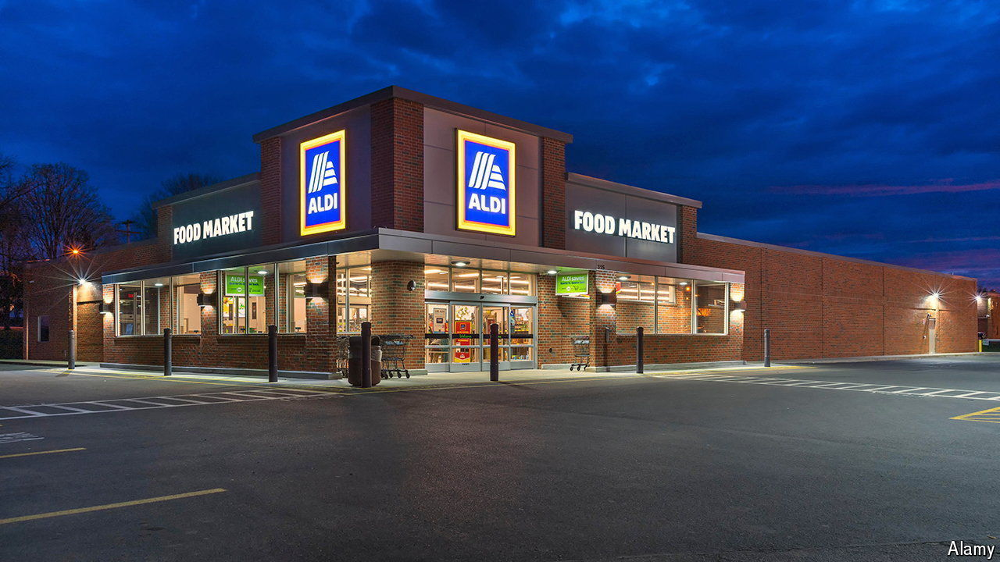

###### Coming to a strip mall near you

# Could Aldi’s supermarkets conquer America? 

##### The European discount chain is the fastest-growing retailer across the Atlantic 

 

> Mar 21st 2024 

Germans are famously stingy when shopping for food. No wonder that it was two German brothers, Theo and Karl Albrecht, who in the 1950s founded Aldi, the world’s first discount grocer. In 1961 they carved up the European market between Aldi Nord, led by Theo, and Aldi Süd, headed by Karl. But despite pioneering the business model, the two Aldis are having their lunch eaten in Europe by Lidl, a younger rival whose sales on the continent exceed their combined total.

Aldi Süd, in particular, thinks it can get its own back across the Atlantic. According to jLL, a property consultancy, it has been opening around 100 shops a year in America, faster than any other retailer—including Lidl and Aldi Nord (which owns Trader Joe’s supermarkets but does not run Aldi shops there). 

Last year Aldi Süd announced the takeover of around 400 Winn-Dixie and Harveys supermarkets in Alabama, Florida, Georgia, Louisiana and Mississippi. Many of them will be remodelled as Aldi markets. And earlier this month Jason Hart, who heads Aldi Süd’s American business, promised to pick up the pace. He said the company will invest $9bn over five years to open 800 new Aldis (including the Winn-Dixie and Harvey conversions), on top of the 2,400 it already has. 

Mr Hart has succeeded where most rivals have struggled partly thanks to luck. Aldi’s rock-bottom prices appeal to Americans irked by food inflation. Although food prices are no longer rocketing, they are 23% higher today than they were four years ago. President Joe Biden rails against punier Snickers bars and fewer crisps per packet in his re-election campaign. 

Another piece of good fortune was the decision by trustbusters at the Federal Trade Commission (FTC) to challenge the $25bn takeover of Albertsons, the second-largest supermarket chain by sales, by Kroger, the largest. (Walmart is bigger but in the eyes of regulators it is not a supermarket but a retailer.) That deal would create an efficient rival capable of driving a hard bargain with suppliers.

Still, luck isn’t everything. Other discounters, including Lidl, have not grown nearly as fast as Aldi Süd. Mr Hart has pulled it off by focusing on bare but astutely managed essentials. Aldis offer far fewer choices than rival outlets: 1,600 products, on average, compared with 31,000 for a typical American supermarket and 4,000 for the already spare Trader Joe’s. That lets it keep shops small, bringing down property and utility costs. Around 90% of its products are its own brand, so it keeps more of the margin for itself. It has no fresh-meat, cheese or bakery counters, and displays products in the cardboard boxes used for delivery, all of which lets it employ fewer people to serve shoppers and stock shelves. It pays its managers good salaries but no bottom-line-hurting bonuses. 

If Mr Hart has his way, and if the FTC prevails in court against Kroger and Albertsons, in five years Aldi Süd will have more shops in America than any retailer save Walmart (which today boasts 4,700). The beast of Bentonville may be in a different category on paper, but that may not stop Aldi from trying to take a bite out of its business. ■


