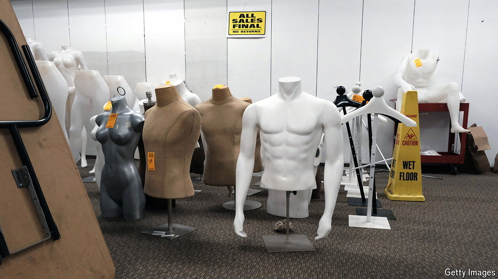
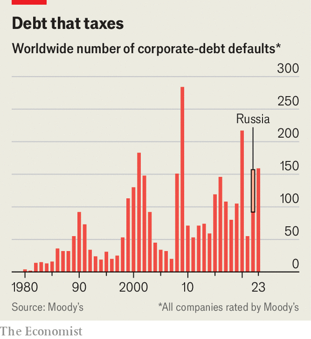

###### Corporate A&E

# Demand is soaring for capitalism’s emergency surgeons 

##### As corporate defaults rise, advisers on restructuring are raking it in 

 

> Mar 21st 2024 

With stockmarkets on a tear and the global economy surprisingly buoyant, plenty of pundits are regretting gloomy warnings of tough times ahead for businesses and investors. They may have been wrong about the economy. But in one respect their gloom looks spot on. Last year 159 companies covered by Moody’s, a ratings agency, defaulted on their debts, up from 92 the year before (excluding Russian firms). Since 1980 that figure has been exceeded only in 2001, 2009 and 2020 (see chart). In America the number of defaults almost tripled last year, compared with 2022—and businesses faced no dotcom crash, financial crisis or pandemic.

Once-robust companies from Instant Brands, a maker of kitchen gadgets, to Yellow, a trucking firm, have collapsed under the weight of falling sales and rising interest rates. And the situation is getting worse: in the first two months of the year 23 firms around the world defaulted on their debts, according to Moody’s, up from 19 in the same period last year. Creditors of Spirit Airlines, a budget carrier that is bleeding cash, are reportedly weighing their options after a proposed tie-up with JetBlue Airways, a rival, was quashed by a court on antitrust grounds in January. On March 18th Joann, a chain of some 850 craft stores, filed for bankruptcy.

 


The vindicated gloomsters are not the only ones quietly pleased by the rising number of corporate failures. So too are the advisers who specialise in restructuring distressed businesses. When a company is on the edge of a precipice, investment bankers are enlisted to negotiate with shareholders and creditors as well as, if needed, to help sell off assets. Consultants are drafted in to slash costs and rewrite business plans. Lawyers pore over the paperwork. For this lot, 2023 was one of the busiest years on record—and 2024 is shaping up to be equally lucrative.

Most advisory business is carved up between Wall Street powerhouses and big-name consultants. But not restructuring work. Having hawked loans to investors, large investment banks such as Goldman Sachs and Morgan Stanley find it awkward to then plead for leniency on behalf of borrowers. The “big four” professional-services giants—Deloitte, EY, KPMG and PwC—are tied up in conflicts from their auditing work. McKinsey, a strategy consultancy whose advice is held in high regard (especially by its own consultants), has tried but failed to cut in—last year the firm wound down its bankruptcy practice. 

Instead businesses facing bankruptcy enlist boutique banks, such as Houlihan Lokey and PJT Partners, and specialist restructuring consultants, like AlixPartners and Alvarez &amp; Marsal. (Law firms are the exception, with top dogs such as Kirkland &amp; Ellis and Latham &amp; Watkins also triumphing in the restructuring market.) Their fees can be eye-watering. Revlon, a maker of cosmetics that emerged from a ten-month bankruptcy last May, shelled out some $250m to advisers during the process. According to Reorg, a data provider, American courts signed off $2.1bn of such payments by bankrupt companies in 2023, equivalent to 1.5% of the failed firms’ debts, up from $1.7bn the year before. 

Even that vastly understates the amount of work up for grabs, given that restructuring efforts typically begin well before a company ends up in court. “We’ve never met a management team that can’t wait to go into bankruptcy,” says William Derrough of Moelis &amp; Company, another investment bank that advises on restructurings. Indeed, advisers are called upon in part because most executives have limited experience with restructurings, notes Joff Mitchell of AlixPartners. 

Managing such processes has become trickier as capital structures have grown more elaborate and the range of parties involved has expanded, says Kevin Kaiser of the Wharton School of the University of Pennsylvania. Private-equity owners and a motley crew of credit investors, including some who specialise in buying dicey debts on the cheap, now go head-to-head in fiery negotiations. “Unsurprisingly, not everyone agrees on who should get what,” says Joseph Swanson of Houlihan Lokey.

In recent years the balance of power in those negotiations has shifted towards the borrowers. Companies were able to issue debt that was not just inexpensive, but also came with fewer strings attached, notes Andrew Merrett of Rothschild &amp; Co, one more investment bank with a busy restructuring practice. “Covenants” that, for example, forced borrowers to maintain a minimum ratio of profits to debts on pain of having their business seized by creditors, common before the global financial crisis of 2007-09, have become rare. 

That has left borrowers room for clever workarounds. In one popular move, known as a “drop-down”, a company shifts valuable assets into a new subsidiary beyond the reach of creditors, and then issues fresh debt against those assets, using the proceeds to top up cash reserves or even repurchase old debts at a discount. In 2022 Envision, a health-care company then owned by KKR, a private-equity giant, pulled off such a manoeuvre. AMSURG, a business unit managing same-day surgery centres, was hived off and used as collateral for a new loan, enraging Envision’s existing creditors. Such “lender-on-lender violence” is becoming more common, says a veteran restructuring lawyer.

Schemes like these can buy a borrower time—but not indefinitely. In May last year Envision finally collapsed into bankruptcy, and KKR lost its $3.5bn equity investment. After shedding $7bn of debt, the company emerged from the process in October as two separate organisations: AMSURG was amputated from its other main business unit, which provides doctors to hospitals. 

With central banks still leery of inflation and reluctant to lower interest rates, more shareholders may soon be forced to throw in the towel. Eventually, all companies that gorged on cheap debt will have to refinance, almost certainly at higher rates. That suggests many more restructurings to come. As Steve Zelin of PJT Partners sums up, “We see a long and steady period of opportunity ahead.” ■


