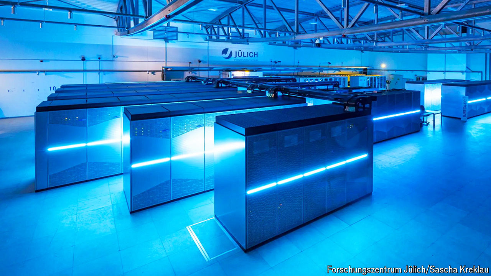

###### Supersize me

# Europe wants startups to do AI with supercomputers 

##### The idea is appealing on paper but fraught in practice 

 

> Mar 21st 2024 

IT IS NOT just technology firms that are fighting over the AI pie. Countries, too, want a bigger slice. As with companies, national spoils are unevenly distributed. If America is big tech, Europe looks more like an early-stage startup. Whereas America boasts many computing clusters of more than 20,000 top-end AI chips, in Europe a 1,000-processor facility counts as big. The EU hopes to give its AI startups a boost by tapping its growing fleet of supercomputers. This idea was one of the themes of the EuroHPC Summit, which drew Europe’s supercomputing experts to Antwerp on March 18th-21st. The gathering drew less attention than the concomitant “Woodstock of AI” hosted in Silicon Valley by , the unstoppable maker of AI chips. But for Europe’s AI ambitions, the meeting in Belgium may end up playing an important role. 

After falling behind America and China in supercomputing, in 2018 the EU launched EuroHPC, a bloc-wide project to expand number-crunching capacity. The outfit is set to spend nearly €8bn ($8.7bn) between 2018 and 2027 on a dozen or so new supercomputers. Of the nine already built, three rank among the world’s ten most powerful machines. They have lifted Europe’s share of global supercomputing power from 15% in 2020 to 22%. In September Ursula von der Leyen, president of the European Commission, declared that this oomph would be made available to European AI startups free of charge. 

Supercomputers used to be the preserve of scientists who were simulating complex things like the climate or chemical reactions. A typical machine was a collection of tens of thousands of general-purpose central processing units (CPUs) similar to those that power personal computers, but souped up and connected via ultrafast networks. Nowadays some supercomputers also contain thousands of graphics-processing units (GPUs). These specialist chips, whose production is dominated by Nvidia, were originally designed with video games in mind. By mathematical happenstance, they also turn out to be just the thing for building AI models. 

AI firms regularly spend a big chunk of the money they raise from venture capitalists to buy such processors or rent them from cloud-computing providers. And American startups, with their deeper pockets, find it easier than European ones to secure the necessary computing resources. The EU wants EuroHPC’s machines to help level the playing field. It plans to equip these with additional GPUs. And it intends to build data centres close to the supercomputers, which would enable firms to harness their computing power.

One of the first such “AI factories”, as the EU calls them, is likely to emerge in Jülich, a town in western Germany. A nearby research centre, where Germany once tested nuclear reactors, is already home to two powerful supercomputers. If all goes well, this autumn it will add a €500m machine that will be Europe’s zippiest. Thanks in part to nearly 24,000 advanced Nvidia GPUs, it will be able to perform a mind-bending billion calculations every billionth of a second. The total amount of GPU power in Jülich is comparable to what OpenAI, America’s leading AI startup, used to train GPT-4, its best model so far. For a European startup, that is real muscle.

Can this approach work at scale? Thomas Lippert, who heads the centre in Jülich, got lucky by ordering Nvidia GPUs a couple of years ago, before demand for them (and their price) exploded. Mr Lippert’s counterparts at the other supercomputers may now find it harder get their hands on such chips. Alternatives to Nvidia exist, but most model-makers prefer to work with the company’s popular software platform. Silo AI, a Finnish firm, had to develop a lot of code before it could train its AI on Lumi, a supercomputer in Finland that runs on GPUs from AMD, Nvidia’s main competitor. What is more, the EU’s efforts to shore up local chip manufacturing will take years to materialise.

Even if EuroHPC can somehow secure the necessary hardware, other challenges remain. Supercomputers are “alien” to machine-learning boffins used to data-centre servers, says Anders Dam Jensen, who heads EuroHPC. Although each AI factory is meant to include resources to help firms adapt their projects for supercomputers, Europe’s most promising AI firms may prefer to avoid the hassle. 

And whereas in the commercial cloud getting computing power is largely a question of money, the free access to European supercomputers is subject to peer review, which means that winners are picked by committee (scientists, for one, aren’t too happy about sharing the machines with startups). It also comes with the obligation to make the results of users’ work public, something that many commercial endeavours will probably balk at. This may be why Mistral, a hot French model-maker, used an Italian supercomputer for some experiments but actually trained its latest model with the help of CoreWeave, an American cloud provider of GPU power. ■


