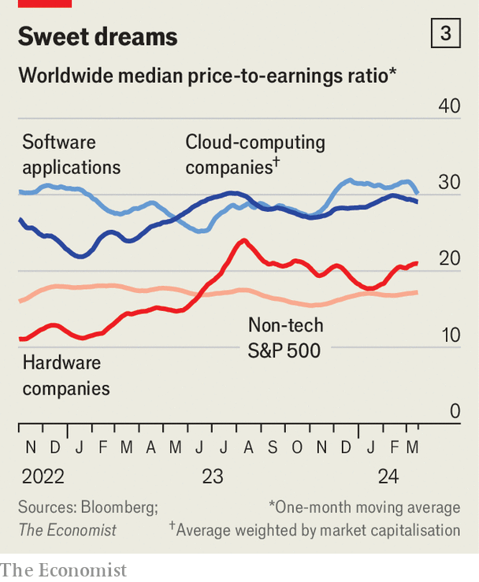

###### The AI pie

# Just how rich are businesses getting in the AI gold rush? 

##### Nvidia and Microsoft are not the only winners 

 

> Mar 17th 2024 

Barely a day goes by without excitement over  sending another company’s market value through the roof. This month the share price of Dell, a hardware-maker, jumped by over 30% in a day because of hopes that AI will boost sales. Days later Together AI, a cloud-computing startup, raised new funding at a valuation of $1.3bn, up from $500m in November. One of its investors is , a maker of AI chips that is itself on an extended bull run. Before the launch in November 2022 of ChatGPT, a “generative” AI that responds to queries in uncannily humanlike ways, its market value was about $300bn, similar to that of Home Depot, a home-improvement chain. Today it is $2.3trn, $500bn or so shy of Apple’s.

The relentless stream of AI headlines makes it hard to get a sense of which businesses are real winners in the AI boom—and which will win in the longer run. To help answer this question  has looked where value has accrued so far and how this tallies with the expected sales of products and services in the AI “stack”, as technologists call the various layers of hardware and software on which AI relies to work its magic. On March 18th many companies up and down the stack descended on San Jose for a four-day jamboree hosted by Nvidia. With talks on everything from robotics to drug discovery, the shindig showed off the latest AI innovations. It highlighted furious competition between firms within layers of the stack and, increasingly, between them. 

 


We examined four of these layers and the firms that inhabit them: AI-powered applications sold outside the stack; the AI models themselves, such as GPT-4, the brain behind ChatGPT, and repositories of them (for example, Hugging Face); the cloud-computing platforms which host many of these models and some of the applications (Amazon Web Services, Google Cloud Platform, Microsoft Azure); and the hardware, such as semiconductors (made by firms such as AMD, Intel and Nvidia), servers (Dell) and networking gear (Arista), responsible for the clouds’ computing power (see chart 1). 

Technological breakthroughs tend to elevate new tech giants. The PC boom in the 1980s and 1990s propelled Microsoft, which made the Windows operating system, and Intel, which manufactured the chips needed to run it, to the top of the corporate pecking order. By the 2000s “Wintel” was capturing four-fifths of the operating profits from the PC industry, according to Jefferies, an investment bank. The smartphone era did the same to Apple. A few years after it launched the iPhone in 2007, it was raking in more than half of handset-makers’ global operating profits.

The world is still in the early days of the generative-AI epoch. Even so, it has already been immensely lucrative. All told, the 100 or so companies that we examined have together created $8trn in value for their owners since its start—which, for the purposes of this article, we define as October 2022, just before the launch of ChatGPT (see chart 2). Not all these gains are the result of the AI frenzy—stockmarkets have been on a broader tear of late—but many are.

 


At every layer of the stack, value is becoming more concentrated. In hardware, model-making and applications, the biggest three companies have increased their share of overall value created by a median of 14 percentage points in the past year and a half. In the cloud layer Microsoft, which has a partnership with ChatGPT’s maker, OpenAI, has pulled ahead of Amazon and Alphabet (Google’s parent company). Its market capitalisation now accounts for 46% of the cloud trio’s total, up from 41% before the release of ChatGPT.

The spread of value is uneven between layers, too. In absolute terms the most riches have accrued to the hardware-makers. These include semiconductor firms, companies that build servers and those that make networking equipment. In October 2022 the 27 public hardware companies in our sample were worth around $1.5trn. Today that figure is $5trn. This is what you would expect in a technology boom: the underlying physical infrastructure needs to be built first in order for software to be offered. In the late 1990s, as the internet boom was getting going, providers of things like modems and other telecoms gubbins, such as Cisco and WorldCom, were the early winners.

So far the host of the San Jose gabfest is by far the biggest victor. Nvidia accounts for some 57% of the increase in the market capitalisation of our hardware firms. The company makes more than 80% of all AI chips, according to IDC, a research firm. It also enjoys a near-monopoly in the networking equipment used to yoke the chips together inside the AI servers in data centres. Revenues from Nvidia’s data-centre business more than tripled in the 12 months to the end of January, compared with the year before. Its gross margins grew from 59% to 74%. 

Nivdia’s chipmaking rivals want a piece of these riches. Established ones, such as AMD and Intel, are launching rival products. So are startups like Groq, which makes superfast AI chips, and Cerebras, which makes supersized ones. Nvidia’s biggest customers, the three cloud giants, are designing their own chips, too—as a way to reduce reliance on one provider and to steal some of Nvidia’s juicy margins for themselves. Lisa Su, chief executive of AMD, has forecast that revenues from the sale of AI chips could balloon to $400bn by 2027, from $45bn in 2023. That would be far too much for Nvidia alone to digest.

As AI applications become widespread, a growing share of demand will shift from chips required for training models, which consists of analysing lots of data in order to teach algorithms to predict the next word or pixel in a sequence, to those needed to use them to respond to queries (“inference”, in tech-speak). In the past year two-fifths of Nvidia’s AI revenues came from customers using its chips for inference. Experts expect some inference to start moving from specialist graphics-processing units (GPUs), which are Nvidia’s forte, to general-purpose central processing units (CPUs) like those used in laptops and smartphones, which are AMD’s and Intel’s. Before long even some training may be done on CPUs rather than GPUs. 

Still, Nvidia’s grip on the hardware market seems secure for the next few years. Startups with no track record will struggle to convince big clients to reconfigure corporate hardware systems for their untested technology. The cloud giants’ deployment of their own chips is still limited. And Nvidia has CUDA, a software platform which allows customers to tailor chips to their needs. It is popular with programmers and makes it hard for customers to switch to rival chips, which CUDA does not support. 

Whereas hardware wins the value-accrual race in absolute terms, it is the independent model-makers that have enjoyed the biggest proportional gains. The collective value of 11 such firms has jumped from $29bn to about $138bn in the past 16 months. OpenAI is thought to be worth $100bn, up from $20bn in October 2022. Anthropic’s valuation rose from $3.4bn in April 2022 to $18bn. Mistral, a French startup founded less than a year ago, is worth $2bn or so. Some of that value is tied up in hardware. The startups buy piles of chips, mostly from Nvidia, to train models. Imbue, which like OpenAI and Anthropic is based in San Francisco, has 10,000 such semiconductors. Cohere, a Canadian rival, has 16,000. These chips can sell for tens of thousands of dollars apiece. More sophisticated models need more chips. GPT-4 reportedly cost about $100m to train. Some suspect that training its successor could cost OpenAI ten times as much. 

Yet the model-makers’ true worth lies in their intellectual property and the profits it may generate. The extent of those profits will depend on just how fierce competition among model providers will get—and how long it will last. Right now the rivalry is white-hot, which may explain why the layer has not gained as much dollar value. 

OpenAI seized an early lead, but challengers have been catching up. They are able to tap the same data as the maker of ChatGPT (which is to say text and images on the internet) and, also like it, free of charge. Anthropic’s Claude 3 is snapping at GPT-4’s heels. Four months after the release of GPT-4, Meta, Facebook’s parent, released Llama 2, a powerful rival that, in contrast to OpenAI’s and Anthropic’s proprietary models, is open and can be tinkered with at will. In February Mistral, which has fewer than 40 staff, wowed the industry with an open model that almost rivals GPT-4, despite requiring much less computing power to train and run. 

Even smaller models now offer good performance at a low price, says Stephanie Zhan of Sequoia, a venture-capital (VC) firm. Some are designed for specific tasks. A startup called Nixtla developed TimeGPT, a model for financial forecasting. Another, Hippocratic AI, has trained its model on data from exams to enter medical school, to give accurate medical advice.

 


The abundance of models has spurred the growth of the application layer. The value of the 19 listed software firms in our application group has jumped by $1.1trn, or 35%, since October 2022. This includes big software providers that are adding generative AI to their services. Zoom uses it to summarise video calls. ServiceNow, which provides tech and human-resources support to companies, has introduced chatbots to help resolve customers’ IT queries. Adobe, maker of Photoshop, has an app called Firefly, which uses AI to edit pictures. Newcomers are adding more variety. “There’s An AI For That”, a website, counts over 12,000 applications, up from fewer than 1,000 in 2022. DeepScribe helps transcribe doctors’ notes. Harvey AI assists lawyers. Thirty-two chatbots promise “sarcastic conversation” and 20 generate tattoo designs. But fierce competition and low barriers to entry mean that many apps may struggle to capture value. 

Then there is the cloud layer. The combined market value of Alphabet, Amazon and Microsoft has jumped by $2.5trn during the AI boom. Counted in dollars, that is less than three-quarters of the growth of the hardware layer, and barely a quarter in percentage terms. Yet compared with actual revenues that AI is expected to generate for the big-tech trio in the near term, this value creation far exceeds that in the other layers. It is 120 times the $20bn in revenue that generative AI is forecast to add to the cloud giants’ sales in 2024. The comparable ratio is about 40 for the hardware firms and around 30 for the model-makers.

 


This implies that investors believe that the cloud giants will be the biggest winners in the long run. The companies’ ratio of share price to earnings, another gauge of expected future profits, tells a similar story. The big three cloud firms average 29. That is about 50% higher than for the typical non-tech firm in the S&amp;P 500 index of large American companies—and up from 21 in early 2023 (see chart 3).

Investors’ cloud bullishness can be explained by three factors. First, the tech titans possess all the ingredients to develop world-beating AI systems: troves of data, armies of researchers, oodles of computing power and plenty of spare cash. Second, the buyers of AI services, such as big corporations, prefer to do business with established commercial parters than with untested upstarts (see chart 4). 

Third, and most important, big tech has the greatest potential to control every layer of the stack, from chips to applications. Besides designing some of their own chips, Amazon, Google and Microsoft are investing in models and apps. Of the 11 model-makers in our sample, nine have the support of at least one of the giants. That includes the Microsoft-backed OpenAI, Anthropic (Google and Amazon) and Mistral (Microsoft again). On March 19th Microsoft announced that it had hired Mustafa Suleyman, founder of Inflection AI, another model-maker, to head a new consumer-AI division—and with him many of Inflection’s staff. (Mr Suleyman sits on the board of ’s parent company.)

The promise of profits from controlling more layers is leading hitherto layer-specific firms to branch out. OpenAI’s VC arm has invested in 14 companies since its launch in January 2021, including Harvey AI and Ambience Healthcare, a medical startup. Sam Altman, boss of OpenAI, is reportedly seeking investors to bankroll a pharaonic $7trn chipmaking venture. Nvidia is becoming more ambitious, too. It has taken stakes in seven of the model-makers, and now offers its own AI models. It has invested in Together AI and CoreWeave, both of which compete with its big cloud customers. In San Jose it unveiled a new superchip and tools from other layers of the stack. The AI boom’s biggest single value-creator is in no mood to cede its crown. ■


