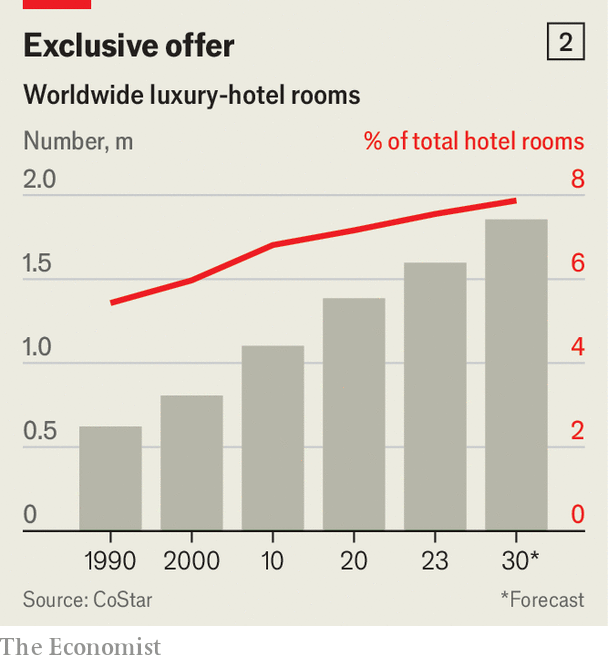

###### Posh space

# Luxury hotels are having a glorious moment 

##### Rich travellers mean rich returns for investors 

 

> Mar 21st 2024 

IN DONCASTER, A town in northern England, $100,000 will buy you a four-bedroom house. In Dubai, it will get you a four-bedroom penthouse—for a night. The Royal Mansion, the nightly rate for which makes it the world’s priciest suite, sits on the 18th and 19th floors of the Atlantis The Royal hotel. It comes with 1,100 square metres (12,000 square feet) of marble floors, a terrace with an infinity pool, a steam room, Hermès shampoo, $500 bathrobes, a not-so-mini bar and, naturally, a butler. 

The Royal Mansion’s opulence—and price—are hard to rival. But only a bit less posh properties are popping up from the Okavango Delta in Botswana to Kangaroo Island in southern Australia. Saudi Arabia is building eco-resorts on the Red Sea with a collective 8,000 rooms, which one executive calls the “new Maldives”. London’s BT Tower is being converted into a high-end hotel. For well-heeled globetrotters, all these cannot come up fast enough. 

 


In contrast to mid-range hotels, luxury ones are in the midst of a boom. The precise definition of what counts as luxury varies, but you know it when you see it. Grand View Research, a firm of analysts, expects travellers to splurge $1.5trn on what it calls luxury trips this year, nearly back to pre-pandemic levels. By 2030 they may be pampering themselves to the tune of $2.3trn (see chart 1). A big slug of that will go on accommodation—the fancier, the better. The number of available luxury rooms could reach 1.9m, up from 1.6m last year, reckons CoStar, an analytics firm (see chart 2). Even so, hoteliers are having trouble keeping up with demand. 

One reason is that there are more big spenders, and they are getting richer. In 2012 the world had 29m dollar millionaires, according to UBS, a bank. By 2022 that figure more than doubled to nearly 60m. The collective fortune of these silver-spooned individuals exceeded $200trn. Many more now hail from what are otherwise middle-income or even poor places. The number of millionaires in Brazil is forecast nearly to double by 2027, to almost 800,000. By 2028 India is expected to mint another 7,000 people with a net worth of $30m or more, on top of the 13,000 it had last year. 

 


The filthy rich are not the only ones partaking in pricey peregrinations. The merely well-to-do are increasingly forking out more of their disposable income on exclusive experiences. Corporate road-warriors are tacking a few days of leisure on top of business jaunts. Bosses are splurging on plush retreats as a way to boost esprit de corps in a hybridised workforce; in America bookings of ten or more luxury rooms rose by 9% in January, year on year. 

All these splendour-seekers are competing for scarce rooms. Although construction of new hotels has resumed after a pandemic-induced pause, it is slow going, especially for fancy digs in select locations such as historic city centres and nature reserves. In many parts of the world just acquiring the necessary approvals and permits can take between five and seven years. And that is before any cement is poured. Atlantis The Royal took 14 years to build from start to finish. Some brands are explicitly constraining supply to create scarcity. Bulgari Hotels, a joint venture between the eponymous Italian jeweller and Marriott International, an American hotelier, will limit itself to 15 locations. 

 


The imbalance between supply and demand is allowing hoteliers to raise nightly rates well above inflation, without worrying too much about putting off patrons. In 2023 revenues at Accor, the French owner of swanky chains like Fairmont and Raffles, rose by 20%, to €5bn ($5.4bn). Its gross operating profit swelled by half, to €1bn. At InterContinental Hotels Group, a British rival, revenues per available luxury room rose twice as fast as those for its less plush accommodations. 

This is turning luxury hotels into a lucrative asset class. The annual rate of return on such properties exceeded 6% in 2022, the highest in at least a decade (see chart 3). And that in turn is attracting investors beyond the usual hotel operators, property developers and buy-out barons. Montage International, a Californian owner of a dozen lavish properties such as Montage Cay in the Bahamas, counts Wall Street stalwarts like BlackRock and Goldman Sachs among its backers. The Aman Group of Switzerland has received more than $1bn from investors that include sovereign-wealth funds from the Persian Gulf. The Public Investment Fund, which manages Saudi Arabia’s riches, recently paid $1.8bn for a 49% stake in Rocco Forte, a British firm that owns Brown’s Hotel in Mayfair and Hotel de Russie in Rome. It isn’t just deep-pocketed travellers who can’t get enough luxury. ■


