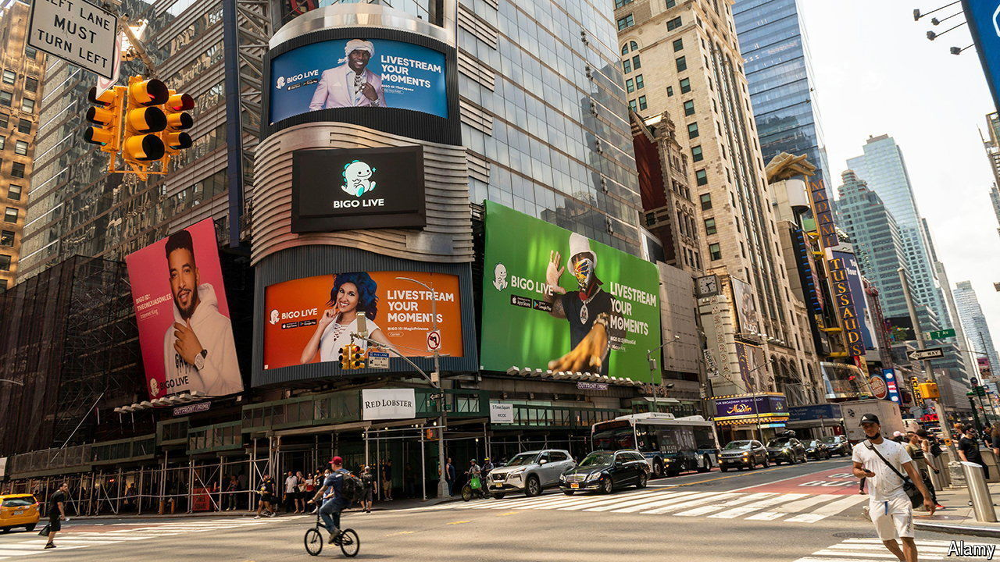

###### China’s other TikToks

# TikTok is not the only Chinese app thriving in America 

##### What happens to them if the short-video sensation is banned? 

 

> Mar 21st 2024 

WITH THE prospect of a ban hanging over TikTok, its 170m American users may start looking for an alternative time-sink. They could plump for Bigo Live, popular for TikTokish live-streaming. Or Likee, which offers similar video-editing and sharing options and has more than 100m users around the world. There is also Hago, which blends social media and video games, and which has clocked up some 500m downloads.

The three apps are similar to TikTok in another way, too. The firm that makes them, Joyy, is based in Singapore, just like TikTok. And like ByteDance, TikTok’s parent firm, Joyy’s controlling shareholder, called Huanju, is based in mainland China. 

ByteDance and Huanju are among dozens of Chinese firms that are thriving on the free-wheeling Western internet, away from China’s censors. They develop apps for everything from gaming and social media to fitness and photo-editing. Many have set up headquarters outside China, often in Singapore, and do not advertise their Chineseness. Plenty dispute the notion that they are Chinese at all. 

According to Sensor Tower, a research firm, a Shanghainese video-gaming firm called MiHoYo last year outperformed even Tencent, a Chinese games powerhouse, when it came to foreign revenues from video games (unlisted MiHoYo does not disclose figures). The 30 biggest Chinese video-game makers account for 18% of the industry’s global sales outside China. Chinese-linked e-commerce apps have been similarly successful. Shein, which sells cheap clothing, mainly to Americans, is thought to have sold garments worth tens of billions of dollars last year. Temu, which is based in Boston but owned by a giant Chinese e-merchant, PDD, may have notched up several billion dollars. PDD, which is listed in New York, does not break out Temu’s results, but on March 20th it reported that its overall sales more than doubled in the last quarter of 2023, to $12.5bn.

Other Chinese services are also pushing into America. Daily Yoga, an app popular with exercise aficionados, is owned by a company from the Chinese city of Xi’an. Bestie-Portrait, a photo-editor, has Chinese owners. CapCut, one of the world’s most popular video-editing apps, is owned by ByteDance. So is Lemon8, a photo- and video-sharing app similar to Instagram. ReelShort, which serves up soap operas to American viewers in micro-episodes, is owned by Crazy Maple Studios, a Californian subsidiary of COL Digital Publishing, whose headquarters are in Beijing. 

A ban on TikTok could open the door to many of these apps being consigned to the digital dustbin. They risk being accused, as TikTok has been, of sharing users’ data with Chinese authorities, being a vehicle for propaganda, or both. TikTok denies these allegations, points to its efforts to ring-fence its American data and algorithm, and says that the Communist Party holds no sway over it. Other apps with Chinese roots may soon have to start issuing similar denials. ■


