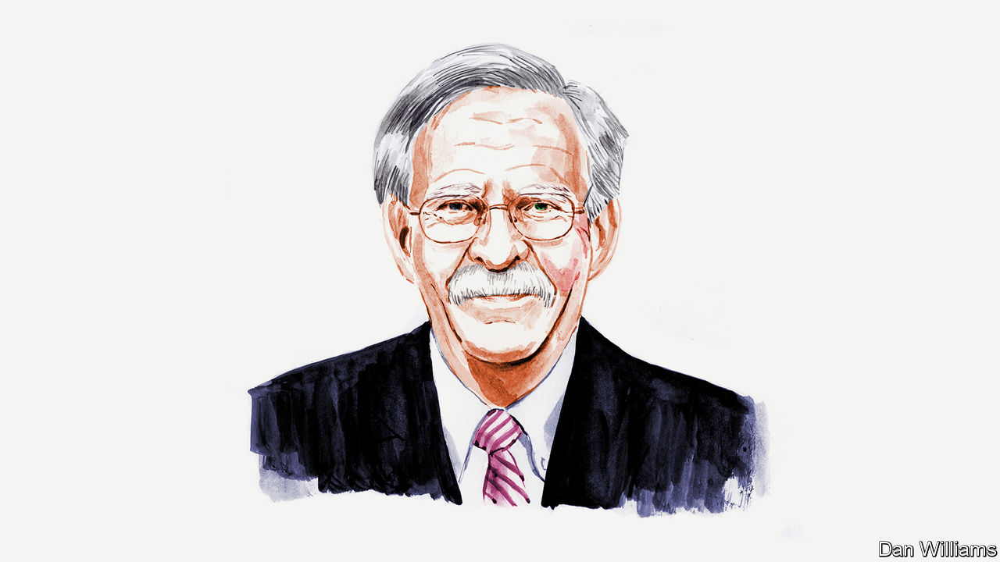

###### American foreign policy

# Both Biden and Trump are foreign-policy flops, argues John Bolton 

##### Threats will go unthwarted, whoever wins in November, says the former national security adviser 

 

> Mar 21st 2024 

SADLY, FOR America and the world, neither candidate in this November’s election is fit to be president. Polling shows voters did not want a rematch between Joe Biden and Donald Trump, but that’s what they’re getting.

A president’s most important national-security responsibility is to identify the risks and opportunities facing America, and to craft ways to thwart the threats and advance the country’s interests. Whether because of incompetence, fading mental capabilities or, worst of all, succumbing to domestic political pressures, Mr Biden and Mr Trump have repeatedly proven unable to perform this mission. For years both have fared poorly at distinguishing friend from foe, a pretty low bar even for neophytes, let alone those seeking another turn in the Oval Office.

Mr Trump’s increasingly strident threats to withdraw America from NATO, for example, came perilously close to reality at the alliance’s summit in 2018. America dodged a bullet then, and Mr Trump’s short attention span kept him from resurrecting the idea before his term ended. Subsequently, however, he has repeatedly insinuated or explicitly advocated withdrawal. Recently, he rejected protecting NATO members whose defence spending did not meet their commitments.

Mr Trump is serious, but supporters and opponents alike discount the extraordinary risk of America leaving NATO. They call his bluster “negotiating tactics” to spur defence-spending increases, or just “Trump being Trump”. This is a grave error. His complaints about NATO or allies like Japan or South Korea shirking their responsibilities are intended not to strengthen America’s alliances but to be grounds for abandoning them. Some believe his most recent comments suggest he is becoming less inclined to withdraw from NATO. Don’t bet on it.

Mr Trump’s views on NATO assisting Ukraine after  are similarly dangerous. Nonsensically, Mr Trump has said he could solve the conflict in 24 hours. Even worse, just weeks ago Viktor Orban, Hungary’s prime minister and a friend of Mr Trump, said that Mr Trump “will not give a penny into the Ukraine-Russia war and therefore the war will end…[I]f the Americans do not give money the Europeans are unable to finance this war on their own.” Granted, with Mr Trump nothing is ever final until it is, and sometimes not even then, but the pattern is unmistakable.

Mr Biden is comparably flawed. In today’s Middle East conflict, he sees only a war between Israel and Hamas. He is unable or unwilling to grasp that Iran is assaulting Israel on several fronts through terrorist proxies. Despite initially embracing Israel and (literally) its prime minister, Binyamin Netanyahu, Mr Biden’s crabbed strategic sense now has him cowering under pressure from the Democrats’ anti-Zionist left wing. Rather than responding to Iran’s long-standing “ring of fire” squeeze against Israel, America is reducing political support for Israel, and there are threats from the White House and congressional Democrats to impose conditions on military aid that could reduce or eliminate it. Mr Biden is in effect granting moral equivalence between Hamas’s terrorist atrocities on October 7th and Israel exercising its legitimate right to self-defence. 

The atrocities committed by Hamas (not to mention by Houthis, Hizbullah and Iraqi Shia militia) over decades have been unspeakable, as has Hamas’s ability to get away with inflicting suffering on its own people. Mr Biden has been duped, as have many others in the West, which is why they primarily blame Israel for civilian casualties. He fails to see that Hamas is at fault for civilian casualties through callously intermingling Gazan civilians with its own fighters and war infrastructure. Neither Hamas nor anyone else acquires a “terrorist veto” over Israel’s right to self-defence by sacrificing their own innocents. 

Mr Biden, confused and beleaguered, echoed Hamas’s demands for a ceasefire, essential for Hamas to buy time to regroup, resupply and continue its war. Iran’s other terrorist proxies are preparing for a long struggle, with the Houthis, for example, now claiming to have acquired hypersonic missiles to continue trying to close the Red Sea and Suez canal passage to international commerce. 

Instead of focusing on the real culprits—Iran and the terrorists—Mr Biden now criticises Israel. Releasing “intelligence” that suits his objectives, he implies that Israel’s government could fall if it doesn’t bend to his views, and that Israel’s policies will foster terrorism for a generation. Mr Biden backed Chuck Schumer’s demand for Israeli elections to oust Mr Netanyahu, saying the majority leader of America’s Senate “expressed serious concern shared not only by him, but by many Americans”.

Both candidates’ views of China offer further evidence of their foreign-policy flaws. Mr Biden spent his first term trying not to offend China, so as not to interfere with his holy grail of bilateral agreement on climate change. No deal emerged, and China wouldn’t have kept to it anyway. Meanwhile, China’s menace continued growing around its long Indo-Pacific periphery. Mr Trump’s holy grail with China was “the biggest trade deal in history”. He may still want that, but for now he blames China for covid-19 and hence for depressing his vote in 2020, thereby making it easier for Mr Biden to “steal” the election. He is instead calling for massive tariffs (his go-to answer on international problems) on Chinese goods, while misguidedly disparaging Taiwan for stealing America’s microchip industry. 

Mr Biden and Mr Trump certainly both believe they will benefit politically from their respective approaches. Unfortunately, their understanding of America’s proper place in the world, and of the threats facing it and other Western democracies, is badly flawed, as are their responses. Many American voters despise both candidates, and with good reason. To the delight of America’s enemies, whichever of them wins, a long, grim four years lie ahead.■


