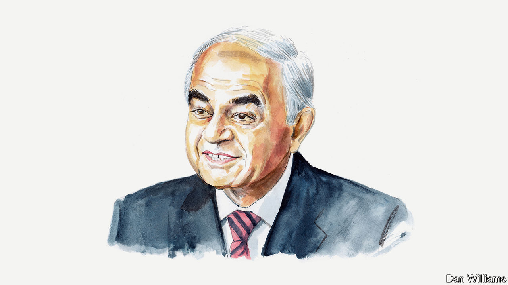

###### India’s election

# Gurcharan Das on why it’s lonely being an Indian liberal 

##### But the attraction of Hindu nationalism will fade, argues the author 

 

> Mar 19th 2024 

I GREW UP in an India that was a proud liberal democracy saddled with an illiberal, over-regulated economy that micro-managed private enterprise. We called it the Licence Raj. I worked for a company that made Vicks VapoRub. One year there was a flu epidemic and sales of Vicks went through the roof. At the end of the year a summons arrived from the government, claiming my company had broken the law: sales had exceeded the production of Vicks authorised in our licence. It was a criminal offence, we were told. 

I was asked to appear at a hearing before a government official. I explained that the epidemic had resulted in extra demand; we were only doing our duty, keeping store shelves stocked. But the official pronounced us guilty, declaring that the law would now take its course. As I got up to leave, I asked the official to imagine how our country would look to the world when news broke that our government had punished someone for alleviating the misery of millions during an epidemic. 

In the end, the government quietly dropped the case. But I abandoned socialism to become a classical liberal and joined the liberal Swatantra Party. Liberalism offered me a philosophy that champions human progress that does not expect it to come solely from the state. I learned to believe in the liberal virtues of openness, mutual respect and tolerance of others’ views.

India had to wait until the liberalisation of 1991 to win its economic freedom, after sacrificing two generations to missed opportunities. I wrote a book, “India Unbound”, predicting the rise of India based on the reforms. India obliged by becoming the world’s second-fastest-growing large economy, expanding at an average annual rate of almost 6% over the next 30 years, lifting 400m people out of poverty and expanding the middle class from 10% to 30% of the population.

But just when everything seemed to be going well, democracy began to weaken. The past decade has seen the rise of identity politics, majoritarianism, Hindu nationalism and Islamophobia. Critics are being silenced and discourse on social media has become a weapon of the right. The atmosphere of hate has damaged India’s cherished secular ideal of respect for all religions. Although there has been no communal riot on the same scale as those in Gujarat in 2002 or in Delhi in 1984, there have been many localised incidents of violence, not least against Muslims suspected of selling beef.

Today, Indian liberals like me face a dilemma: not only do we have no one to vote for, but even if we did they would be unelectable. It can feel like a lonely road. I lost my friends on the right when I publicly condemned the riots in Gujarat and criticised the banknote demonetisation in 2016 by the government, led then, as now, by the Bharatiya Janata Party (BJP). I lost my friends on the left when I voted for the BJP in 2014. 

Sadly, I am the man in the middle, disappointed with both sides. I cannot vote for the authoritarian, identity politics of the BJP. But I also do not trust the redistributive, populist and statist economics of the opposition Congress party, ever ready to make a false trade-off between growth and equity. Nor do I have much faith in the INDIA alliance of opposition parties that was formed last year with Congress at its centre.

Lamentably, in the past ten years the opposition has not come up with a single new idea to deal with most of India’s biggest issues: jobs, air quality, education and health care. Handing out pocket money to women in Karnataka or free bus rides in Delhi will not cut it. The INDIA alliance is incapable of doing the heavy lifting to take the economy to the next level. 

India may have become a fast-growing economy but it has still not created enough jobs. It has failed to create an industrial revolution. Manufacturing accounts for only 17% of GDP and India punches well below its weight when it comes to exports of industrial goods. It needs to find more productive jobs for the 45% of its workers stuck in agriculture. 

But how? It will require major reforms, including three that Narendra Modi’s BJP government tried but failed to enact because of the lack of opposition support: simplifying the acquisition of land for industrial purposes; modifying rigid labour laws to give companies flexibility to hire and lay off workers while protecting them from exploitation; and overhauling farm laws to improve productivity. I trust the BJP to execute these reforms far more than the opposition—though the BJP, while a party of modernisation, is not an ideological reformer.

Liberals are partly to blame for this unhappy state of affairs. One reason is that liberalism in India remains an elite enterprise: the rise of Hindu nationalism is partly a revolt against the English-speaking elite. Another reason is that no liberal political leader has had a serious dialogue with tradition. Mahatma Gandhi, alas, died too soon. He had been able to translate the liberal ideas of liberty and equality into the civilisational language of —his moral principles—and thus capture the hearts and minds of the masses.

And yet, despite this gloomy situation, I remain optimistic about liberalism’s future in India. India’s civilisational temper is open, inclusive and liberal. In a land of 330m gods where no god can afford to feel jealous, and where people are argumentative, narrow Hindu nationalism is unlikely to have a long shelf life. Liberalism will win out in the end.■


