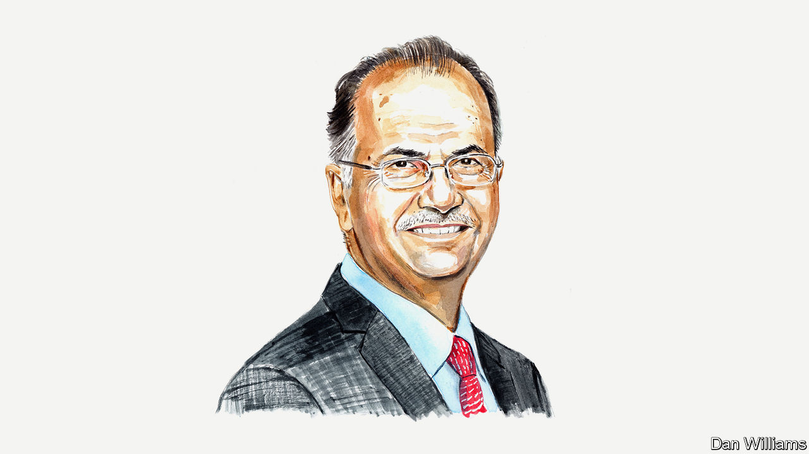

###### A way forward?

# The new Palestinian prime minister maps out his vision for a path to peace 

##### It will require reunification—and reforms—across the Palestinian territories, says Mohammad Mustafa 

 

> Mar 17th 2024 

AS I STEP into the role of prime minister-designate of the Palestinian National Authority (PNA) under excruciating and unprecedented circumstances, I am acutely aware of the monumental challenges that lie ahead. The Palestinian people find themselves at yet another critical juncture, facing a tragic confluence of crises that are testing our resilience and ingenuity, qualities we have proved we possess in abundance time and time again.

There are, however, at least a couple of differences this time: the injustices are more horrific than ever, and they are on global display. 

At this pivotal moment, Palestinians and the international community are more galvanised and determined to create real change than perhaps ever before. It is therefore imperative that we chart a clear path forward to stop the humanitarian catastrophe in Gaza, end the occupation and establish an independent Palestinian state in the West Bank and the Gaza Strip with East Jerusalem as its capital. It is time we were given a fair chance at realising our collective aspirations for justice, freedom, security, peace and prosperity—fundamental rights that Palestinians have been denied for 76 years.

Foremost among our priorities is addressing the dire situation that has transpired since October 7th. The devastation wrought by the continuing Israeli bombardment and deprivation (on top of years of siege) has left our people in Gaza in ruins, with unimaginable human suffering. 

The statistics are staggering, and the personal stories behind them are devastating. In less than six months, more than 30,000 people have been killed in Gaza, at least 13,000 of them children. On average, ten children every day lose at least one limb, and more than 17,000 are now considered “unaccompanied”, or without a parent. At least 70,000 people are injured and 1.7m—75% of the population of the Gaza Strip—have been internally displaced. Over 60% of housing units have been destroyed or damaged, the education and health systems have completely collapsed, and food and water insecurity have reached catastrophic levels. Nothing can justify the hell that the people of Gaza are experiencing.

Nor, for that matter, can anything excuse the deterioration that is occurring at the same time in the West Bank. As settlers ramp up violence and the occupation’s restrictions continue to make it difficult to pay salaries and live stable lives, the pressing security and economic situations have again become impossible to ignore.

Immediate action is needed to end this suffering. Our priority, therefore, will be to continue to work with regional and international partners to secure an immediate and permanent ceasefire and lead a humanitarian relief campaign to help our people in Gaza. In parallel, we aim to establish an independent, competent and transparent agency for Gaza’s recovery and reconstruction and an internationally managed trust fund to raise, manage and disburse the required funds. The siege must end, and the Palestinian people of Gaza (and the West Bank) must be allowed to live and thrive.

Crafting a proactive blueprint is essential. This blueprint must not only tackle the immediate crises we face, but also pave a path for a sustainable and prosperous Palestinian state that allows for the inalienable right of the Palestinian people to self-determination, a cornerstone for peace and stability in the region. 

To realise this vision we must bring together various parties and voices that are committed to the principles and frameworks established by the Palestine Liberation Organisation (PLO). Acknowledging the complexities on the ground, we must forge a non-partisan, technocratic government that can gain both the trust of our people and the support of the international community. This government will foster the engagement of all Palestinian factions and parties in a constructive dialogue at the PLO level. The aim should be to reach a consensus on how to bring about peace, an independent Palestinian state and the democratic governance of our institutions. 

Central to this vision is the reunification of our institutions and laws across Gaza, the West Bank and East Jerusalem under cohesive governance, facilitating economic integration and ensuring freedom of movement and access (until the establishment of a permanent territorial link). This vision has been the international consensus and the only accepted way forward to lasting peace and stability, yet its implementation remains long overdue.

The incoming Palestinian government is determined to undertake all necessary internal reforms to gain the trust of our people and to succeed in the enormous tasks ahead. We will undertake comprehensive reforms that include improving financial controls and transparency, streamlining the bureaucracy, strengthening the rule of law, safeguarding the independence of the judiciary, fighting corruption, upholding human rights and freedom of expression, empowering civil society and oversight bodies, and preparing for elections. 

To be clear, we will pursue a policy of zero tolerance towards corruption and full commitment to transparency. An effective and accountable government is crucial not only for garnering international support and credibility but, more important, for gaining the trust of our own people. 

The scepticism that greets declarations of reform may be understandable given the history of our governance. But I am committed to showing progress and accountability. My government’s measures will include putting together a credible and professional cabinet and establishing a Transformation Office tasked with charting the required reforms and implementing them in co-operation with civil-society groups and international organisations with relevant experience, such as the World Bank and the UNDP. To succeed, this will require support from the international community, to ensure that the restrictive and disabling policies of the Israeli government are brought to an end.

An essential step in regaining the trust of our people and ensuring the legitimacy of our governance is the commitment to hold democratic elections. We aim to hold both presidential and parliamentary elections, a vital step towards reinvigorating our democratic institutions. We will strive for a process to make these free, fair and inclusive. However, the realities on the ground in Gaza, the West Bank and East Jerusalem must be conducive to ensuring these elections are genuinely representative.

Improving the fiscal stability of the PNA and revitalising our economy will be an important task, but also a daunting one given our significant reliance on dwindling external aid and the systemic restrictions imposed by the occupation. However, it is not insurmountable. Israeli restrictions must be removed. Then, with the assistance of the international community and our private sector, including in the diaspora, we will be able to diversify our revenue sources, reduce dependence on external aid and create a thriving, resilient economy.

Moving forward requires bold ideas and reforms, decisive action, engagement, transparency and pragmatism. It is time for the suffering of Palestinians to finally end. We are a strong and capable people, but we cannot do this alone. The support of the international community and our regional partners is indispensable in fostering peace, security, stability and prosperity for Palestinians and the region. The time is now to free Palestine—once and for all. ■


