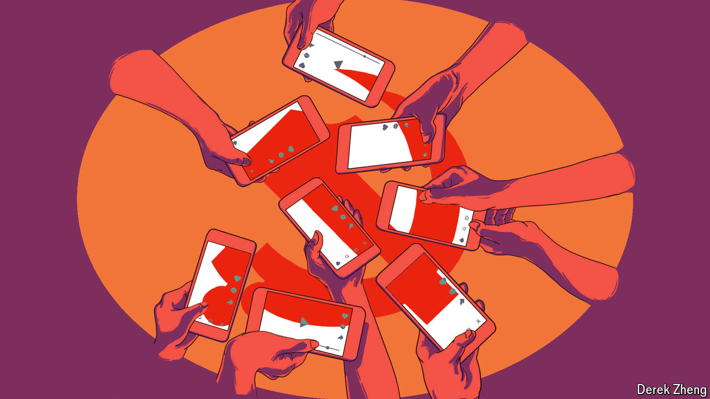
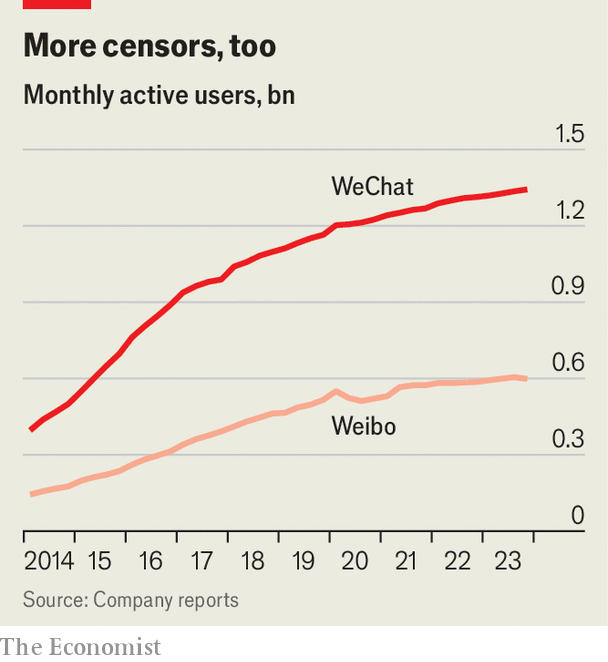

###### Clicks and control

# America is concerned about social media. China is, too 

##### Most Chinese get their news from such platforms. The Communist Party is paying attention 

 

> Mar 21st 2024 

THERE SEEMS to be no end to official anxiety over social media in America. The idea that TikTok, a popular Chinese app, might be used as a tool of Communist Party propaganda has terrified politicians. On March 13th the House of Representatives passed a bill that would force the platform’s Chinese owner, ByteDance, to sell the app or else face a ban in America. Five days later the Supreme Court heard a case over the Biden administration’s requests that social-media companies remove posts containing misinformation. Both stories speak to the power of these firms, which play an enormous role in disseminating news and guiding opinions.

That is no less true of social media in China. The party long ago banned American-owned sites such as Facebook, X and YouTube. But China’s own versions have filled the gap. Like their American counterparts, they have evolved into broad media platforms. A survey in 2022 found that 46% of Chinese get their news from short-video apps such as Douyin, the domestic form of TikTok which has about 740m active monthly users (China’s population is 1.4bn). Another third or so catch up while perusing platforms like Weibo, an X-like site owned by a company called Sina. Many also look to WeChat, a messaging app from Tencent which has 1.3bn users.

Given the party’s  and deep suspicion of private enterprise, this looks from the outside like a remarkable state of affairs. The party, though, has harnessed social media to deliver its message. The platforms are scrubbed of subversive content. Still, officials in Beijing worry about them as much as politicians in Washington do.

The party certainly did not plan for social media to play such a big role in informing the public. For much of their life, these firms were viewed by the government primarily as drivers of economic growth. Their founders were held up as entrepreneurial heroes. And, for the most part, they knew not to cross the party. In 2018 the founder of ByteDance, Zhang Yiming, issued a cringeworthy public apology after one of his social-media platforms was criticised by regulators for hosting indecent content. “I have been filled with remorse and guilt, entirely unable to sleep,” he said, admitting that his product was “incommensurate with socialist core values”.

 


But as their audiences and influence grew (see chart), social-media firms, along with the rest of the tech industry, came under more scrutiny. In 2020 regulators clamped down, deeming tech companies to have strayed too far from the values cited by Mr Zhang. The regulatory regime that emerged embeds the party even more deeply in the industry. ByteDance, Tencent and Sina already had internal party committees that were consulted over big decisions. In recent years state investors have also taken small stakes in key subsidiaries of the firms. These “golden shares” let the government appoint board members, among other things.

Even so, party officials exhibit anxiety similar to—if not exactly the same as—the twitchiness on display in America. While the Biden administration goes after misinformation, China’s ruling party desperately tries to root out anything that contradicts its line. The methods, of course, differ. China’s government spends $6.6bn a year censoring online content, estimates the Jamestown Foundation, a think-tank in America. In one two-month period last year the authorities claim to have deleted 1.4m social-media posts and 67,000 accounts (ironically, they branded many of the posts “misinformation”). More recently officials launched an investigation into short-video platforms that were spreading “pessimism” among young people, many of whom are struggling to find jobs.

Unwelcome content still gets through, however. In 2022, for example, a short video showing the cruelties of a covid-19 lockdown in Shanghai was shared by millions of Chinese netizens. They moved faster than censors could keep up, using tricks such as inverting the video or embedding it in cartoon clips in order to avoid detection. 

Hostile content

Perhaps a bigger concern is foreign interference via social media. Here, too, the anxiety resembles America’s. “All sides strive to spread and amplify their own propaganda, and denounce and suppress the other party’s propaganda, by manipulating social-media platforms,” wrote a researcher at China’s Academy of Military Science in 2022. The fears of Chinese officials were no doubt heightened when Reuters reported this month that in 2019 the CIA launched a clandestine campaign on Chinese social media aimed at turning public opinion against the government. (It is thought to have made little impact.)

Today the government is digging in deeper, examining the algorithms that decide what users see on social media. Since 2022 companies have been required to register their algorithms with regulators and explain their logic. Most of the time, the code brings to the fore content the party likes. The top spot on Weibo’s list of trending topics is usually news about what China’s leader, Xi Jinping, is doing. In 2020 researchers at Stanford University tracked which videos were trending on Douyin over a period of four months and found that 57% were created by government or party-affiliated organisations. 

But the algorithms work in mysterious ways. Sometimes even their creators cannot explain why they recommend one thing over another. The party does not like such uncertainty. In many ways it has co-opted social media for its own purposes. Yet it must long for the days when Chinese people could only get their news from state-run television and newspapers. ■


