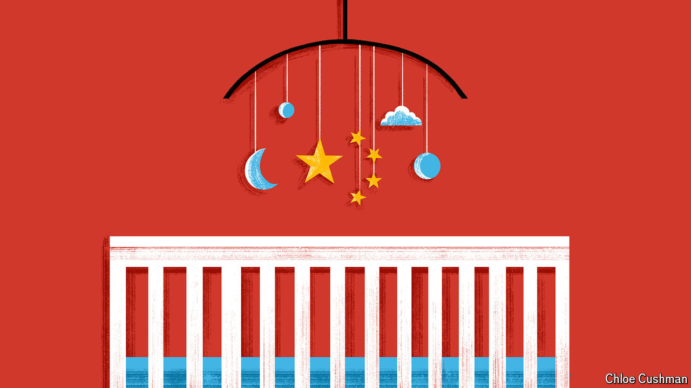

###### Chaguan

# China’s low-fertility trap 

##### The one-child policy may be gone, but its harmful effects linger 

 

> Mar 21st 2024 

ASMALL NUMBER should haunt the sleep of China’s leaders: 1.1. That is the number of children that, given prevailing trends, each Chinese woman is expected to have on average during her child-bearing years. China’s total fertility rate (TFR), to use the demographers’ term, has fallen far below the 2.1 children needed for a stable population. Sure enough, in 2023 China’s population declined for the second year in a row.

Communist Party bosses may cling to a (thin) comfort. This disaster has many causes, only one of which is their one-child policy, the harsh system that between 1980 and 2016 limited most urban families to a single child, and many rural folk to two. Most of China’s fertility decline happened in the 1970s, as a result of such forces as urbanisation and women’s education (Mao-era calls for large families also stopped). Similar forces saw birth rates plunge across East Asia. Japan’s TFR has fallen below 1.3 and in South Korea, catastrophically, it is below 0.8. The rapid ageing of China’s population also follows patterns seen region-wide.

Even so, pangs of remorse should trouble party chiefs’ dreams. The one-child policy is not the sole reason for this crisis, but its legacy will make it exceptionally hard for China to escape demographic doom. China’s population structure has been left permanently skewed. Brutal, often corrupt officials enforced rules with propaganda, fines and tens of millions of abortions and sterilisations, many of them involuntary. There are about 150m one-child families today. Worse, many parents who wanted sons chose to abort girls, leaving China with 30m fewer women than men.

The policy was both cruel and a blunder. Family-planning officials assumed that birth rates would spring back once controls were abolished. Alas, they re-educated parents too well. One child became the norm, certainly in cities. Consider another figure that should haunt leaders: 1.7. That is the number of children that, on average, Chinese women of child-bearing age call ideal. China’s ideal is one of the world’s lowest, far below the number given in Japan or South Korea. Chinese women born after 1995 want the fewest of all: 48.3% of them told the Chinese General Social Survey of 2021 that they desire one or no children. There is growing evidence that such attitudes are powerfully shaped by how people, and those around them, experienced the one-child policy.

When asked why they want small families, Chinese parents usually cite the costs of child-rearing. In fact, there is no neat link between fertility rates and average incomes. Birth rates are very low in China’s richest city, Shanghai, but also in its post-industrial north-east. Those very different places do have something in common. Shanghai enforced childbirth rules sternly. So did state-owned firms that employed millions in the north-east, notes Yu Jia of the Centre for Social Research at Peking University.

Another revealing variation involves the roughly one in 11 Chinese who are from ethnic minorities. The policy was enforced (a bit) less strictly for minorities, allowing larger families to remain the norm in isolated places like Tibet, but also in diverse rural regions home to the Bai, Miao, Yi, Zhuang and other peoples. Distinctive effects may be seen to this day. Even after controlling for education and degrees of social contact with China’s dominant Han majority, many ethnic groups stand out for wanting larger families. One consistent factor, says Ms Yu, is that minority households had “different one-child rules applied to them”.

Intrigued, Chaguan headed to Guizhou, a province in China’s south-west with many minorities and the highest birth rates of any region outside Tibet. Locals offered varied explanations for high fertility rates and vivid memories of family-planning rules. Heading into the mountainous heartland of the Miao people, a first stop was the township of Zhou Xi. Locals thronged an open-air fair marking a Miao festival, Lusheng. Stalls sold tangerines, sugar cane and roast dog. Mr Wang, a father in his 30s, watched two sons playing on a bouncy castle. One of three siblings himself, he recalled how his own mother hid from officials enforcing her village’s two-child limit. Rule-breakers braved fines and the confiscation of cows, chickens or pigs to have larger families. “We Miao are more hospitable in every way, we prefer to have lots of relatives and friends,” Mr Wang explained.

Next, a winding road led to Puzi, a wood-smoke-scented mountain hamlet. Many working-age villagers are Miao, but toil in faraway Han Chinese towns. Some have picked up big-city views. Mr Mu has worked in a factory in Dongguan, a southern coastal city, for almost 12 years. He returned to Puzi for the recent Spring Festival and stayed on to attend a funeral. He has two sons and cited Miao beliefs that one child is not enough. But his neighbours in Dongguan with a lone child enjoy an “easier” life, he ventured. Faced with the prospect of helping his sons buy cars and homes so that they can marry, he sighed: “I’m under a lot of pressure.”

Beware officials claiming to plan for the long term

The final stop was Guiyang, the sleepy provincial capital where Han Chinese and minorities live side by side. In a park outside a children’s hospital, your columnist met a Han couple in their late 30s from Hunan province, Mr Luo and Ms Yang. They had a first child 13 years ago, while working in the wealthy eastern province of Jiangsu, and feared more would be “too tiring”. If they had stayed in Jiangsu, they would still have one, they said. But after moving to Guiyang to open a shop, Miao neighbours convinced them that solo children are “lonely”. They ended up with three, laughed Ms Yang, as a pair of small children tugged at her sleeves.

Even here, 20-something locals are converging with national norms, marrying later and wanting just one or two children, reported Ms Yang, adding: “Probably we are the generation who will have the most children.” Words to haunt China’s leaders. ■


