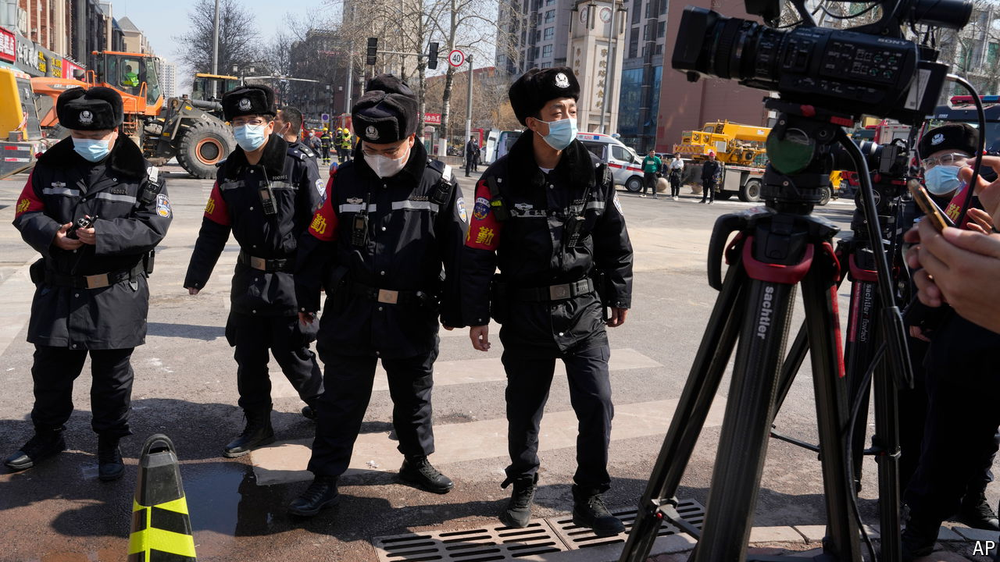

###### Bang and blast! It’s too noisy to muffle

# Even China’s own state media sometimes resent state control 

##### Censorship of a deadly explosion causes ructions among local journalists 

 

> Mar 21st 2024 

There is nothing unusual about the sight of Chinese policemen oafishly blocking the lens of a television-news camera, or bundling reporters away from the scene of a big event. It happens to foreign journalists all the time. But many were stunned this month when reporters from China Central Television (CCTV), the country’s leading state-run broadcaster, got the same treatment. Even the anchor of a live telecast could not hide her on-air surprise when colleagues reporting from the site of a deadly explosion were shoved away.

The blast occurred at rush hour on the morning of March 13th in Yanjiao, a commuter town just a few kilometres beyond the boundary of Beijing, China’s capital. Seven people were killed and 27 injured. The incident highlighted long-simmering questions about the regime’s control of news.

In another incident a reporter for China Media Group, CCTV’s parent company, posted a video online of her team’s similarly rough handling by police at the scene. Pointed commentary came quickly, as it often does around controversial events, on social media. The mighty party-controlled media, wrote one user, “also gets a taste of the iron fist of socialism”. Now, wrote another, CCTV journalists are enjoying the same treatment as foreign media.

More unusual was a sharp statement on the night of the explosion by the All-China Journalists’ Association, normally a docile party-controlled lot. “Legitimate news-gathering is a journalist’s right,” said the group. The authorities must not “crudely obstruct journalists from conducting their work in a normal manner in order to control public sentiment”. Objective reports, the association said, can help “alleviate public anxiety” and “protect the people’s right to know”. 

Since taking power in 2012 the country’s leader, Xi Jinping, has made clear that informing the public with objective information is not the Chinese media’s priority. Rather it is to “safeguard the party’s authority” and “closely align themselves with the party leadership in thought, politics and action”. 

CCTV staffers say state control over their work has tightened in recent years. It is rarely as visible as it was in Yanjiao. But reporters have long had to get advance approval before reporting at any site and are strictly supervised by censors in choosing topics and deciding whom to interview.

Local officials apologised a day later for their treatment of the journalists in Yanjiao. A week after the explosion, the site remained full of emergency vehicles and roped off behind police cordons. Local residents still grumbled about remaining in the dark over the disaster’s true cause. In polite but very firm fashion, police insisted that your correspondent must not take photographs.■


