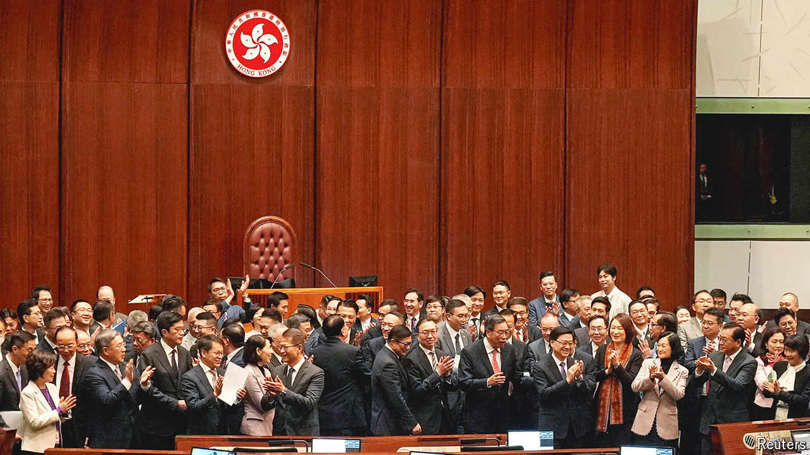

###### Article 23

# Hong Kong passes a security law that its masters scarcely need 

##### But the city’s clampdown on dissent will please officials in Beijing 

 

> Mar 19th 2024 

AS A SYMBOL of China’s tightening grip on , the national-security law known as  takes some beating. The measure, which grants the authorities more powers to clamp down on dissent, was passed unanimously by the city’s legislative council, or Legco (pictured), on March 19th. That is hardly surprising. Since 2021 members of the body have had to swear allegiance to the central government in Beijing. Opposition politicians have been disqualified, thrown in jail or forced to flee abroad. Still, the swift passage of a bill that few Hong Kongers thought was needed, but the central government demanded, reinforces the city’s loss of autonomy.

The law covers offences such as treason, insurrection and espionage. It overlaps with a security law  by the central government in 2020, a year after the city was rocked by big pro-democracy gatherings. But the latest measure has new elements that ought to worry liberal types. For example, anyone accused of breaking the law can be denied access to a solicitor and have their detention extended by 14 days (on top of the 48 hours previously allowed) with court approval. The law also makes more cases eligible to be heard by national-security judges—who are picked by John Lee, Hong Kong’s chief executive—rather than by a jury.

Just as concerning is the new law’s focus on “external interference” in Hong Kong’s affairs. Mr Lee thinks that shadowy foreign forces were behind the demonstrations in 2019 and are still stirring up trouble today (a conspiratorial view shared by the central government). He has warned of “wolves” trying to undermine China by advocating freedom and democracy in Hong Kong. Government-friendly media have reported that Amnesty International, which campaigns for human rights, and Greenpeace, which focuses on the environment, could be among the international NGOs designated as national-security threats. 

The press itself may also find its job harder. The law protects news reports that are in the public interest, but the government will be the arbiter of that. A letter signed by several foreign outlets (including ) expressed concern that normal journalistic activity, such as analysis and criticism of decision-making and investigating government malpractice, could be criminalised.

The wording of the law is vague, probably by design. It gives the authorities lots of room for manoeuvre. And the government no doubt hopes that Hong Kongers and foreigners, facing fuzzy red lines, will pull up well short of them. But officials have also had to bat down several rumours, such as that Western social-media platforms might be banned. There was also buzz that people might be prosecuted for possessing old newspapers that contained articles deemed seditious. This is “completely wrong”, said the government—the offence would apply only if the owner did not have a “reasonable excuse”.


When Hong Kong was handed back to China by the British in 1997 it was given a mini-constitution, called the Basic Law, and promised “a high degree of autonomy” under the “one country, two systems” model. Residents were granted freedoms and civil liberties denied to Chinese on the mainland. Yet Article 23 of the document loomed over the city. It required Hong Kong to pass national-security legislation that many people feared would alter its character. When the government tried to push through such a measure in 2003, the public responded with large protests and the city’s leaders backed down.

The ease with which the measure passed this time round shows just how much has changed in Hong Kong. In recent years, controls on speech, news media, books and culture have grown more stifling, at the behest of the central government. The older security law had already deterred most people with political grievances from attempting to challenge the authorities. The new one adds to this atmosphere of fear. No big protests are expected in the coming days.

But the speed with which the government moved to pass Article 23 has raised eyebrows. It was unveiled on January 30th. There followed an unusually brief public consultation, which closed on February 28th. The bill was then rushed through Legco. Some believe the aim was to avoid criticism by catching foreign observers off guard. If so, the gambit failed. The UN’s high commissioner for human rights suggested the measure was incompatible with international law. The EU warned that it might threaten Hong Kong’s status as a global commercial hub. Britain said it would “damage the rights and freedoms” of city residents.

Hong Kong officials are expecting repercussions. The lawmakers who scrutinised the bill at the committee stage are said to have begun referring to themselves as “martyrs” because they expect to be hit with sanctions by Western governments. But Mr Lee always aimed to please a different audience. He called the moment “historic”, adding that Legco “did not let the central government down”. The chief executive and his colleagues credit the original security law with helping to bring peace and prosperity to the city, and think the new law will have a similarly positive impact. If the people of Hong Kong disagree, they will have to say so quietly. ■


