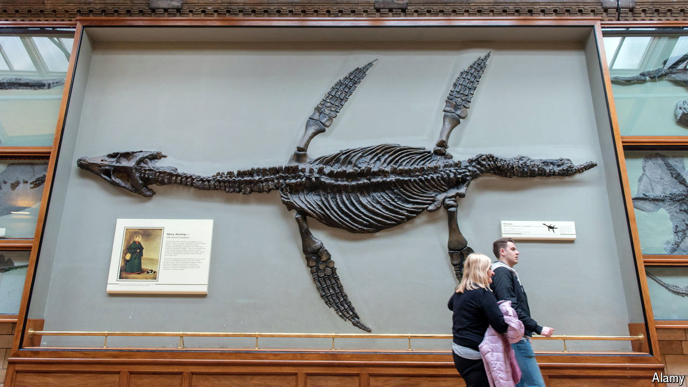

###### Jurassic spark

# How the discovery of dinosaur fossils caused a revolution 

##### “Impossible Monsters” looks at 70 years that changed human thought 

 

> Mar 20th 2024 

By Michael Taylor. 

AN intellectual revolution began in 1811 when Mary Anning, a 12-year-old living in Lyme Regis, a harbour town in south-west England,  of a marine reptile, the . It culminated in 1881 with the opening of the Natural History Museum in London, imperial capital of the world, by Richard Owen. Those seven decades spanned a change in thinking as profound as that triggered by the astronomers of the late Renaissance—and as disturbing to the established church. (In this case, the threatened church was that of England, not Rome.)  sparked a revelation of biblical proportions: God had not created the world in six days a few thousand years before, as so many believed.

“Impossible Monsters” is a story about time—or, rather, two parallel stories. In one, time moves forward, as the players take turns making remarkable discoveries that help advance science and humans’ understanding of their place in the world. In the second, it moves backwards, as the years needed to accommodate the findings of geologists and naturalists expand from thousands, to hundreds of thousands, to millions, pushing the date of “Creation” further away. 

In writing “Impossible Monsters”, the task of Michael Taylor, a historian, was to tell a much-told tale better than it had been told before. He has succeeded splendidly. The cast is many and varied, including Anning (pictured), a lowly fossil-seller, who achieved international fame through her discoveries— was but the first—yet was barred from joining the Royal Geological Society because of her sex. Many are memorably idiosyncratic, such as William Buckland, an eccentric Oxford don who once ate a mummified morsel of Louis XIV’s heart. He is better remembered for identifying and naming , the first of the group subsequently dubbed “dinosaurs”. 

Some of the characters are familiar, like  (no introduction needed, unless you live somewhere  is banned from textbooks). But many are less well known, such as Alfred Russel Wallace, a collector and seller of tropical specimens, who devised the idea of natural selection independently., Darwin’s self-appointed “bulldog”, became chief mover and shaker for all things official and scientific in Victorian Britain. Owen, Huxley’s enemy, held out against Darwin’s ideas, yet forced through the construction of the museum many now regard as evolution’s temple. 

It is a grand pageant. But Mr Taylor also conveys a sense of just how risky it was to believe in and promulgate the new ideas tied to the rocks and tropical forests where people hunted for specimens. Some clergymen, Buckland among them, performed intellectual contortions to reconcile the bones with the Bible. Even Darwin, wealthy and well-connected (and at one point himself destined for the church), at first lived in fear of the disgrace that might accrue if his ideas became public.

The intellectual climate changed, of course. However, lest readers congratulate themselves too readily on their enlightenment, it is salutary to consider, as the book’s prologue does, the case of James Ussher, an Anglo-Irish archbishop who lived in the 17th century. Ussher devoted his life to calculating the exact date of God’s creation of the world. Unlike some of his 19th-century ecclesiastical successors, he cannot be accused of ignoring or twisting the evidence. He spent decades and a fortune assembling dusty tomes that gave him what he thought were the data points he needed to anchor biblical passages in time, just as a modern geologist might use the radiometric evidence of volcanic-ash layers to date a series of strata. 

Ussher’s conclusion was that the world began on October 22nd 4004BC. It is an idea that sounds almost as prehistoric as a fossil. But who knows what widely accepted notions of today will also go extinct? ■


