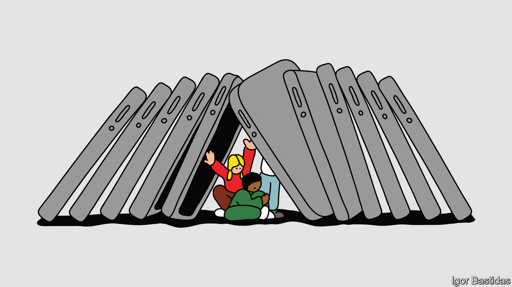

###### The young and the relentless

# How worried should people be about Generation Z? 

##### Two new books fit into a familiar pattern of the old fretting about the young 

 

> Mar 15th 2024 

 By Jonathan Haidt.  

By Abigail Shrier. 

In 1935  magazine published a sorrowful article about young Americans. The authors, journalists George Leighton and Richard Hellman, argued that a generation was “rotting before our eyes”. Apathy and disenchantment were taking hold, together with criminality. Even high-school students were packing guns and were “out for what they can get”. Leighton and Hellman blamed mass unemployment for this tragedy. Some of their contemporaries pointed at marijuana. 

Around 50 years after that article—and 40 years after the supposedly rotten generation had saved the world from fascism—older people again complained that the young were going awry. In a book, “The Disappearance of Childhood” (1982), Neil Postman, an educational theorist, argued that teenagers were adopting adult vices such as heavy drinking and crime, and having far too much sex. The chief culprit, he explained, was television. 

Two more books have now been published about the troubles and flaws of young people. They say almost nothing about unemployment, marijuana or TV; indeed, they do not agree with each other about why the young are in such a mess. The causes change, the measurements change. What does not change is the absolute certainty with which older adults hold forth on the problems of youth. 

“The Anxious Generation” describes a cohort suffering from unprecedented levels of . One-fifth of American students were diagnosed with or treated for depression in 2019, up from one-tenth a decade earlier. Jonathan Haidt, a social psychologist at New York University, argues this is not just a sign of increased frankness. Suicides are rising too, more than doubling among American 10- to 14-year-old 

Smartphones and social media are the chief villains. Instead of small, stable real-world communities, young people join virtual ones, where they experience “a daily tornado of memes, fads and ephemeral micro-dramas, played out among a rotating cast of millions of bit players”. Smartphones are so alluring that they reduce interest in all other activities. Reversing Postman’s complaint about teenagers in the 1980s, Mr Haidt says that modern ones are slow to date and to have sex. 

Mr Haidt rehearsed some of these arguments in an earlier book, , which explained why university students have become so sensitive. “The Anxious Generation” posits that the problems begin much earlier, with an over-protective style of child-raising. The book argues for banning phones during school hours, preventing pre-teens from accessing social media and letting children run wild more often. All the suggestions sound sensible. Some even sound fun. 

“Bad Therapy” agrees that young people are deeply troubled, but disagrees about the cause. To Abigail Shrier, the culprit is not technology but what she calls the “mental-health industry”. Almost two-fifths of young Americans say they have received help from a mental-health professional, and it has done them great harm, she argues. They can “never ignore any pain, no matter how trivial”.  have sapped them of agency. A boy who has been pronounced learning-disabled and neurodivergent “no longer has the option to stop being lazy”.

Ms Shrier, who has previously written about the perils of  also has sharp words for modern parents, although her criticism differs slightly from Mr Haidt’s. Parents’ desire to be loved by their children, and to see them always happy, leads them to stifle and coddle, she thinks. The result is a crop of “far more self-involved, undisciplined and unlikeable children” than any before. Because children grow up without clear rules, they are confused and aggressive. When their behaviour becomes troubling, the therapists are summoned. 

“The Anxious Generation” is the better book. It deals seriously with counter-arguments and gaps in the evidence; although it might sound like faint praise, the endnotes are well worth reading. And Mr Haidt’s assured tone is pleasantly interrupted by personal admissions. He, too, has struggled with severe anxiety. He gave his son a smartphone at a startlingly young age and used it to track his movements. 

“Bad Therapy” admits no nuance. Ms Shrier has spoken to many therapists, but she declares that she trusts only those who assert that therapy can harm young patients. When assessing arguments that she dislikes, such as the notion that childhood trauma often produces damaged adults, she rightly insists on rigorous evidence. By contrast, some of her own arguments are based on conversations with friends and on a Facebook group where liberal parents complain about their children. 

Both authors would have benefited from more travel. Mr Haidt hangs out in New York, Ms Shrier in west Los Angeles. They generalise from those privileged, sometimes nutty places to the rest of America and the world. Their limited perspectives lead them into trouble. Mr Haidt—in the course of saying that fierce competition for university places cannot explain why young Americans are so miserable—argues that applying to university is “far less fraught” in Britain. That will come as a nice surprise to British readers. 

“Everyone goes” to , writes Ms Shrier in a typically sweeping aside. They do not. And young people who do not attend university, who live far from the most privileged corners of America, are often the ones to worry about. The youth suicide rate is much higher in states like Alaska and South Dakota than it is in California or New York; in Britain, it is high in Northern Ireland. It seems unlikely that teenagers in such places are afflicted by a peculiarly large number of smartphones, therapists or permissive parents. 

Many young people are certainly anxious, unhappy or lonely. But the conviction that their mental state matters above all is contemporary. Previous generations of adults cared less about young people’s minds than about their deviant and unruly behaviour. By such yardsticks, the rising generation is angelic. Fighting, juvenile crime, drug use and teenage pregnancy are all retreating in America. 

Generation Z improves on earlier cohorts in other ways. It is intolerant of prejudice: members of Generation X might care to recall how much of their youthful repertoire of insults questioned other people’s sexuality or pointed to mental and physical disabilities. To describe Gen Z as hopelessly self-involved, as Ms Shrier does, ignores recent history. Children and teenagers submitted to  in 2020 in order to save older people from covid. 

The generation that is now young will eventually grow up, get jobs, form relationships and have children. If the past is any guide, its members will proceed to write articles and books that find fault with young people. In the 1930s the young were seen as threats to public order; in the 1980s they were growing up too fast. Today they are growing up too slowly and are miserable. What judgment awaits a generation not yet born? ■


