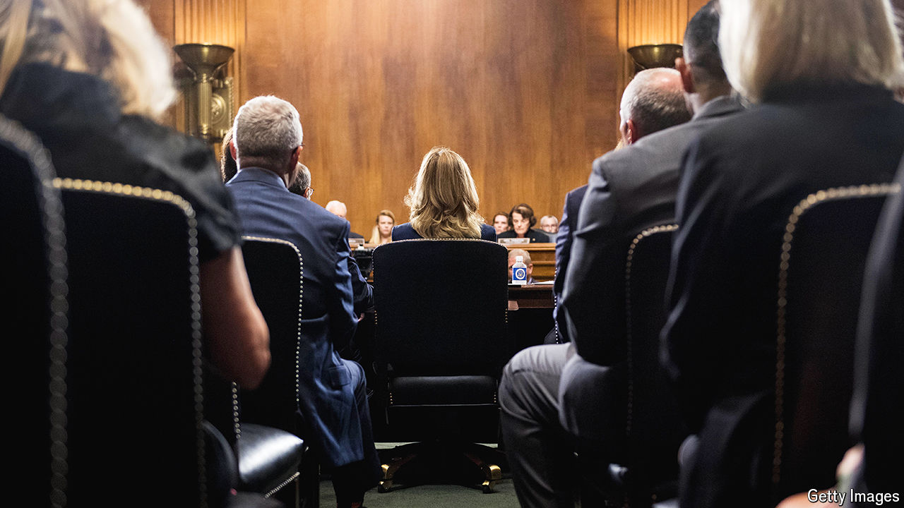

###### Court disorder

# Justice Brett Kavanaugh’s accuser returns with a memoir 

##### Christine Blasey Ford re-enters the spotlight 

 

> Mar 18th 2024 

By Christine Blasey Ford. 

“Most memoirs are the story behind a life. This is the life behind a story.” So begins “One Way Back” by Christine Blasey Ford, who became a global story herself i, after she accused , Donald Trump’s nominee for the Supreme Court, of assaulting her when they were teenagers. Her testimony before the Senate Judiciary Committee was watched by around 20m Americans on television, as was Mr Kavanaugh’s . 

Mr Kavanaugh was narrowly to the Supreme Court in a vote along party lines. But many women were inspired by Ms Blasey Ford’s courage to come forward. She received more than 100,000 letters of support from 42 countries and all 50 states, with about a quarter of them sharing personal experiences of sexual assault. These correspondents inspired her to pen her full account, which is dedicated to them: “Thank you. I’m finally writing you back.”

Given a years-long smear campaign that included doxxing and death threats—requiring her to spend a small fortune on private security—Ms Blasey Ford’s decision to re-emerge publicly may be surprising. Though her book does not provide dramatic new revelations, it shows the cost of stepping forward. Her message is that, contrary to accusations by some Republicans, her testimony was not a politically motivated “last-minute effort to block Kavanaugh’s confirmation”. 

Indeed, the process was protracted and messy. She agonised over how to reveal the assault she recalled occurring when she was 15 at a home in the posh suburbs of Washington, DC. She, like Mr Kavanaugh, was a “Beltway baby” raised in mainly Republican circles, when she found herself trapped in a bedroom at a party. Even former President Donald Trump initially called her a credible witness and “very fine woman” after she described her memory of Mr Kavanaugh, then 17 and drunk, trying to undress her and covering her mouth so she would not scream.

Ms Blasey Ford, a professor of psychology at Palo Alto University in California, first realised that her “attacker” was a powerful judge in 2004, when then-President George W. Bush attended his wedding. But not until Mr Kavanaugh’s name appeared on a shortlist for the Supreme Court did she feel it her “civic duty” to step forward. 

Determined to go it alone, Ms Blasey Ford comes across as naive and out of her depth. At first she refused legal help and believed she could remain anonymous. “Never in a million years did I think my face would publicly accompany the allegations,” she writes. 

However, her name was leaked, possibly by a senator, and then she came under pressure to testify. History might have been different had she heeded advice from contacts in  to hire a top Republican lawyer and act more assertively. 

Written earlier, the book would have been a diatribe against “the machine [that] would stop at nothing to rehabilitate Kavanaugh”. Instead her memoir is honest and often wry. Readers learn that the unassuming professor once dyed her hair partially blue and was pulled from the brink of despair by an invitation to meet her favourite band, Metallica, backstage.

“One Way Back” feels like a missive from a time long past. In the five years since Ms Blasey Ford’s testimony, the chorus of #MeToo, in which women came forward and publicly identified men who they said had abused them, has faded. Now a  has been enabled by a conservative Supreme Court majority, which  helped to cement.

Ms Blasey Ford has many regrets about how her testimony unfolded. But she would do it again, “absolutely”. She surfs, a sport that gives her ordeal and the book its (clichéd) metaphor. The book is not ghostwritten or slick, and is occasionally awkward and out of order, but Ms Blasey Ford is “riding the wave back” with her head held high. Her tone is one of disgusted resignation. “It felt like I had been believed,” she writes, “but then the response was a proverbial shrug.” ■

r

