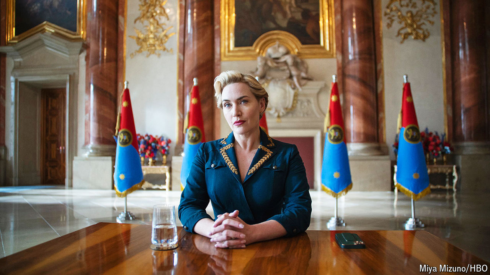

###### Back Story

# Kate Winslet explores how to be a good autocrat 

##### “The Regime” is a silly show with a deadly serious point 

 

> Mar 19th 2024 

The capricious leader of an unnamed country in central Europe, Elena Vernham is carried around her palace in a mobile oxygen chamber. She chats with her father’s embalmed corpse. In  star turn, her lisping petulance recalls Veruca Salt, the spoiled brat in “Charlie and the Chocolate Factory”. Elena’s antics, amours and annexations are chronicled in “The Regime”, a satiricaldrama out now in America and in Britain soon. It is a silly TV show that makes serious points about autocracy.

Elena and her country are sly composites of real people and places. There are echoes of communist Romania under the doomed Ceausescus and of the failed Soviet coup of 1991, when state tv broadcast “Swan Lake” (here it is “The Barber of Seville”). Elena’s ceremonial braided hairstyle evokes Yulia Tymoshenko, a Ukrainian firebrand. But the main influence is . The action begins with the arrival in the palace of a rough-hewn corporal, Herbert Zubak (Matthias Schoenaerts).

Because of his role in a massacre, which nobody lets him forget, his nickname is “the Butcher”. This is the show’s first insight: Herbert is promoted not in spite of his disgrace but because of it. Elena, like other autocrats, knows compromised people are pliable. Systems like hers rely on mutual blackmail, whereby every courtier has dirt on all the others; an honest person is useless. If blood is shed, many hands are dipped in it, as when Russian bigwigs appear with Mr Putin in his televised warmongering. 

Next, consider that portable oxygen chamber. Elena’s hypochondria—she has a horror of spores—spoofs germophobe leaders who are fanatical about their own welfare yet neglect their citizens’. But her quirks are also exertions of power. If she says noxious spores pervade her palace, they do. Everyone applauds her atrocious singing, just as Mr Putin’s lickspittles let him win at ice hockey.

The goal is not to make anyone believe in such fantasies and lies: it is to force underlings to swallow them, so underlining the autocrat’s power. You are not meant to believe the Kremlin’s denial that it killed  in Russia’s gulag. If you did, the murder’s intimidating message would be blunted. The aim is to add intellectual insult to lethal injury. 

Elena speaks to her subjects in televised addresses, calling them “my loves”. As autocrats do, she claims to have a mystical connection to the people, wielding them in arguments like a mace. In truth, she despises them as grubby bumpkins and loathes meeting them. She frets over their loyalty, as rulers tend to when normal debate is stifled. 

“They love to see America punched in the mouth,” an apparatchik says of his compatriots. As in many smallish countries, Elena oscillates between courting and resenting American involvement. She tries to play Washington off against Beijing and launches half-baked bids for autarky. Yet even as she denounces America she enjoys its pop culture, watching “Friends” over dinner, rather as Bashar Assad clung to his iTunes account as Syria imploded. 

Apart from bashing the West, in a fix Elena deploys two go-to autocratic tactics. She trumpets a crackdown on corruption (notwithstanding her own offshore stash) and seizes a slice of adjacent territory in what is not, repeat not, an invasion. The ensuing sanctions mean a disgruntled insider can no longer visit his pied-à-terre in Miami. As circumstances deteriorate, the cronies must calculate when to run, a dilemma familiar to henchmen from Cairo to Caracas.

Artistically, the show has flaws. It tries vainly to make you care about its characters even as it sends them up. The waspish dialogue is not as funny as the invective in . But, autocratically, it hits the mark—above all in capturing the way this sort of power is itself a kind of twisted performance.

“Could it just be theatre?” that insider wonders when an oligarch is publicly humiliated. In regimes like this, however, theatre is the basic mode of statecraft. It isn’t only that “the visuals” matter more than the substance of events. The autocrat substitutes ritual and spectacle for political competition (as in Russia’s ). Politics is a pastiche of democracy, a satirical pantomime in which all are dragooned into the joke. An autocracy, in other words, is often a silly show with a tragically serious point.■


