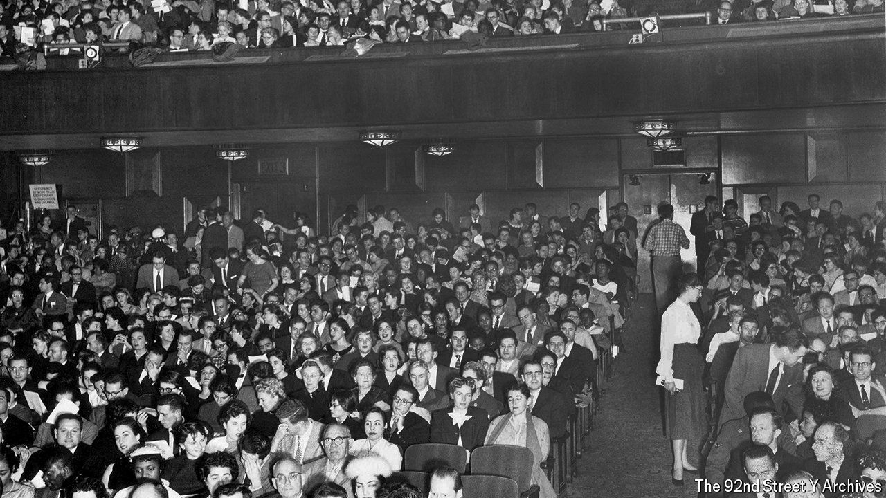

###### A miracle on 92nd Street

# New York’s 92nd Street Y turns 150 

##### Its reinvention holds lessons for other cultural centres 

 

> Mar 21st 2024 

THE 92ND STREET Y is a temple of culture that has hosted some of the greatest creative minds of the 20th and 21st centuries. Truman Capote first publicly discussed his novel “In Cold Blood” there, and  unveiled “Breakfast of Champions” before even his wife had read it. Yo-Yo Ma, a cellist, performed at the venue as a teenager. Literary greats , James Baldwin,  and Dylan Thomas have stridden across the stage. Others have pirouetted:  and Alvin Ailey, modern-dance choreographers, put on performances. 

The 92nd Street Y (which rebranded itself 92NY in 2022) is celebrating its 150th birthday in the style you might expect: with a year of talks, workshops and other events. Jewish business and civic leaders founded it on March 22nd 1874 as the Young Men’s Hebrew Association, with the goal of helping Jewish immigrants arriving from eastern Europe. When Emma Lazarus wrote “The New Colossus” in 1883—which contained the line “give me your tired, your poor, your huddled masses”, still etched on the Statue of Liberty—she was teaching English to recently arrived Russian Jewish immigrants at the 92NY. 

92NY has innovated to stay relevant. In the early 1900s it started providing services and enrichment programmes to people of all backgrounds and beliefs. Today it still serves as a community centre, offering swimming and violin lessons to children and shoemaking classes to adults, and is in the throes of a $200m renovation. It invented “Giving Tuesday”, now celebrated worldwide by workers at charities, who use the occasion to ask people for donations. 

It is not easy for other institutions to replicate 92NY’s special mix of wealth, networks and breadth of programming that have made it so successful—though no doubt many have tried. But despite 92NY’s uniqueness, it is navigating two challenges that other community groups also face.

One is how to deal best with faith in a polarised climate. The murder of Israelis by Hamas terrorists on October 7th complicated 92NY’s goal of bringing diverse thinkers to the stage. Shortly after the attack it postponed a reading by , a Pulitzer-prizewinning novelist who had been critical of Israel. A handful of other authors then cancelled events at 92NY in solidarity, to oppose what they called censorship. 92NY decided to put its literary series on hold.

As a Jewish institution that serves more non-Jews than Jews, 92NY has struggled to get the balance right. Seth Pinsky, its boss, says 92NY is “an ambassador to the world on behalf of the Jewish community” but also caters to “the need for meaning” and “community” generally. This makes 92NY “more relevant than we’ve ever been in our history”. In recent months it has hosted both critics and supporters of Israel. Like 92NY, many arts groups have tried to balance inclusivity and free speech, with bumps along the way. 

92NY has also had to confront another challenge: a transition from a renowned venue with programmes housed in a single building into an online brand with links to people outside New York. Here it has been succeeding spectacularly. The pandemic forced a digital pivot. In 2019 138,000 people attended an event or class at 92NY, all in person. Last year 150,000 people attended in person, but in addition, 26% of all tickets and places in classes were sold to online participants. One in every $8 of sales was generated from digital sources. In the year to February, there were 44m views of 92NY’s online digital content, which includes classes, concerts, archives and panel discussions. About 42% of the views came from outside America.

92NY has become a platform for other cultural groups, too. The Cleveland Museum of Art, the Bronx Zoo and the Isabella Stewart Gardner Museum in Boston are among 45 institutions that put their content on the 92NY’s website. Mr Pinsky says 92NY’s competition is “everybody and nobody”. Plenty of somebodies outside New York will be hearing about 92NY in the years ahead. ■


