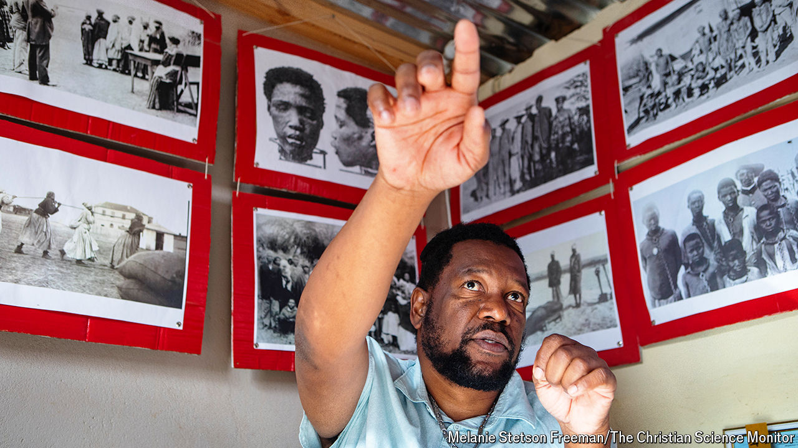
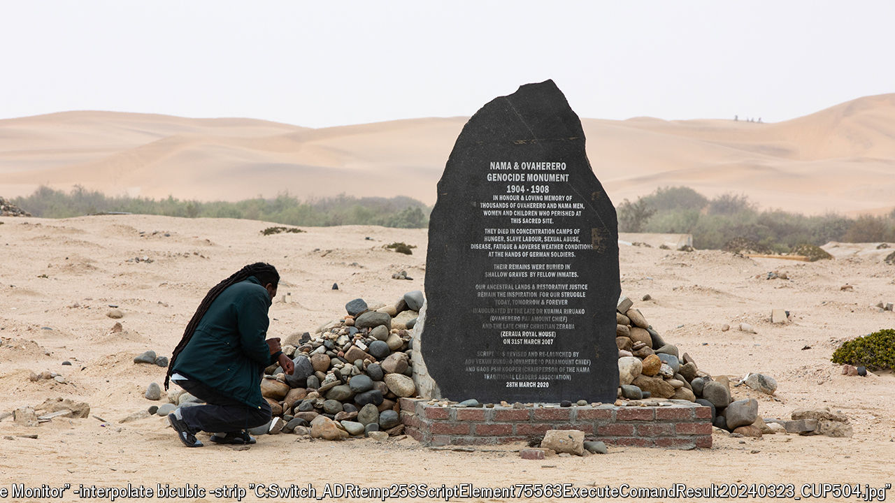

###### House of horrors

# One of the smallest museums in Africa might be its most important 

##### A curator’s battle to commemorate Germany’s forgotten genocide in Namibia 

 

> Mar 21st 2024 

There are plenty of reminders of the colonial past in Swakopmund, a town on Namibia’s coast, if you know where to look. Mechanics work beneath battered Mercedes; doughy cooks prepare doughy strudel; a guesthouse is named after a Bavarian prince. In the centre of town the privately run Swakopmund Museum is a mix of taxidermy and Germany. Near a stuffed seal is a cabinet of pilsner glasses used by those who left the Second Reich for German South-West Africa, as Namibia was known between 1884 to 1915. The museum’s curator concedes that it “does not tell the whole story” and cites a lack of funds.

To grasp a fuller account of German colonialism, travel to the town’s outskirts. In front of a small house is an outbuilding no bigger than a Volkswagen SUV. It is probably the smallest museum in Africa; it is certainly one of the most important. 

The Swakopmund Genocide Museum memorialises what scholars have described as the first genocide of the 20th century. From 1904 to 1908 around 65,000 Herero people (80% of the total) and 10,000 Nama (50%) were killed as part of a brutal German response to a rebellion. The methods foreshadowed and inspired the Nazis. (The brown shirts worn by the Nazi Party’s paramilitary  came from a surplus supply of colonial uniforms.) Thousands were crammed into concentration camps. Their skulls were sent to Germany for examination by eugenicist scientists. 

 


“I set this up because the Swakopmund Museum does not tell the story of my people,” says Laidlaw Peringanda (pictured), whose museum officially gained permission to operate in January. It is sparse, consisting mostly of homemade print-outs of black-and-white photos. The images are of skulls, emaciated children in camps and women chained together. 

Aside from an old German rifle that Mr Peringanda swivels in his hand as he talks, there is just one artefact: an (a traditional headdress worn by Herero women). It was sent by a rich Swiss woman who found it in her private collection. Many totems still remain outside Namibia. 

After more than five years of talks,  Germany’s then foreign minister announced that “We will now officially call these events what they are from today’s perspective: genocide.” Germany promised to spend more than €1bn ($1.1bn) over 30 years on aid and development projects. 

Though some Herero worry that they will not see the cash, no other European country has offered to pay as much for colonial crimes in Africa. In 2013 Britain offered about £20m ($31m) in compensation to 5,000 elderly victims for abuse they suffered in Kenya in the 1950s, and only after a lawsuit. A Belgian commission was assembled to assess brutality in Congo but failed to issue an apology. France is keener on  than apologising. 

Mr Peringanda points out that Germany is no longer the main obstacle to a reckoning; there are two more important forces. The first is the Namibian government. Like neighbouring South Africa, from which the country seceded in 1990, Namibia is run by a party, SWAPO, whose legitimacy stems from its opposition to white rule. School textbooks make little mention of the genocide, lest it complicate the narrative that only they, SWAPO, resisted the whites. Ovambo, Namibia’s largest group, dominate SWAPO; Herero and Nama remain marginalised.

The second target is recalcitrants in Swakopmund itself. A monument to the German soldiers who died in the “war” against the Herero and Nama still stands near the beach. The statue makes no mention of atrocities; some powerful townsfolk worry that it could damage tourism. 

Later your correspondent crosses town to where researchers have detected mass graves of Herero. In a grimly ironic twist, the site is a cemetery used by affluent residents of adjacent suburbs. Only a black stone monument built by Mr Peringanda marks who else lies beneath the ground. He erected it after the council stated that many Herero had died here in “mysterious circumstances”. His tiny but vital museum clears up any mystery. ■


