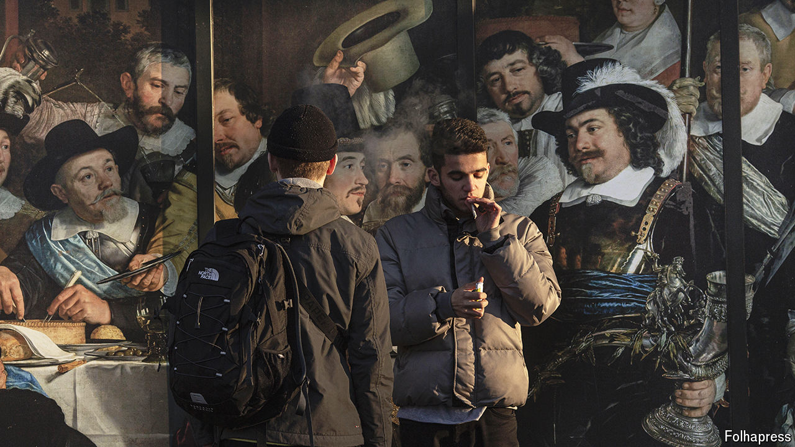
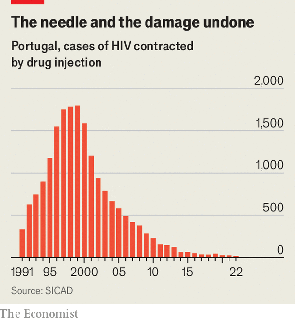

###### From high to low

# Drug decriminalisation in Europe may be slowing down 

##### An increase in gang violence and open-air drug use is changing politicians’ minds 

 

> Mar 21st 2024 

“HASH? WEED? Cocaine?” In central Lisbon, even your grey-haired correspondent gets the pitch. The Vale de Alcântara, a valley housing a main road alongside a park, is strewn with garbage and drug paraphernalia. Dealers and users huddle in a strip of dilapidated buildings. Nearby is a government-run facility where they can get high safely. But it is often full, and some like it better outside.

Portugal is held up as a model of drug liberalisation. In 2001 it decriminalised possession of all drugs for personal use. Selling remains illegal, but the government’s “harm-reduction” strategy softens the role of the police. Instead it offers therapy to those who want to quit and “dissuasion commissions” with a range of interventions, from fines to travel bans, to shove them in that direction. It also helps provide clean needles and tests for drug purity.

Such policies, and similar ones in the Netherlands, are credited with reversing epidemics of addiction in the 1980s and 1990s, limiting drug-related crime and disease. Despite political resistance, many European countries have gradually followed this trend towards harm reduction.

But second thoughts are rising. In some countries open-air use of hard drugs is more visible; in others, such as Sweden and the Netherlands, gang violence is up. This has led some politicians to go back to advocating tougher law enforcement.

 


Portugal’s reforms are still seen as successful. In the 1990s, notes João Goulão, head of the country’s drug-policy unit, perhaps 1% of the population used heroin. Since the switch from criminalisation to harm reduction, needle-borne HIV infections have fallen from around 1,800 in 1999 to 20 in 2022 (see chart); deaths from overdoses by four-fifths. 

But the financial crisis and the pandemic have led to drug relapses. Poor immigrant populations have become heavily represented among addicts, stirring discontent in Porto, Portugal’s second city, where open-air use had spread to richer neighbourhoods. The city council and mayor called for penalties for taking drugs in public places, especially near hospitals and schools. Discontent over drugs is also rising in the Netherlands, once known for its liberal drug policies. When an apartment thought to house a drug lab blew up in Rotterdam on January 29th, killing three people, the mayor, Ahmed Aboutaleb, was, coincidentally, in Colombia to learn about combating drug cartels. Femke Halsema, Amsterdam’s mayor, said the Netherlands risked becoming a “narco-state”.

That is an exaggeration, but reflects growing concerns. In the 1970s the government wanted to legalise cannabis altogether, but settled for decriminalising possession. Police began tolerating cafés where joints could be smoked on the premises or bought in small amounts to take away. In 1995 a new law began registering such “coffee shops”. Tourists streamed into them. 

Heroin was the more dangerous problem. In the 1980s authorities promoted harm reduction, the world’s first needle-exchange programme, substitution therapy with drugs such as methadone, drug-testing centres and safe-injection rooms. In the early 2000s a few hundred addicts who repeatedly failed substitution therapy were even given free heroin at government facilities. This seemed to work: by 2010 the heroin-addict cohort was small and ageing. 

Decriminalising marijuana possession, too, came to be seen as a success, with scant violence around small sales and usage little higher than in countries nearby. Others have eventually not only decriminalised but legalised cannabis: Malta, Luxembourg and, on February 23rd, Germany.

But in the Netherlands many do now see drug tourism as a plague. Amsterdam has banned smoking marijuana on the street in its red-light district and cut the number of coffee shops by two-fifths. Other cities have restricted access to Dutch citizens only—but illegal dealers have returned as a result.

And although heroin use has declined, party drugs are on the rise. The number of Dutch adults who said they had used cocaine in the past year rose from 1.6% in 2015 to 2.4% in 2022. The rise of cocaine has led to a rise in violent trading. On February 28th a Dutch court ended the country’s biggest ever drug-gang trial, sentencing Ridouan Taghi, a syndicate boss, to life in prison for ordering a string of killings. 

Gang activity is not led mainly by Dutch demand: consumption has been rising across Europe, and the Netherlands is ideal for distribution, thanks to the huge ports at Rotterdam and Amsterdam and to Schipol airport. In 2023 police seized 60 tonnes of cocaine at Dutch ports, up from 51 the year before. But as the police at the biggest ports have become tougher, the traffic has shifted to smaller ones.

The flaws in both the war on drugs and the ceasefire strategy have made other countries pursue half-measures. Norway considered Portuguese-style decriminalisation in 2021, only for the coalition of support to crumble at the last minute; it is pursuing piecemeal changes instead. Denmark, where hash has been tolerated in Christiania, a commune-like neighbourhood in Copenhagen, is going through one of its occasional crackdowns, after a gang murder last summer. And though Germany has just legalised possession of cannabis, it stopped short of making it available for sale in shops or chemists. 

Paul Griffiths, the science director at the European Union’s drug-monitoring agency, says that too much focus is put on criminal policy alone. Global factors play a big role; for example the Taliban’s supression of opium-poppy production could lead European heroin supplies to dry up. His agency fears the rise of ultra-potent synthetic opioids called nitazenes, which have caused a surge of deaths in Estonia and Latvia. Fentanyl, which has ravaged America, has not yet reached Europe in great quantities, but it may only be a matter of time before it surges in.

In any case, says Mr Griffiths, drug policy cannot be applied in isolation. It must be joined with health care, housing, public education and other services. Europe features strong welfare states, which is one big reason 6,000-7,000 die of overdoses there each year, compared with around 100,000 in America with a similar population. But that does not make the traffic or use of drugs cost-free. Harm reduction, after all, does still imply harm. ■


