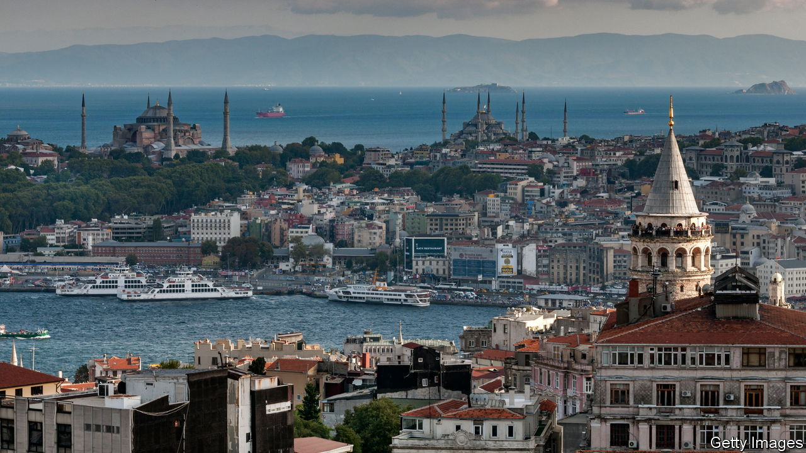

###### On shaky ground

# Earthquake fears loom large in Istanbul’s mayoral race 

##### The money involved is staggering 

 

> Mar 18th 2024 

MELIH OZUNAL and his neighbours had reason to worry about the state of their apartment block in Goztepe, on Istanbul’s Asian shore. They had long known that the cement used in their building, which dates back to the late 1980s, had been made from corrosive sand dredged from the bottom of the Marmara Sea. But last year, after he discovered that the contractor had used 16-millimetre iron rebars instead of the 18mm ones mentioned in the original plans, Mr Ozunal, an architect, asked the local authorities to check the building’s earthquake resilience. “Everyone here is anxious,” he says, as inspectors use a hammer to test the concrete in one of the columns. “We may need to have the building torn down and replaced.” 

Concerns over the state of Istanbul’s ageing housing stock have mounted since last year, when a  killed more than 53,000 people in southern Turkey. The city of 16m people is bracing for a similar disaster. Leading seismologists put the probability of a 7.0-magnitude earthquake striking the region before 2030 at over 60%. Europe’s biggest city is not ready. Istanbul’s infrastructure is in reasonably good shape, but its buildings are not; the majority are not up to the required code.

The mayor, Ekrem Imamoglu of the opposition Republican People’s Party, says about 200,000 (out of 1.2m) are at risk of collapsing or suffering irreparable damage once the ground starts to shake. Earthquake preparedness is sure to be on the minds of many , as well as voters across Turkey, when they elect mayors and council members on March 31st. Mr Imamoglu’s own job will be on the line.

An economic malaise, accompanied by a severe housing crisis, is holding up progress. For many Istanbul residents, the costs of building back better, even with some help from the state or the city, are too high to bear. , which in February topped 67% in annual terms, has warped the property market. The cost of construction materials, as well as a tendency to hedge against inflation by investing in real estate, have propelled rents and property prices. Over the past two years,  in Istanbul and Ankara, the capital, have soared by a dizzying 272% and 332%, respectively. 

Earthquake-proofing has turned into one of the main themes of Istanbul’s mayoral campaign. Murat Kurum, the ruling Justice and Development party’s candidate, has promised to deliver 650,000 new housing units in five years if elected. Past experience suggests this is a pipe dream. The project’s price tag could easily top $50bn, roughly the size of the country’s entire construction sector and 5% of GDP.

Mr Imamoglu has made a more modest pledge, to cover most of the construction costs of 50,000 new buildings, but even that may be optimistic. Since 2019, when he was elected, the municipality’s construction company has completed work on only 10,000 housing units. No more than 2,000 buildings have been demolished. On its own, the mayor’s office does not have the resources needed to overhaul Istanbul’s housing stock. Turkey’s president, Recep Tayyip Erdogan, recently suggested his government might be able to help, assuming the city votes for the right candidate, meaning his own. “Who runs the country today?” he told a crowd of supporters, while stumping for Mr Kurum. “We do. Does the person in charge of Istanbul have our resources? He does not.” ■


