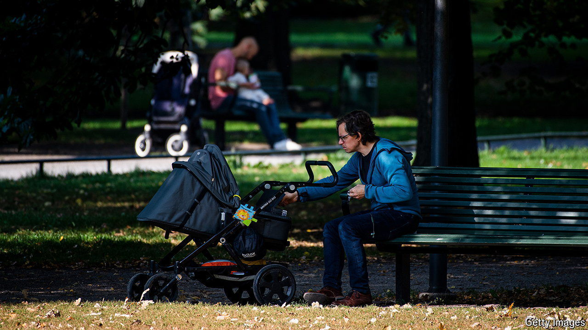
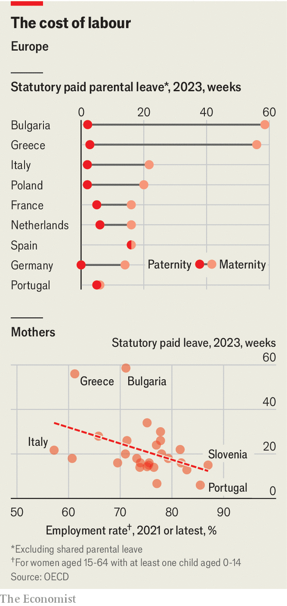

###### Bringing up baby

# Europe is giving more parental leave to its workers 

##### And fathers are getting more 

 

> Mar 21st 2024 

Parents OFTEN feel they can do nothing right. Whether they are too cautious or too relaxed, someone will think they are doing it wrong. And the conundrums begin before childbirth: how much time to take off work afterwards? Too little and they will miss out on valuable time with the offspring; too long, and their boss may write them off as slackers. It is not just parents who worry about this. Policymakers have mulled the question for decades.

Most European countries have been making parental leave more generous since the 1980s. The EU sets a statutory minimum of 14 weeks leave for mothers and, since 2022, two weeks for fathers. But many member states offer leave that is much longer: the average across the EU is 21 weeks for women and three weeks for men, but lengths vary wildly (see top chart). 

 


Paternity leave has been changing the most. Nordic countries were the first to introduce it by statute. Sweden had in 1974 introduced shared paid leave that could be taken by either parent; it now amounts to 69 weeks. In the 1990s Norway became the first country to reserve four weeks of the paid parental leave for fathers, and Sweden followed two years later. Every EU country has done the same since then. 

Germany will soon become the last member state to introduce it, offering two weeks in order to comply with the recent EU rule. Some countries are now making maternity leave less generous in order to fund more shareable leave, in the hope that fathers will take more. But in systems where leave can be shared, 90% still ends up being taken by the mother. In 2021 Spain became the only country to equalise the length of maternity and paternity leave: 16 weeks for both parents. If parents took equal amounts of leave, that could reduce the incentive for employers to pass over women when hiring. 

Emmanuel Macron, France’s president, has announced, in an effort to improve female labour-force participation, that he would like to change parental leave to six months for each parent; at present, including shared leave, women can get up to 42 weeks paid time with their babies. There is a rough inverse correlation between the generosity of maternity leave and a mother’s propensity to work (see bottom chart). But many factors are in play: tradition, for example, might dictate that women remain at home, particularly if they have few career opportunities. 

Even the most generous system may fall short. “If leave is not paid, it remains a benefit for rich people who can afford to take it,” says Emily Oster, an economics professor at Brown University. Mr Macron has promised more funds: “Better-paid parental leave will allow both parents to be with their children for six months,” he said in January. It may also encourage them to have more babies: a study published in 2022 found that well-paid leave can indeed boost fertility a bit.■


