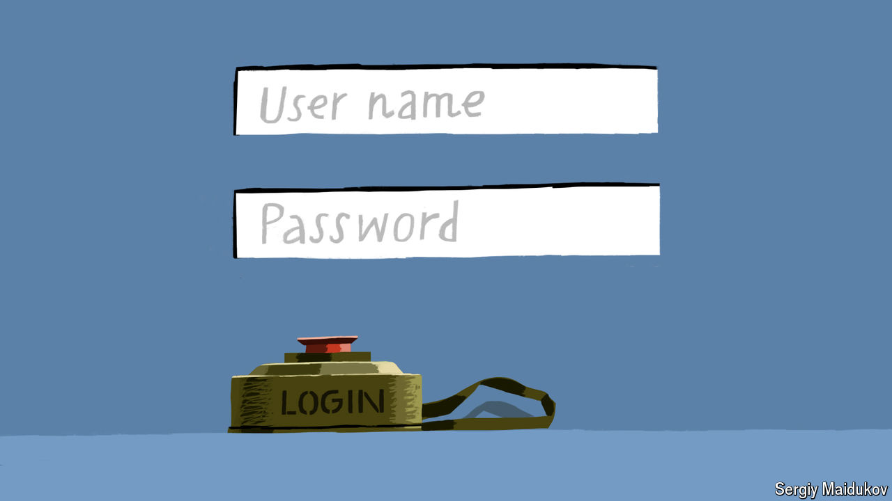

###### Stealth bombers

# The cyberwar in Ukraine is as crucial as the battle in the trenches 

##### So far, no one is winning 

 

> Mar 20th 2024 

There is nothing to identify who is inside the office building in Kyiv, but the Russians do not need a nameplate to tell them. Windows on its higher floors are still smashed from a drone attack last summer on the nerve centre of Ukraine’s cyber-defence operations. Both sides are locked in combat to steal intelligence and sow panic by attacking telecommunications, critical infrastructure, military computers and whatever else they can hack into. 

This war is being fought in the shadows, says a Ukrainian intelligence official. Last June, he says, “big strikes” shut down petrol stations and internet providers in Russia’s Belgorod and Rostov regions; but few outsiders noticed and the Russian authorities said nothing about it. Tim Karpinsky, head of the Ukrainian Cyber Alliance, a “hacktivist community”, says that many Ukrainians and Russians, including vast criminal networks, once worked together in IT and cyber. When the two countries went to war, this meant the Ukrainians had “the skills, tools, knowledge and abilities to fight back effectively”. The cyber warriors see themselves battling on a new front line that is as crucial as the war in the trenches.


Big Russian attacks a decade ago were wake-up calls. In 2015 hackers infiltrated power-station systems and turned off the electricity for several hours in parts of western Ukraine. Kyiv’s grid was attacked a year later. In June 2017 banks, energy companies and government computers were clobbered, writes an analyst, David Kirichenko, in a new report. Data from 10% of computers across Ukraine were erased, he says, causing widespread disruption.

One result, says Dmytro Osyka of Modus X, the cyber-security arm of DTEK, which produced about a quarter of Ukraine’s energy before the invasion of 2022, is that no one can now break into the controls of their power stations, because they have been taken offline and quarantined from the rest of the company’s cyber infrastructure. Since the invasion, the cyber-defence team within DTEK has quadrupled to 40 people. 

Hide and seek in the ether

Volodymyr Korniichuk heads security at Diia, an app used by 20m Ukrainians that contains their ID card and other documents and lets them pay taxes, get social-security payments and so on. “There hasn’t been a week when we have not been under attack,” he says. Behind one Russian operation a company was discovered that had been incorporated two weeks before the invasion. It was traced to an address of a company registered in London.

In December, in the biggest single successful strike of the war, Russian hackers took down Kyivstar, Ukraine’s largest mobile and internet provider, shutting down services for several days. Standing in front of a large screen, Major Yurii Myronenko, head of the State Service of Special Communications and Information Protection of Ukraine (SSSCIP), points at graphs detailing who was responsible. SSSCIP comes under the security services, so he is in uniform. It is also at the centre of a galaxy of state, military and private cyber-defence outfits and helps co-ordinate them all. There were 2,194 “cyber incidents” in 2022, he says, of which 1,048 were “major or critical”. In 2023 there were 2,554, of which only 367 were serious. So Ukraine’s cyber defenders have drastically reduced the rate of serious attacks. But in the first two months of this year the Russians stepped it up, and he expects 2024 to be “even harder in terms of cyber warfare”. 

He says the SSSCIP has learned that 10% of attacks come from cyber units of the Russian security services, while the rest come from affiliated criminal hacker groups and others. The single most effective Russian cyber unit is called Armageddon, which belongs to the FSB security service. Some of its personnel are said to be ex-members of the Ukrainian security services in Crimea who defected to Russia when the peninsula was annexed in 2014. 

Mr Kirichenko says that when the invasion of 2022 began, experts feared a “digital Pearl Harbour”; but Ukraine’s defences remarkably “stood firm”. Now, he warns, “the Russia-Ukraine cyber war is becoming more aggressive than ever and will continue to expand in the future to potentially more devastating critical…targets.” ■


