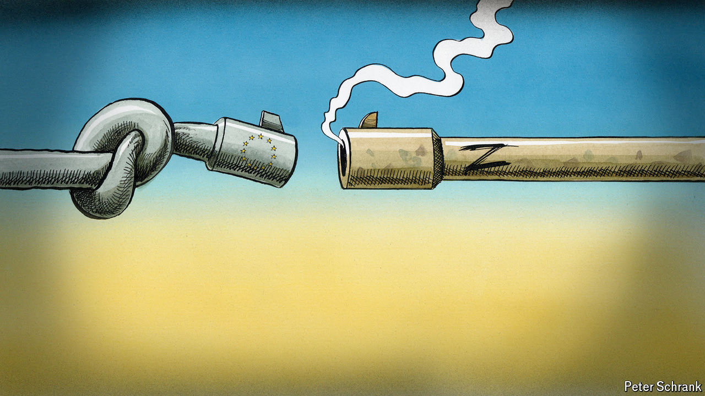

###### Charlemagne

# Ukraine’s European allies are either broke, small or irresolute 

##### In search of the perfect partner to derail Russian aggression 

 

> Mar 21st 2024 

The perfect European, or so the sarcastic quip goes, should drive like a Frenchman, cook like the Dutch, be as organised as the Greeks and as humorous as a German. A variant of the joke might haunt those trying to devise the perfect ally for Ukraine as it fends off Russian aggression. Imagine a country the size of Latvia, with the budget problems of the hard-up Italians, the willingness to pitch in of Kremlin-loving Hungarians and the arms industry of neutral Ireland. Alas, that is close to the reality of Europe today. Ukraine needs allies that are hefty, big military spenders and decisively on its side. As things stand, countries are either too small to matter, too broke to help or too hesitant to use their power—if not all three. A new approach to meld the 27 countries of the EU into one sizeable and decisive ally is necessary yet elusive. 

Statesmanship has been woefully lacking. A summit of EU leaders starting on March 21st will feature plenty of sound-bites on Europe’s unwavering support, but little else. The mood ahead of the confab has been gloomy. What has become a war of attrition seems to favour Russia, whose economy has proved resilient to Western sanctions. Support from Europe and America has helped keep the Ukrainian state solvent and its soldiers in the battle. But now a dearth of artillery shells, supplies of which Europe has promised but is struggling to deliver, means holding the front line is the pressing aim for Ukraine, not counter-attacking in a way that might force Russia to sue for peace. Worse, if Donald Trump wins the American election in November, Europe could be left with the prospect of fending off Russia alone. In a bid to galvanise Europe, France’s President Emmanuel Macron has gone so far as to suggest some NATO countries might send troops to Ukraine, prompting simultaneous howls of enthusiasm, panic and derision.


On paper, Europeans should be in a position to deliver more than enough support to Ukraine. The 30 European countries that belong to NATO have, taken together, the world’s second-biggest military budget (exceeded only by America’s), vastly outspending Russia. Their economy is bigger than America’s. And across the continent the desire for Ukraine to prevail is strong. The realisation that Vladimir Putin would be unlikely to be satisfied with invading just one neighbour is chilling. 

The problem is that the attributes needed in a good ally are unevenly spread. Most of Ukraine’s most vocal backers are also the bloc’s smallest countries, whether Baltic or Nordic. Take Estonia, which is among the EU’s biggest defence spenders as a share of GDP. Its healthy public finances mean it can act on its word: Estonia has the highest bilateral aid to Ukraine per head of any EU country. But that only goes so far given there are just 1.4m Estonians. Kaja Kallas, the prime minister, wants all of Ukraine’s allies to spend an extra 0.25% of GDP on fending off Russia. The money coming from Estonia would on its own finance enough rounds for Ukraine to match a mere two days’ worth of Russian artillery fire. One EU member, the Czech Republic, has dazzled with its agility. In recent weeks it has managed to source 800,000 rounds of artillery from far and wide—enough to match Russia for three months. 

Some countries are bigger—but lack Estonia’s sound public finances. Total defence spending by European members of NATO in 2023 was about $65bn below what it would be if all members met the alliance’s minimum target of 2% of GDP. Over half of that deficit stems from a handful of countries with a debt-to-GDP ratio of over 100%. Italy, Spain and France are among the biggest EU countries, but have had little fiscal leeway to invest in military capacity in recent years. Their contributions to Ukraine have been underwhelming. For all Mr Macron’s Baltic-style rhetoric, the amount of military aid France has sent to Ukraine remains paltry (but is more than made up for by the quality of what is sent, officials in Paris argue, stressing its supply of howitzers and cruise missiles).

One EU country is big, rich and thus able to spend lots. Alas, Germany falls into the hesitant camp. Its chancellor, Olaf Scholz, is ramping up defence spending and has pledged lots of cash and military equipment to Ukraine—often belatedly. Having dithered over sending weapons of any sort, then delayed the delivery of tanks, he is now opposed to the delivery of Taurus missiles that Ukraine thinks could help. Some in his party seem comfortable with the idea of a “frozen conflict”, or running on a doveish platform in next year’s elections. Poland, perhaps the only big, solvent country hawkishly worried about Russia, has led a successful charge to throttle imports of Ukrainian agricultural goods, thus hobbling its ally’s economy to placate its own farmers.

With friends like these

If some countries are short on size and others on either money or ambition, why not join forces? EU schemes abound, some better than others. A boost to the “European Peace Facility” agreed on March 18th was meant to deliver military kit worth €5bn ($5.4bn) to Ukraine—but turns out to be in part recycled past commitments. A better idea, floated by Estonia and now backed by Mr Macron, might be for the EU to jointly borrow €100bn that would go towards bolstering the bloc’s defence. This would be a repeat of the pandemic-busting Next Generation EU fund worth €750bn. 

Such a scheme could turn the EU into, in effect, a single large, solvent and potentially ambitious ally for Ukraine. For now it is being resisted by richer countries, mainly in the north of Europe, which end up repaying most of the money borrowed by the EU (and which agreed to the pandemic fund only as a one-off). Sceptics worry that a large defence fund would be hostage to a familiar type of sclerosis that befalls joint EU projects, often involving Hungarian vetoes. They may be right. But Ukraine might well prefer one big yet imperfect ally to lots of smaller ones that all fall short in their own different ways. ■


