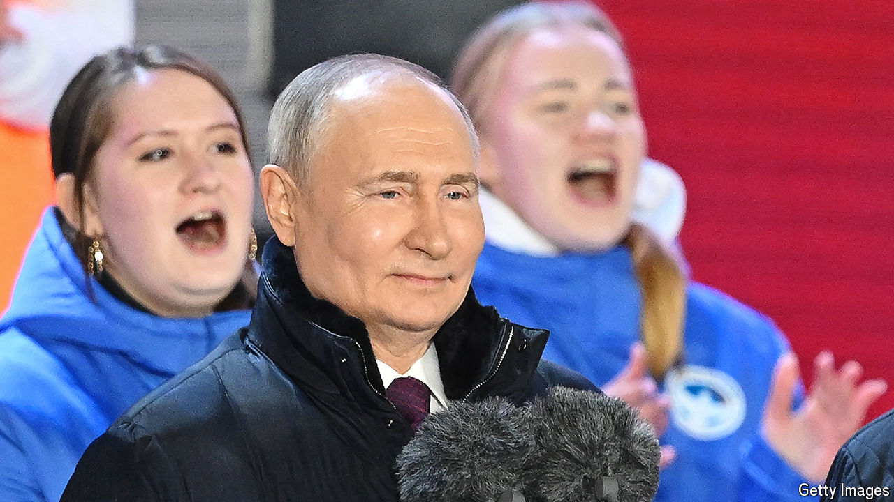

###### After the show

# Vladimir Putin celebrates his fake election win 

##### He claims he secured 87% of the vote 

 

> Mar 17th 2024 

Vladimir Putin looked smirkingly triumphant as he strode onto a Red Square that had been filled with thousands of flag-waving extras, herded in to demonstrate unity and support. This spectacle, on March 18th, a day after the election that gave him yet another , was designed to give legitimacy to a dictator whose power rests on violence, lies and corruption; and it cleverly doubled up with the celebration of the annexation of Crimea exactly ten years earlier. “Glory to Russia,” he shouted, clutching a microphone and cueing up the Stalin-era Soviet national anthem, which he brought back to Russia in 2000 after he first became the country’s president. 

But neither the election, which was spread over three days with no proper scrutiny and no true opposition candidates, nor Mr Putin’s victory with a whopping 87% of the vote, are real. Not only had the exercise excluded the very possibility of choice, but up to 30m votes, which would be nearly half of the total, appear to have been fabricated, according to a statistical analysis of electoral anomalies by Sergei Shpilkin, a reputable Russian data analyst.

Yet the result is meaningful in another way. As Kirill Rogov, a Russian political analyst, explains, it marks Russia’s transition from a merely authoritarian regime enjoying wide popular support, which it inflated through manipulation, rigging and propaganda. The election shows it has now turned into a Central Asian-style personal, unconstrained dictatorship. The regime “lacks sufficient support for its policies ‘from below’, and has to resort to violent and systemic repression, ideological indoctrination and control over the public sphere,” writes Mr Rogov. 

This transition began with the subversion of Russia’s constitution in 2020 through a phony referendum. That year was also when Alexei Navalny, Mr Putin’s most prominent rival, was first poisoned. The crushing of his movement, the elimination of opposition and, most important, the war against Ukraine allowed Mr Putin to impose a level of repression that he could not have managed in peacetime. 

The biggest and most symbolic pre-election move by Mr Putin was Navalny’s murder. It was a clear demonstration to the country’s elite and to the world that for Mr Putin there are no more red lines. This is perhaps why, in his first public appearance after claiming his victory, Mr Putin spoke of Navalny, whose name he had until then always avoided uttering. “Yes, he passed away. This is always a sad event,” he sneered, barely able to hide his joy. 

However, the sham election has also revealed a degree of pent-up resentment against Mr Putin and his usurping of power that is hard to quantify. Across Russia tens of thousands of people heeded Navalny’s call to turn up at midday on the last day of the vote and spoil their ballots or vote against Mr Putin as a form of protest. Several participants in the “Noon against Putin” protests in Moscow said they felt the same mood of solidarity as at Navalny’s funeral on March 1st. 

Photos posted on social media showed queues stretching for hundreds of metres, with helmeted police and prison vans waiting nearby. Protesters disseminated photos of their ballot papers marked “No to war” and “Putin is a thief and murderer”. Many crossed out Mr Putin’s name and replaced it with “Navalny”. Some voters in Moscow held on to their ballots, took them to the cemetery where Navalny is buried and placed them at his grave. Both Navalny’s funeral and “Noon against Putin” show that people will protest when they are not faced with guaranteed imprisonment and physical abuse. 

The repression is only likely to increase as the war puts ever more strain on the economy and funding it gets harder. One of the main sources of future instability, according to Alexandra Prokopenko of the Carnegie Russia Eurasia Centre in Berlin, could be the enforced redistribution of private assets, which has already begun and will need to speed up. As Mr Putin said in a pre-election speech, the old “elite” which gained money and status on the back of privatisation and the market reforms of the 1990s “has lost its credibility”. He wants it replaced by “military, reliable and trustworthy people who have proved their loyalty to Russia”—and to him personally and his war aims. Mr Putin may hope this will make his war policy and his legacy irreversible. But that may be harder to achieve than awarding himself 87% of the vote in his special electoral operation. ■


