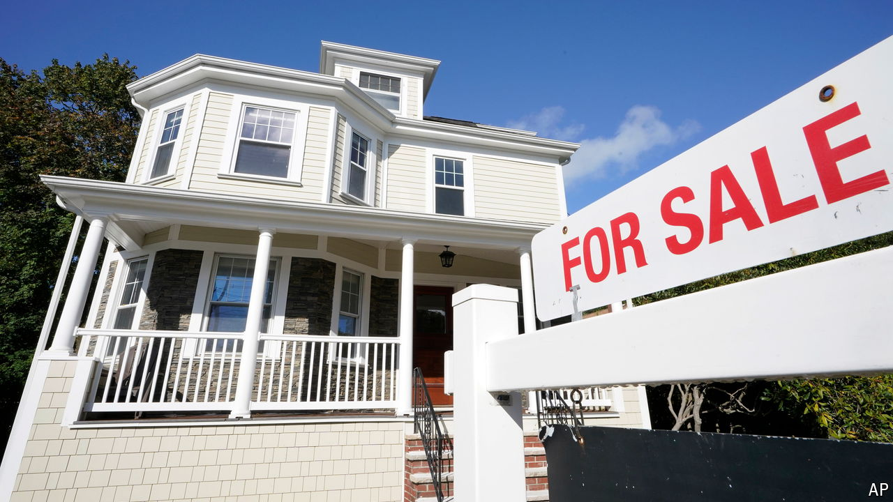
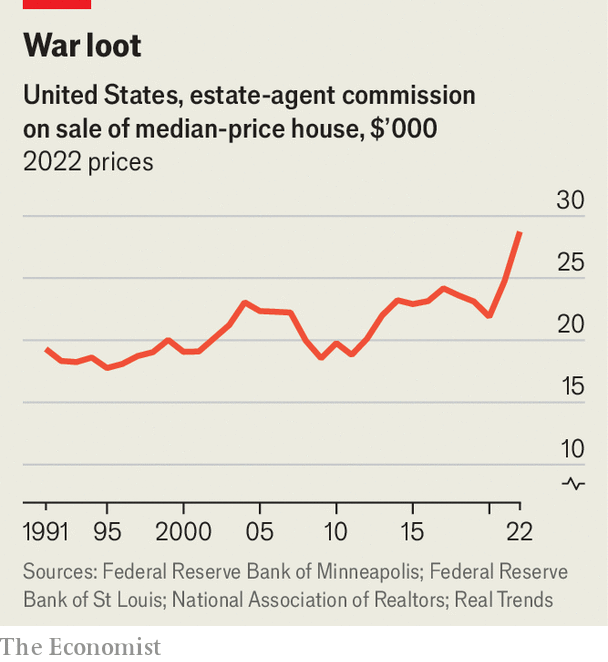

###### The 6% problem

# America’s realtor racket is alive and kicking 

##### Celebrations over a settlement between agents and homeowners are premature 

 

> Mar 21st 2024 

For five years homeowners have been waging war. They have railed against the extortionate fees charged by estate agents, known as “realtors” in America, which are enforced by anticompetitive practices. They have filed lawsuits against brokers; fought cases against the National Association of Realtors (nar), an industry body; and sued the keepers of databases of homes for sale, known as “multiple-listing services”. Juries and judges across the country have found merit in their claims, deciding that homeowners have been ripped off, manipulated and duped into overpaying. In recent months they have awarded billions of dollars to plaintiffs and sent the two sides into negotiations over the rules that control realtors’ practices.

How wonderful it would be to believe that a settlement reached on March 15th, between the plaintiffs in several class-action lawsuits and the NAR, was about to usher in a fairer, cheaper era. That is how the agreement was described by the , which plastered the headline “Powerful realtor group agrees to slash commissions to settle lawsuits” across its scoop revealing that the agreement had been reached. CNN wrote that the settlement would “effectively destroy” the industry’s anticompetitive rules. The notion that victory is now assured has even been seized upon by the White House, which is desperate for any kernel of good news about housing affordability ahead of the presidential election in November. On March 19th President Joe Biden declared that the settlement was “an important step toward boosting competition in the housing market”, adding that it could reduce transaction costs by “as much as $10,000 on the median home sale.”

It is not at all clear, however, that this settlement will actually bring about a Utopia of greater competition and lower commissions. And the stakes are too high to accept such a settlement, which also protects brokers and agents from future lawsuits that might seek more reform. Under the existing system Americans pay 5-6% commission on almost every sale, triple the level in other rich countries. Since they trade homes collectively worth $2.8trn each year, if commissions fell to just 2% Americans would save $110bn in fees annually. 

 


The problem boils down to a tactic called “steering”. In America it is both legal and expected that a home seller will make a blanket offer of compensation to any realtor who brings them a buyer. Often this is a proposal to split commission equally: if the total compensation is 6%, the seller’s agent and the agent of the buyer will each receive 3%. The problem is that although sellers can negotiate with their own agent and drive down that side of the bargain, if they attempt to offer a low commission to a buyer’s agent they will be told—correctly—that their home will get less interest and no decent offers. 

It is not necessary to believe that realtors are morally bankrupt in order to see how this system perpetuates itself. The risk that even, say, 10% of agents might steer buyers away from a low-commission listing is enough to ensure that all the honourable ones benefit, since sellers offer 3% to ensure they do not lose out. This enforces a floor in total commissions.

Keep fighting

The settlement, which needs to be approved by a judge before being implemented in July, does little to tackle this underlying problem. One of its main provisions is that offers of buyer-agent compensation can no longer be published on a multiple-listing service, the databases used in the industry. But they can still be made, and can be published on websites or explained via text or a phone call. In Facebook groups and Reddit threads, realtors are already discussing such workarounds. 

Another provision is that, before employing an agent’s services, buyers must sign an agreement outlining how the agent will be paid. At present buyers almost never discuss, and often do not even know, how much money their agent is making. They just know it is not their problem, since the fee is covered by the seller. 

It is just about possible to see how this provision could erode the floor in buyer-agent compensation. If agents are required to tell buyers they intend to collect 3% of the sale price, and that—in the unlikely event a seller is not offering compensation—the buyer will be on the hook for it, cash-strapped buyers might seek a cheaper option instead. They might also reject the idea that their agent is worth 3%, and could argue for any compensation above a certain level, perhaps 1%, to be kicked back to them after the purchase. 

Yet this probably assumes too much savvy on the behalf of buyers, and too little ingenuity from agents. Realtors might simply agree to add a clause to any contract reassuring buyers that they will not go after them for cash in the event a seller offers low commission, before steering them away from such properties, notes Rob Hahn, an industry analyst. 

The Department of Justice (DoJ) could intervene. It did so in a case in Massachusetts, arguing that the agreement would not fix the problem of steering and was therefore insufficient. Officials appointed by the Biden administration have been constrained by a letter sent by those in the Trump one, which agreed to close a probe into the industry. When the current DoJ attempted to reopen it, the department was sued by the NAR, which argued it should not renege on the earlier promise. But an appeals court in the District of Columbia hearing this case sounded sceptical of the NAR’s arguments. That could pave the way for the DoJ to make a move.

Whether by killing the current settlement or opening its own probe, the doj would be wise to act. Homebuyers and sellers in America do not stand a chance of paying a fair price for commissions under the current approach. And the settlement as agreed offers no guarantee that they will have such a chance in the future. ■


