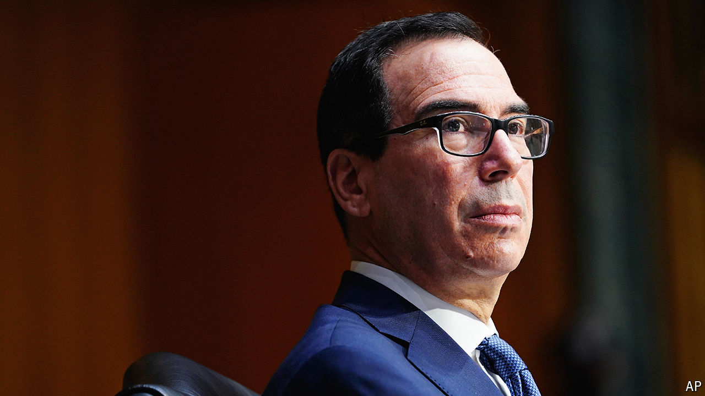

###### Hamilton’s heir

# First Steven Mnuchin bought into NYCB, now he wants TikTok 

##### Is there any limit to his ambitions? 

 

> Mar 21st 2024 

Time served on Wall Street has long smoothed the path to the top job at America’s Treasury. Before he was the first treasury secretary Alexander Hamilton could boast, among other things, a role in establishing the Bank of New York, which is still in business. More recently, and somewhat less heroically, Robert Rubin and Hank Paulson both ran Goldman Sachs, a bank, before taking office. As its name suggests, the “revolving door” sends people in the other direction, too. Mr Rubin went on to hold senior positions at Citigroup, another bank. Cerberus Capital Management and Warburg Pincus, two investment firms, are chaired by John Snow and Timothy Geithner respectively.

Now Steven Mnuchin, a former partner at Goldman Sachs who served as treasury secretary throughout the presidency of Donald Trump, has leapt back into the limelight. In 2021 he set up Liberty Strategic Capital, an investment firm. That much of the cash raised by Liberty came from sovereign-wealth funds in the Middle East raised some eyebrows. Until recently, the firm’s investments did not. But this month Liberty led the capital raise by New York Community Bank (NYCB) after losses relating to the bank’s property loans caused its shares to tank. That deal closed on March 11th. Three days later Mr Mnuchin told CNBC that he was trying to buy TikTok after America’s House of Representatives passed a bill that would force its Chinese owner, ByteDance, to sell the social-media app or face a ban in America.

Before this flurry of high-profile dealmaking, the firm mainly invested in privately held cyber-security firms. Some of its bets look like duds. In 2021 Liberty invested $200m in Cybereason, valuing the firm at $2.7bn. After plans to list its shares were shelved, Cybereason’s next capital raise in 2023 implied a valuation of just $575m, according to PitchBook, a data provider. At the beginning of 2022 Liberty invested $150m in Satellogic when the firm merged with a special-purpose acquisition company to list its shares. Today shares in Satellogic are worth less than a quarter of what Mr Mnuchin’s firm paid for them.

Mr Mnuchin has experience of investing in banking. In 2009 he led a group of investors that purchased IndyMac, a casualty of the global financial crisis, before offloading it in 2015. As part of nycb’s $1bn capital raise, Joseph Otting, who served as a senior Treasury official responsible for bank supervision during the Trump administration, has been appointed as the firm’s chief executive. Meanwhile, Liberty stumped up $450m of the cash. Although the deal bolsters NYCB’s capital, cleaning up its loan portfolio will take longer. The extent to which investors’ confidence holds up while this happens remains to be seen—indeed, this week the bank’s shares fell by 7% after analysts at Raymond James, yet another bank, expressed doubts about the speed of NYCB’s turnaround.

But managing a struggling regional bank is light work compared with engineering a buy-out of TikTok. Mr Mnuchin has not said who would feature in his consortium, only that it would be controlled by American businesses, and that no single investor should own more than 10%. Finding the money would surely be the most straightforward part of executing the deal. Democrats may balk at the involvement of private-equity funds. Any role for technology firms could raise antitrust concerns. Even an intentionally inoffensive squad—perhaps including Walmart, a supermarket, and Oracle, a software firm, which came close to striking a deal in 2020—would probably find the Chinese government standing in the way of a sale.

Mr Mnuchin’s background could also become a source of discomfort. As treasury secretary, he chaired the Committee on Foreign Investment in the United States, the country’s watchdog screening inbound investment, playing a crucial role in an earlier attempt by Mr Trump to force the divestment of TikTok. To some his acquisition of the social-media app would represent everything wrong with the revolving door. Others, especially those happy to keep using TikTok, would see it as mere swings and roundabouts. ■


