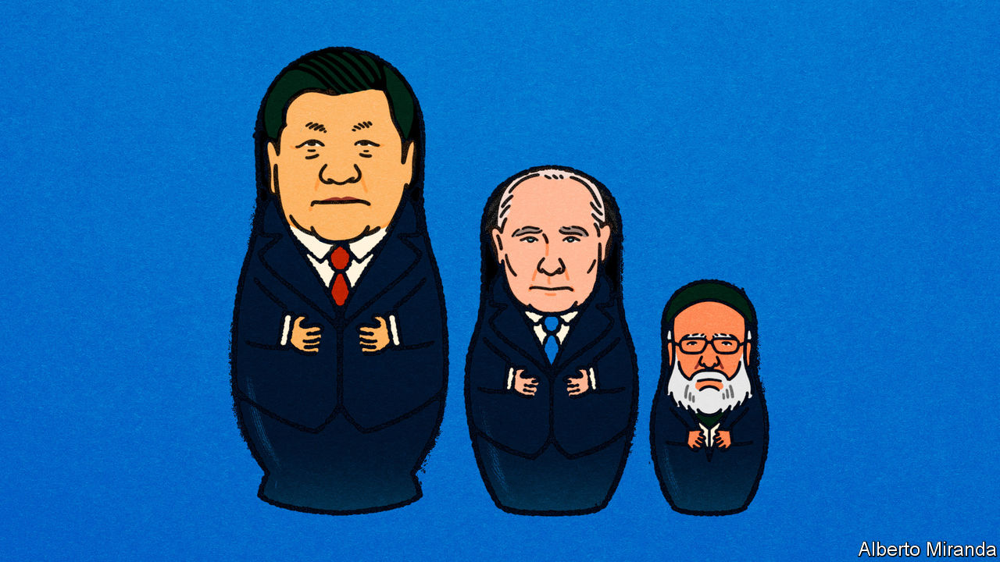
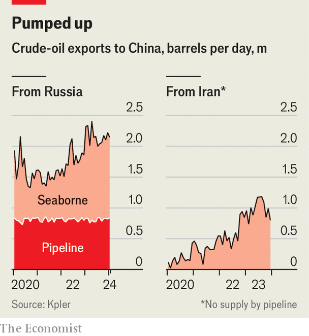
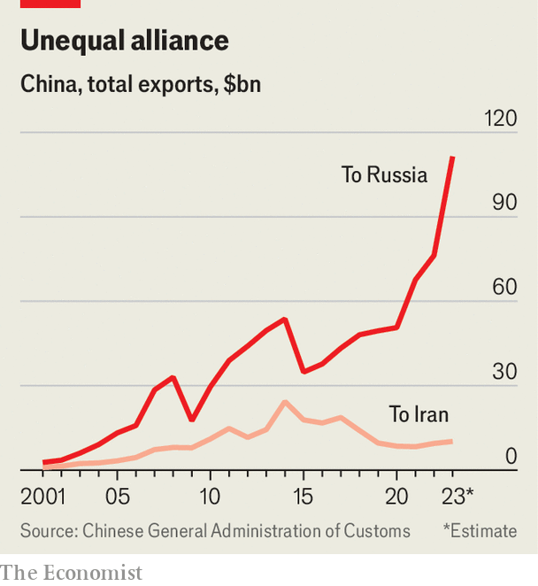

###### Oil and beyond

# How China, Russia and Iran are forging closer ties 

##### Assessing the economic threat posed by the anti-Western axis 

 

> Mar 18th 2024 

Vladimir Putin, Russia’s president, and Ebrahim Raisi, his Iranian counterpart, have several things in common. Both belong to a tiny group of leaders personally targeted by American sanctions. Even though neither travels much, both have been to China in recent years. And both seem increasingly fond of one another. In December they met in the Kremlin to discuss the war in Gaza. On March 18th Mr Raisi was quick to congratulate Mr Putin on his “decisive” election victory.

For much of history, Russia, Iran and China were less chummy. Imperialists at heart, they often meddled in one another’s neighbourhoods and jostled for control of Asia’s trade routes. Lately, however, America has changed the dynamic. In 2020, two years after exiting a deal , it reimposed a trade embargo on the country; more penalties were announced in January, to punish Iran for backing Hamas and Houthi rebels. Russia fell under Western sanctions in 2022, after invading Ukraine, which were recently tightened. Meanwhile, China faces restrictions of its own, which could become much more stringent if Donald Trump is elected president in November. United by a common foe, the trio now vow to advance a common foreign policy: support for a multipolar world no longer dominated by America. All see stronger economic ties as the basis for their alliance.

China has promised  with Russia, and signed a 25-year “strategic agreement” with Iran in 2021. All three countries are members of the same multilateral clubs, such as the BRICS. Bilateral trade is growing; plans are being drawn up for tariff-free blocs, new payment systems and trade routes that bypass Western-controlled places. For America and its allies, this is the stuff of nightmares. A thriving anti-Western axis could dodge sanctions, win wars and recruit other malign actors. The entente involves areas where links are already strong, others where collaboration is only partial and some unresolved questions. What might the alliance look like in five to ten years? 

Start with booming business. China has long been a big customer of petrostates, including Iran and Russia. But these two also used to sell lots of oil to Europe, which was close to Russia’s fields and easy to reach from the Gulf. Since Europe started snubbing them, China has been buying barrels at bargain prices. Inflows from Russia’s western ports have risen to 500,000 barrels a day (b/d), from less than 100,000 pre-war, reckons Reid l’Anson of Kpler, a data firm. In December imports of Russian crude reached 2.2m b/d, or 19% of China’s total, from 1.5m b/d two years ago. In the second half of last year, Iran’s exports to China averaged 1m b/d, a 150% rise from the same period in 2021. 

 


Whereas Western sanctions allow anyone outside the G7 to still import Russian oil, the Iranian energy industry is subject to so-called secondary sanctions, which restrict third countries. Since 2022, however, the Biden administration has relaxed enforcement and is willing to see rules broken if it means lower prices. The result has been a surge in , with the beneficiaries not China’s state-owned firms, which could one day be exposed to sanctions, but smaller “teapot refineries” with no presence abroad. China also gets cheap gas from Russia: imports via the Power of Siberia pipeline have doubled since Mr Putin’s invasion of Ukraine.

Russia and Iran have little choice but to sell to China. In contrast, China is only subject to restrictions on imports of Western technology—it does not face financial bans or trade embargoes. Therefore it can, and does, buy oil from other countries, which gives it the upper hand in negotiations with its allies. China gets Russian and Iranian supplies at a discount of $15-30 a barrel on the global oil price, and then processes the cheap hydrocarbons, turning them into higher-value products. The production capacity of its petrochemicals industry has grown more in the past two years than that of all other countries combined since 2019. China also cranks out enormous volumes of refined-oil products. 

Trade not aid

Boosting commodity trade between the three countries was always going to be the easy bit. Everyone wants oil; once on a ship, it can be sent anywhere. Yet China has an informal policy of limiting dependence on any commodity supplier to 15-20% of its total needs, meaning that it is close to the maximum it will want to import from Russia. Although the trade is still enough to provide Russia and Iran with a lifeline, it is helpful only if they can spend the hard currency earned on importing goods. Hence the ambition to develop other types of trade.

 


China’s exports to Russia have duly soared. As covid-19 rules strangled its economy, China sought to compensate by boosting manufacturing exports. Instead of shoes and t-shirts, it tried to sell high-value wares, such as machinery and mechanical devices, for which Russia acted as a test market. Last year the biggest importer of Chinese automobiles was not Europe, a destination for its electric vehicles, but Russia, which purchased three times as many petrol cars it did as before the war. 

Purchasing-manager surveys show that Iranian companies are constantly short of “raw materials”, a category including both sophisticated wares, like computer chips, and more basic ones, such as plastic parts. This hampers Iran’s manufacturing industry, which is as large as its petroleum sector. Yet China exports few parts and just 300-500 cars a month to Iran, compared with 3,000 or so to neighbouring Iraq. Not many of China’s manufactured-goods exporters, which sell a lot to the West, are brave enough to risk American retribution. 

In theory, more business with Russia could help Iran. The two countries supply each other with useful goods. Since 2022 Iran has sold Russia drones and weapons systems that are causing damage in Ukraine—its first military support for a non-Islamic country since the revolution in 1979. Early this year Iran also sent Russia 1m barrels of crude by tanker, another first. But sanctions make deeper ties tricky. Although Russia stopped releasing detailed statistics in 2023, ship-traffic data in the Caspian Sea show only a modest rise since 2022, when the country’s leaders set an ambitious target to boost bilateral trade.

Limited trade between Iran and Russia means they lack common banking channels and payment systems. Despite government pressure, neither SPFS (Russia’s alternative to SWIFT, the global interbank messaging system) nor Mir (Russia’s answer to American credit-card networks) is widely used by Iranian banks. Efforts to de-dollarise trade led to the creation of a rouble-rial exchange mechanism in August 2022, but transaction volumes remain low. 

To resist sanctions in the longer run, Iran and Russia also need investment—the weakest area of co-operation at present. China’s stock of foreign direct investment in the Islamic Republic has been flat since 2014, even as it has poured money into other emerging economies, and at roughly $3bn remains puny for an economy of Iran’s size. Deals agreed during the last visit of Iran’s president to Beijing, which could be valued at $10bn at most, are dwarfed by the $50bn China pledged to Saudi Arabia, Iran’s great rival, in 2022. 

Although China remains involved in Russian projects such as Arctic LNG, a gas-liquefaction facility in the country’s north, it has not snapped up assets dumped by Western firms, notes Rachel Ziemba of CNAS, a think-tank, nor backed new ventures. Russia had been expecting China to bankroll the Power of Siberia 2 pipeline, due to carry 50bn cubic metres of gas to the Middle Kingdom when complete—almost as much as Russia’s biggest pipeline used to deliver to Europe. Without China’s support, the project is now in limbo. 

A little help from your friends

The alliance has already achieved something remarkable: saving its junior members from collapse in the face of Western embargoes. But has it reached its full potential? The answer depends on the ability of its members to surmount external and internal obstacles.

Various forums aim to promote co-operation and cross-border investment. Last July Iran became the ninth member of the Shanghai Co-operation Organisation, a China-led security alliance that also includes Russia. In December it signed a free-trade agreement with the Russia-led Eurasian Economic Union, which covers much of Central Asia. In January it joined the BRICS, an emerging-market group that includes both China and Russia. 

These get-togethers give the trio more chances to talk. At recent summits, Iranian and Russian ministers have revived negotiations to extend the International North-South Transport Corridor (INSTC), a 7,200km route connecting Russia to the Indian Ocean via Iran. At present Russian grain must travel to the Middle East through the NATO-controlled Bosporus. The proposal, which includes a mixture of roads, rail and ports, could turn Iran into an export outlet for Russia. 

Iran’s and Russia’s bureaucracies have relatively little experience of working with one another, and the amount of investment required is daunting: the Russia-backed Eurasian Development Bank estimates it to be $26bn in Iran and Russia alone. Mustering such funding, in two countries not known for investor friendliness, would be hard at the best of times, let alone under sanctions. Still, the idea is gaining traction. On February 1st envoys discussed the next steps for the Rasht-Astara railway, a $1.6bn project that could ease freight transport in northern Iran. Last year Russia used part of the INSTC to move goods to Iran by rail for the first time. 

The more serious problem is that Iran’s and Russia’s economies are too similar to be natural trading partners. Of the top 15 categories of goods that each exports, nine are shared; ten of their 15 biggest imports are also the same. Only two of Russia’s 15 most-wanted goods count among Iran’s top exports. Where Iran does have demand gaps Russia could fill, such as in cars, electronics and machinery, Russia’s production capacity is constrained.

With gains from trade curtailed by sanctions, the relationship between the two countries will instead be a competitive one, particularly when it comes to energy. Since the West imposed an embargo on Russia’s oil, the country has been vying with Iran to win a bigger share of China’s imports, resulting in a price war. It is a battle that Iran is losing. Russia is a bigger oil producer and its energy is not subject to secondary sanctions. Some of its crude can also be piped to China, a cheaper option. 

Having the upper hand makes Russia uninterested in collaborating with Iran. Early in the war, Ukraine’s supporters feared that Russia and Iran would team up to evade sanctions. Instead, Russia developed its own “shadow” fleet of tankers and gave no access to the Iranians, says Yesar Al-Maleki of MEES, a research outfit. Iran has sought Russian funds and technology to tap its giant gas reserves; Russia has provided little help so far. 

In other areas, China has become a competitor to Iran. Until recently, the Islamic Republic’s sizeable manufacturing base and home market was a source of resilience. The country could take advantage of a devalued currency to sell things like nuts and toiletries, says Esfandyar Batmanghelidj of Bourse &amp; Bazaar Foundation, another think-tank. Its hope, in time, was to climb the value chain, exporting air-conditioning units and perhaps even cars. China is dashing such dreams. As it shifts towards higher-value exports, it is flooding Iran’s target markets with cheaper, better versions of these goods.

The West has little appetite for wholesale secondary sanctions. But existing measures will cause trouble. In December America announced penalties for anyone dealing with Russian firms in industries including manufacturing and technology. These look similar to those it imposed on Iran in 2011, which were suspended in 2015, after the nuclear deal was signed. Before the suspension, the measures caused Iran’s imports from China to plummet. There is evidence that some Chinese banks are already dumping Russian business. 

Although these new sanctions do not target Russia’s energy sector, they could hinder Russia’s oil trade with customers other than China if banks react by pausing business with the energy giant. Since October America has also imposed penalties on 50 tankers that it says breach sanctions on Russia; around half of them have not loaded any of the country’s oil since. All this is making exports to China both more necessary and more difficult for Russia, which is bound to increase competition with Iran. America could further fan the flames by leaning on Malaysia to inhibit oil smuggling in its waters, choking off Iranian flows. And China itself is under growing scrutiny. In February the EU announced sanctions on three Chinese firms it reckons are helping Russia. 

At this stage, then, the anti-Western entente is worrying but not truly scary. How will it develop over the years to come? The likeliest scenario is that it remains a vehicle that serves China’s interests, rather than becoming a true partnership. China will use it for as long as it can reap opportunistic gains, and stop short of giving it full backing. The country’s officials will decline to put weight behind alternative trade routes or payment systems, not wanting to put at risk business in the West. 

Yet that might change if America, perhaps during a second Trump presidency, attempts to force China out of Western markets. With nothing more to lose, China would then put far greater resources into forming an alternative bloc, and would inevitably attempt to build on existing relationships and broaden its alliances. Junior partners may not be pleased: their manufacturing industries would suffer as China redirected its exports. America would also suffer: its consumers would pay more for their imports, and in time its leaders would see the first serious challenge to their dominance of the global trading system. ■


