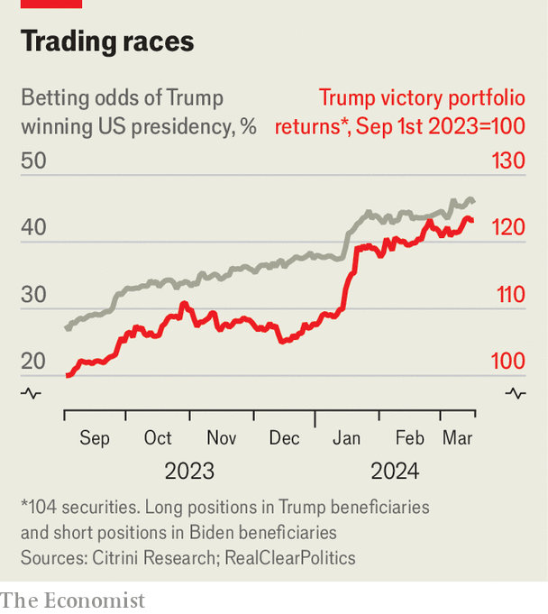

###### Buttonwood

# How to trade an election 

##### It is becoming harder for investors to ignore politics 

 

> Mar 21st 2024 

Investors differ in their approach to elections. Some see politics as an edge to exploit; others as noise to block out. Even for those without a financial interest, markets offer a brutally frank perspective on the economic stakes. As elections approach in America and Britain, as well as plenty of other countries, that is especially valuable. 

Take what happened before and after America’s presidential election in 2020. Green-energy and cannabis stocks briefly became market darlings as the odds of a victory for Joe Biden rose, since investors expected his administration to enact policies favourable to both. Exchange-traded funds covering the sectors rallied by over 100% from two months before the election to Mr Biden’s inauguration, before later dropping as investors scaled back their optimism.

What are markets saying about the current race for the White House? The candidates’ agendas are similar in places. Both tilt protectionist (though Mr Trump’s plans are more radical); both would oversee hefty deficits (though with different beneficiaries). But there are also big differences. Mr Trump has vowed to end Europe’s freeriding on America’s defence budget; Mr Biden is unlikely to renew tax cuts from Mr Trump’s first term that expire in 2025. Mr Trump would gut Mr Biden’s Inflation Reduction Act (IRA), redirecting green spending to fossil fuels. Mr Biden sees Mexico as somewhere to “friendshore”; Mr Trump sees it as a bogeyman. 

This means that some listed firms stand to win, while others look likely to lose out. Higher European military spending would boost the continent’s defence firms. If Mr Trump were to roll back the IRA, solar-power providers and electric-car makers would be hurt, while owners of coal plants would be rather happier. If the vote is close, and supporters of the losing candidate riot, shares in architectural-glass firms should do well. 

Speculators can bet on the outcome of the election by investing money accordingly. Indeed, a portfolio of company stocks that ought to benefit if Mr Trump wins, as well as short positions on companies that ought to lose out in such a scenario, tracks Mr Trump’s odds of winning the election in betting markets. The chart below shows one such basket, assembled by Citrini Research, a research firm. 

 


What about the consequences for broader asset classes? Investors who would prefer to avoid politics used to be able to shield themselves by simply holding a diversified portfolio. After all, in well-functioning democracies, politics rarely affected overall stockmarket returns, sovereign bonds or currencies. When assessing past American presidential elections, JPMorgan Chase, a bank, finds there is no clear relationship between the outcome and subsequent overall stockmarket performance.

Avoiding politics is becoming more difficult, however. Pity anyone trading British markets while ignoring Brexit negotiations or the policies of Liz Truss, who was prime minister for the life of a lettuce in 2022. Elections also drive moves in emerging markets, which is why Brexit prompted half-joking concerns that Britain had become one. Until the run-up to the referendum there was virtually no relationship between gauges of political risk and the implied volatility of sterling as measured by options, which captures how much hedging currency moves costs. Since then, the two have tracked one another closely.

Yet rather than being an outlier, Britain’s experience may presage a global trend. Enthusiasm for state spending is now widespread, and fiscal excess can have large and unforeseeable consequences. The Democrats’ knife-edge win in the Georgia US senate election in 2021 unlocked a bevy of stimulus, for instance. Treasury yields rose by 0.1 percentage points that day—a big move but not an unusual one. With hindsight, it is clear that fiscal largesse amplified inflation, meaning an even larger move would have been justified.

Moreover, politics does not only matter more for markets; its effects are also becoming less predictable. Take a scenario troubling many investors today: that Mr Trump carries out his threat to replace Jerome Powell, the Federal Reserve chairman. Would bond yields fall on expectations of looser monetary policy, or rise as a Ms-Truss-style “moron risk premium” became baked in? The answer is far from obvious. Its importance could not be any clearer.■


