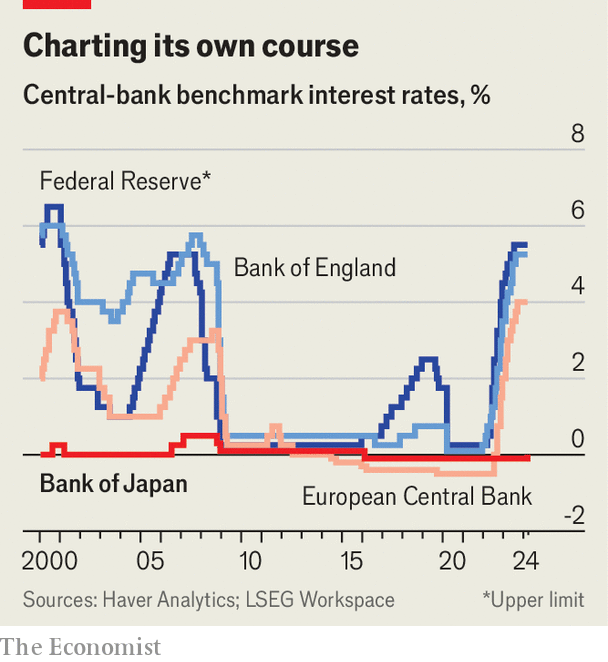
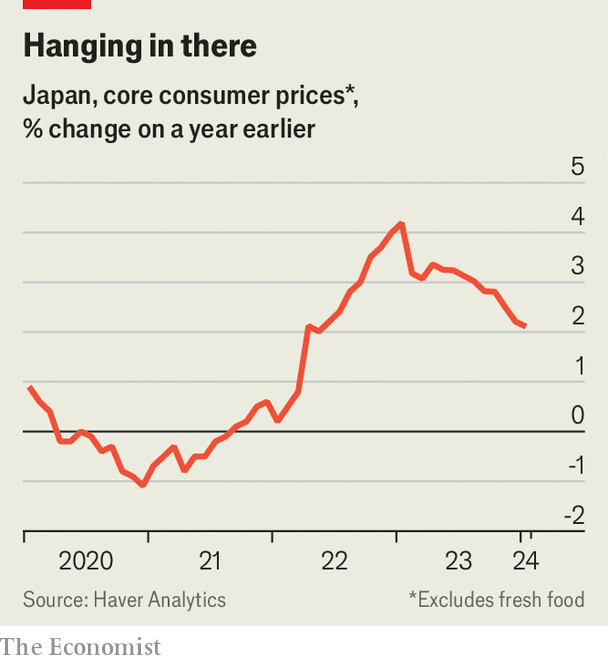

###### Interesting times

# Japan ends the world’s greatest monetary-policy experiment 

##### For the first time in 17 years, officials raise interest rates 

 

> Mar 19th 2024 

On March 19th officials at the Bank of Japan (BoJ) announced that, with sustainable inflation of 2% “in sight”, they would scrap a suite of measures instituted to pull the economy out of its deflationary doldrums—marking the end of a radical experiment. The bank raised its interest-rate target on overnight loans for the first time since 2007, from between minus 0.1% and zero to between zero and 0.1%, becoming the last central bank to scrap its negative-interest-rate policy. It will also stop buying exchange-traded funds and abolish its yield-curve-control framework, a tool to cap long-term bond yields. Even so, the BoJ stressed that its stance would remain accommodative: the withdrawal of its most unconventional policies does not augur the beginning of a tightening cycle.

This shift reflects changes in the underlying condition of the Japanese economy.  has been above the bank’s 2% target for 22 months. Recent annual negotiations between trade unions and large companies suggest wage growth of more than 5% for the first time in 33 years. “The BoJ has confirmed what many people have been suspecting: the Japanese economy has changed, it has gotten out of deflation,” says Hoshi Takeo of the University of Tokyo. That hardly means Japan is booming—consumption is weak and growth is anaemic. But the economy no longer requires an entire armoury of policies designed to raise inflation. When Ueda Kazuo, the BoJ’s governor, was asked what he would call his new framework, he said it did not require a special name. It was “normal” monetary policy.

 


Japan’s economy slid into deflation in the 1990s, following the bursting of an asset bubble and the failure of several financial institutions. The BoJ began trying new tools, cautiously at first. Although in 1999 the bank cut interest rates to zero, it raised them the next year, only to see prices fall again (one of two board members opposed to the decision at the time was Mr Ueda). The BoJ then went further, becoming the first post-war central bank to implement quantitative easing—the buying of bonds with newly created money—in 2001. 

Yet it did not fully embrace the wild side of monetary policy until the arrival of Kuroda Haruhiko as governor in 2013. Backed by then-prime minister Abe Shinzo, Mr Kuroda embarked on a programme of vast monetary easing, vowing to unleash . The bank adopted a 2% inflation target and began “quantitative and qualitative easing”, which saw enormous government-bond purchases coupled with aggressive forward guidance (promises to keep policy loose). In 2016 the bank set its key overnight rate at minus 0.1%, meaning that commercial banks were in effect charged for depositing with it, and then implemented yield-curve control in order to restrain longer-term interest rates, too. Although inflation picked up a bit, it never consistently reached the central bank’s target during Mr Kuroda’s term, which ended nearly a year ago.

Officials are now confident that inflation has at last become embedded. Supply-chain snags and rising import costs pushed up inflation at first, but price rises have since become widespread. GDP growth figures for the last quarter of 2023 were recently revised into positive territory owing to an uptick in capital expenditure. 

 


The missing piece of the puzzle had been  Last year annual wage negotiations produced gains of 3.8%, the highest in three decades. But wage growth still trailed inflation, leaving real incomes falling. Then came last week’s blockbuster numbers. They included a big boost to the so-called base-up portion of Japanese wages, which is not linked to seniority. A sustained period of rising prices has emboldened unions to push forcefully for higher pay; Japan’s shrinking labour force is also forcing firms to compete for talent. Policymakers “have been very, very patient, deliberately waiting for the right timing”, says Nakaso Hiroshi, a former BoJ deputy governor. “And now the time is right.”

For such a momentous decision, the short-term impact will be limited. The BoJ had hinted at its intentions, meaning markets priced in the move, and had loosened its yield cap last year. The yen depreciated slightly against the dollar following the announcement. Long-term yields have settled at 0.7% to 0.8%, below the scrapped 1% reference point. Although some local investors may bring funds home as a consequence of the policy shift, global capital flows are unlikely to move drastically since rates in Japan will still be low by international standards, notes Kiuchi Takahide of Nomura Research Institute, a research outfit. Nor will the change to the policy rate have a big effect: under the BoJ’s old framework, there were three tiers of accounts, and the share of funds held in those subject to negative rates was minimal. 

The question is where the BoJ goes from here. Officials have been careful to signal they are not embarking on a tightening cycle. Last month Uchida Shinichi, a deputy governor, said there would not be a rapid series of rate rises. Mr Ueda offered few clues about where he suspects rates will settle; most economists reckon they will not exceed 0.5%. The BoJ will also continue to buy “broadly the same amount” of government bonds to control long-term rates. Normalisation of its own balance-sheet will be a gradual process. “The BoJ has left a huge footprint on the market,” says Kato Izuru of Totan Research, a think-tank. “They want to reduce that footprint, but it cannot be reduced suddenly.”

As the BoJ enters its new era, several risks loom. One comes from overseas. If there is a slowdown in America or China, Japan’s two biggest trading partners, it would weigh on external demand and drag down the outlook for Japanese firms, making them less likely to invest. 

Another comes from within. In the long run, interest payments on Japan’s large government debt will rise, putting pressure on public finances. The financial system looks sound, but Japan’s financial regulator recently stepped up oversight of regional lenders. Many observers are concerned about the impact of rate rises on mortgages and small and medium-sized businesses that do not have large cash buffers. 

Most worrying, inflation could drop below target again. Price inflation, while still above 2%, is already falling. Two doveish board members voted against the decision to abolish negative interest rates, arguing that more time was needed to be sure that inflation will stick. For the trend to continue, Japan needs reforms that raise productivity and boost the potential growth rate, Mr Nakaso argues. If there is one lesson from Japan’s era of monetary-policy experiments, it is that there are limits to central banks’ powers. During Japan’s new era, others will have to take the lead. ■


