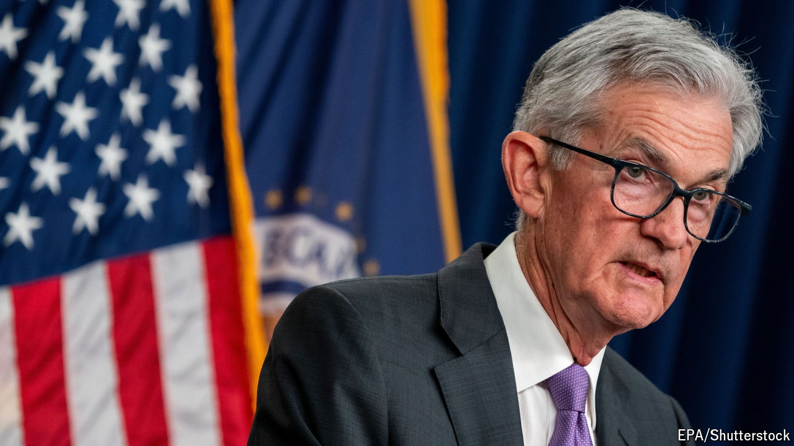
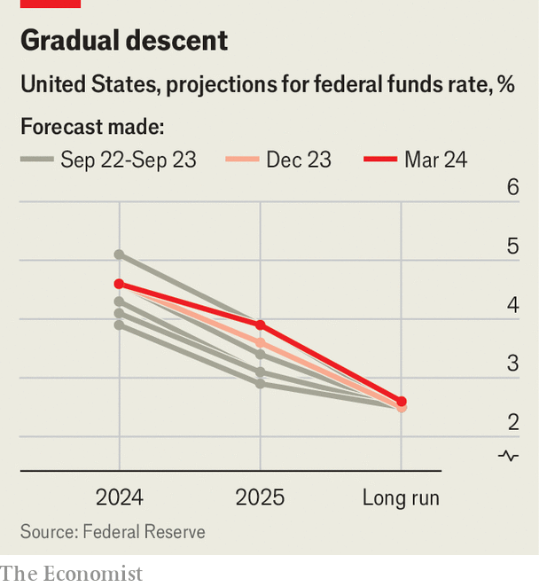
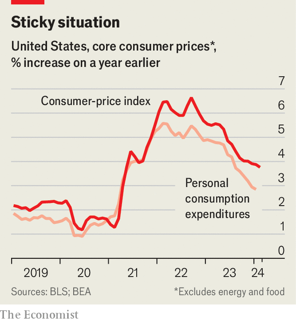

###### The last mile

# Why America can’t escape inflation worries 

##### The Federal Reserve sticks to its plans, despite an uncertain situation 

 

> Mar 20th 2024 

Some hikers believe that the last mile is the hardest: all the blisters and accumulated aches slow progress at the very end. Others swear that it is the easiest because the finishing line is in sight. For the Federal Reserve, the last mile of its trek to bring inflation back to its 2% target has been simultaneously easy and hard. Easy in the sense that the central bank has not budged on interest rates for eight months, instead letting its previous tightening do the work. Hard because the wait for inflation to recede has felt rather long.

The slow easing of price pressures and America’s continued economic vigour have fuelled debate about whether the Fed might chart a more aggressive course for the last mile of its anti-inflation journey. Policymakers had telegraphed that they would make three quarter-point rate cuts this year. But since then some prominent measures of inflation have seemingly got stuck at around 3-4%, while the unemployment rate has remained below 4%. So the big question heading into a monetary-policy meeting that concluded on March 20th was whether the Fed might pare its projection to two cuts. In the end, the central bank (or, to be a little more precise, the median voting member of its rate-setting committee) opted to maintain its outlook for three cuts in 2024, though it lowered its projection for 2025 from four cuts to three.

 


An important gap in inflation measures helps explain the Fed’s rationale for sticking with its plan for this year. Much of the concern about the persistence of inflation stems from recent readings of the consumer price index. “Core” CPI, which strips out volatile food and energy costs, decelerated throughout much of 2022 and early 2023, but since last June has picked up speed. In both January and February it rose at a monthly clip of roughly 0.4%, a rate which, if sustained for a full year, would lead to annual inflation of about 5%—far too high for comfort for the Fed. In such a scenario America’s central bankers would be fretting not about cutting rates but about whether to resume raising them.

Yet whereas investors and commentators tend to emphasise the CPI, in no small part because it is the first inflation data point each month, the central bank’s focus is a separate gauge: the price index for personal consumption expenditures, which comes out several weeks later. Core PCE prices have been better behaved. Although they heated up in January, their annualised pace over the past half-year has been smack in line with the Fed’s 2% inflation target. This has helped give central bankers the confidence that they can start trimming rates relatively soon. 

 


At a press conference after its meeting Jerome Powell, the Fed’s chairman, studiously avoided giving any strong hints about when the central bank will make its first cut. But the market—as implied by the price of rate-hedging contracts—expects that it will get under way in June. And Mr Powell was generally satisfied with price trends. “We continue to make good progress in bringing inflation down,” he said.

What accounts for the CPI-PCE divergence? The CPI is more rigid, with its components adjusted annually; the PCE is in effect adjusted every month, reflecting, for example, whether consumers substitute cheaper apples for dearer oranges. Over time that leads to slightly lower PCE price growth. Different weightings have also had a big impact this year. Housing makes up about a third of the CPI basket but just 15% of the PCE one, and stubbornly high rents have kept the CPI elevated. There are other differences, too. For instance, airfares pushed up the CPI in February, based on prices for a fixed set of flight routes. The PCE, which considers distances actually flown, has been lower.

Neutral territory

Once inflation does come down, the Fed’s officials face another debate. In an ideal world central bankers would guide a full-employment, stable-inflation economy to what is known as the neutral rate of interest, the level at which monetary policy is neither expansionary nor contractionary. In reality, although there is no way of observing the neutral rate the Fed still tries to aim for it, with its policymakers writing down their estimates every quarter. Since 2019 their median projection has, in real terms, been 0.5% (ie, a Fed-funds rate of 2.5% and a PCE inflation rate of 2%).

That has changed, albeit pretty imperceptibly. Narrowly, the Fed’s new median projection for rates in the long run shifted up to 2.6%, implying a real neutral rate of 0.6%. This may sound like a puny, academic difference. But it lies at the core of central-bank thinking about post-pandemic growth, in particular whether officials believe that rates should be higher on an ongoing basis in order to avoid economic overheating, perhaps because of rising productivity or excessive government spending. They appear to be heading towards that view, though Mr Powell demurred on drawing any conclusions based on the upward creep in long-run rates. The Fed still has to travel the last mile in its fight against inflation. Even once the journey comes to an end, though, a difficult interest-rate question will remain. ■


