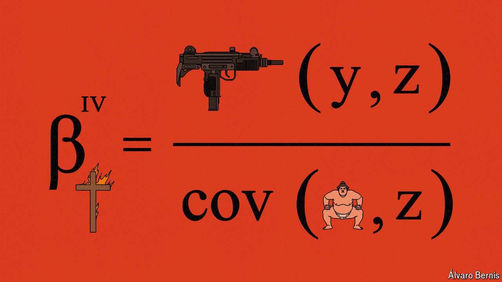

###### Free exchange

# Why “Freakonomics” failed to transform economics 

##### The approach was fun, but has fallen out of favour 

 

> Mar 21st 2024 

“Economics is a study of mankind in the ordinary business of life.” So starts Alfred Marshall’s “Principles of Economics”, a 19th-century textbook that helped create the common language economists still use today. Marshall’s contention that economics studies the “ordinary” was not a dig, but a statement of intent. The discipline was to take seriously some of the most urgent questions in human life. How do I pay my bills? What do I do for a living? What happens if I get sick? Will I ever be able to retire? 

In 2003 the published a profile of Steven Levitt, an economist at the University of Chicago, in which he expressed a very different perspective: “In Levitt’s view,” the article read, “economics is a science with excellent tools for gaining answers but a serious shortage of interesting questions.” Mr Levitt and the article’s author, Stephen Dubner, would go on to write “Freakonomics” together. In their book there was little about the ordinary business of life. Through vignettes featuring cheating sumo wrestlers, minimum-wage-earning crack dealers and the Ku Klux Klan, a white-supremacist organisation, the authors explored how people respond to incentives and how the use of novel data can uncover what is really driving their behaviour. 

Freakonomics was a hit. It ranked just below Harry Potter in the bestseller lists. Much like Marvel comics, it spawned an expanded universe: columns, podcasts and sequels, as well as imitators and critics, determined to tear down its arguments. It was at the apex of a wave of books that promised a quirky—yet rigorous—analysis of things that the conventional wisdom had missed. On March 7th Mr Levitt, who for many people became the image of an economist, announced his retirement from academia. “It’s the wrong place for me to be,” he said. 

During his academic career, Mr Levitt wrote papers in applied microeconomics. He was, in his own self-effacing words, “a footnote to the ‘credibility revolution’”. This refers to the use of statistical tricks, such as instrumental-variable analysis, natural experiments and regression discontinuity, which are designed to tease out causal relationships from data. He popularised the techniques of economists including David Card, Guido Imbens and Joshua Angrist, who together won the economics Nobel prize in 2021. The idea was to exploit quirks in the data to simulate the randomness that actual scientists find in controlled experiments. Arbitrary start dates for school terms could, for instance, be employed to estimate the effect of an extra year of education on wages.

Where the Freakonomics approach differed was to apply these techniques to “the hidden side of everything”, as the book’s tagline put it. Mr Levitt’s work focused on crime, education and racial discrimination. The book’s most controversial chapter argued that America’s nationwide legalisation of abortion in 1973 had led to a fall in crime in the 1990s, because more unwanted babies were aborted before they could grow into delinquent teenagers. It was a classic of the clever-dick genre: an unflinching social scientist using data to come to a counterintuitive conclusion, and not shying away from offence. It was, however, wrong. Later researchers found a coding error and pointed out that Mr Levitt had used the total number of arrests, which depends on the size of a population, and not the arrest rate, which does not. Others pointed out that the fall in homicide started among women. No-fault divorce, rather than legalised abortion, may have played a bigger role.

Other economists, including James Heckman, Mr Levitt’s colleague in Chicago and another Nobel prizewinner, worried about trivialisation. “Cute”, was how he described the approach in one interview. Take a paper on discrimination in the “The Weakest Link”, a game show in which contestants vote to remove other contestants depending on whether they think they are costing them money by getting questions wrong (in the early portion of the game) or are competition for the prize pool by getting them right (later on). That provided a setting in which Mr Levitt could look at how observations of others’ competence interacted with racism and sexism. A cunning design—but perhaps of limited relevance in understanding broader economic outcomes. 

At the heart of Mr Heckman’s critique was the idea that practitioners of such studies were focusing on “internal validity” (ensuring estimates of the effect of some change were correctly estimated) over “external validity” (whether the estimates would apply more generally). Mr Heckman instead thought that economists should create structural models of decision-making and use data to estimate the parameters that explained behaviour within them. The debate turned toxic. According to Mr Levitt, Mr Heckman went so far as to assign graduate students the task of tearing apart the Freakonomics author’s work for their final exam. 

Did you know...

Neither man won. The credibility revolution ate its own children: subsequent papers often overturned results, even if, as in the case of those popularised by Freakonomics, they had an afterlife as cocktail-party anecdotes. The problem has spread to the rest of the profession, too. A recent study by economists at the Federal Reserve found that less than half of the published papers they examined could be replicated, even when given help from the original authors. Mr Levitt’s counterintuitive results have fallen out of fashion and economists in general have become more sceptical. 

Yet Mr Heckman’s favoured approaches have problems of their own. Structural models require assumptions that can be as implausible as any quirky quasi-experiment. Sadly, much contemporary research uses vast amounts of data and the techniques of the “credibility revolution” to come to obvious conclusions. The centuries-old questions of economics are as interesting as they always were. The tools to investigate them remain a work in progress. ■


