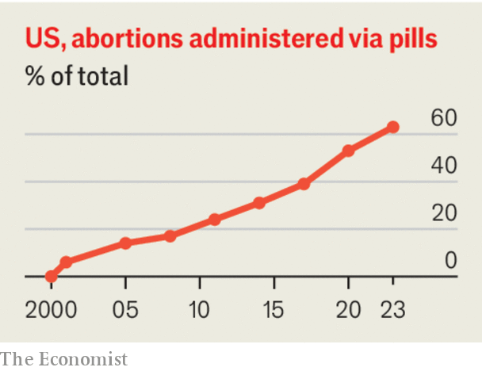

###### Pills by post

# America’s Supreme Court should reject the challenge to abortion drugs 

##### The case against mail-order mifepristone is legally and medically spurious 

 

> Mar 20th 2024 

AMERICAN WOMEN are thought to have more abortions today than they did before the Supreme Court overturned  in 2022. The main reason is probably . Safe and effective, cheap and convenient, and small enough to fit into an envelope, they enable many women to have an abortion without leaving home. The pills account for nearly two-thirds of terminations in America, up from almost a quarter in 2011, partly because the Food and Drug Administration (FDA) has loosened rules around their use and distribution. No wonder pro-lifers want the Supreme Court to clamp down on them. Medically and legally, that would be an error.

The court will hear the case on March 26th—its first on abortion since it ignited a nationwide battle over reproductive rights by scrapping . The Alliance for Hippocratic Medicine, a conservative group, wants greater restrictions around mifepristone, a drug typically used in combination with another, misoprostol, to induce abortions. Arguing that the FDA’s rulings have been “arbitrary” and “capricious”, it wants to restore a strict seven-week limit on use of mifepristone, as well as a requirement that only doctors can prescribe and provide it—and that this must be in person. 

 


That would be a bad outcome for women’s health. Mifepristone is safer than Tylenol (paracetamol) and has fewer complications than later-stage surgical abortion. It is also cheaper, less invasive and more convenient than surgery, especially for women who cannot easily get to a clinic or when prescribed through telemedicine. Pill-based abortion has risen globally. In England and Wales, and much of Scandinavia, around 90% of terminations now use pills. During the pandemic, which limited visits to doctors, trials found that remote prescriptions of abortion pills have many benefits and no added risk.

Restricting mifepristone’s use to seven weeks of pregnancy makes no sense medically. If anything, the FDA’s current ten-week limit is too restrictive. The World Health Organisation lists mifepristone as safe and effective for abortions up to 12 weeks. Although women now detect and terminate pregnancies earlier than in the past, 49% of abortions in America still happen between six and 12 weeks (94% take place in the first trimester). Without mifepristone, most of these women will still have abortions, using either misoprostol alone or surgery. But these options tend to bring more hassle, discomfort and a higher risk of further medical intervention.

Siding with the plaintiffs would also be a bad legal outcome. Courts should require strong grounds to conclude that a regulator has got a technical assessment wrong. If judges can substitute their own supposed expertise for the FDA’s, it will weaken America’s system of technically informed regulation—especially if the test case is a charged issue in which the empirical evidence is strong and the plaintiff has suffered no concrete injury. Anyone with a cause, from moral objections to contraceptives to conspiracy theories about covid-19 jabs, will be encouraged to sue the FDA. Meritless challenges against other agencies will proliferate, too. 

This case presents an opportunity for the justices to rein in judicial activism. Our hope is that the Supreme Court took it on chiefly for that reason. It can best do so by coming down unanimously in favour of the FDA. ■

