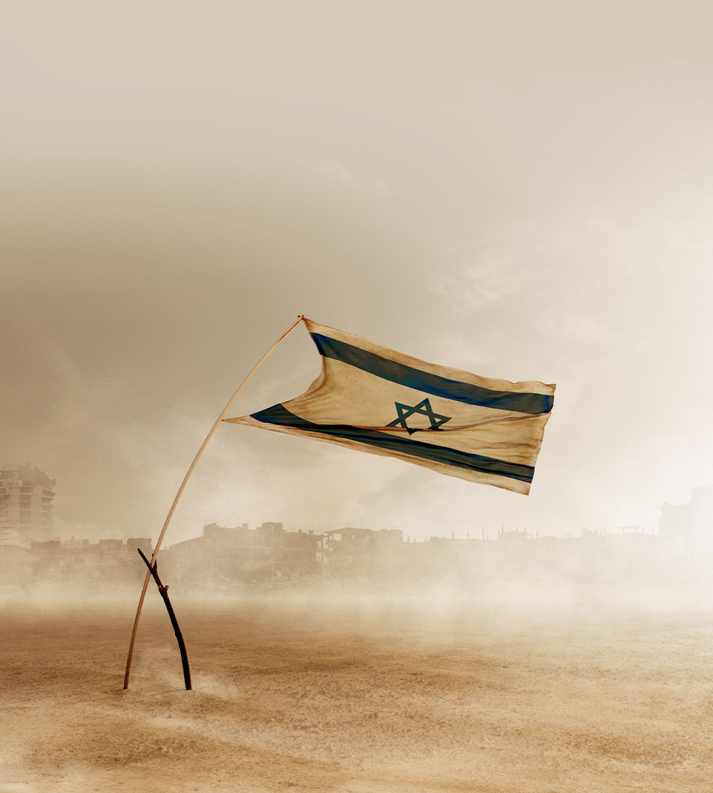

###### The war in Gaza and beyond

# At a moment of military might, Israel looks deeply vulnerable 

##### America should help it find a better strategy 

 

> Mar 21st 2024 

There is still a narrow path out of the hellscape of Gaza. A temporary ceasefire and hostage release could cause a change of Israel’s government; the rump of Hamas fighters in south Gaza could be contained or fade away; and from the rubble, talks on a two-state solution could begin, underwritten by America and its Gulf allies. It is just as likely, however, that ceasefire talks will fail. That could leave Israel locked in the bleakest trajectory of its 75-year existence, featuring endless occupation, hard-right politics and isolation. Today many Israelis are in denial about this, but a political reckoning will come eventually. It will determine not only the fate of Palestinians, but also whether Israel thrives in the next 75 years. 

If you are a friend of Israel this is a deeply uncomfortable moment. In October it launched a justified war of self-defence against Hamas, whose terrorists had committed atrocities that threaten the idea of Israel as a land where Jews are safe. Today Israel has destroyed perhaps half of Hamas’s forces. But in important ways .


First, in Gaza, where its reluctance to help provide or distribute aid has led to an avoidable humanitarian catastrophe, and where the civilian toll from the war is over 20,000 and growing. The hard-right government of Binyamin Netanyahu has rejected plans for post-war Gaza to be run by either the Palestinian Authority (pa) or an international force. The likeliest outcome is a military reoccupation. If you add the West Bank, Israel could permanently hold sway over 4m-5m Palestinians.

Israel has also failed at home. The problems go deeper than Mr Netanyahu’s dire leadership. A growing settler movement and ultra-Orthodox population have tilted politics to the right and polarised society. Before October 7th this was visible in a struggle over judicial independence. The war has raised the stakes, and although the hard-right parties of the coalition are excluded from the war cabinet they have compromised Israel’s national interest by using incendiary rhetoric, stoking settler violence and trying to sabotage aid and post-war planning. Israel’s security establishment is capable and pragmatic, but no longer fully in charge.

Israel’s final failure is clumsy diplomacy. Fury at the war was inevitable, especially in the global south, but Israel has done a poor job of countering it. “Lawfare”, including spurious genocide allegations, is damaging its reputation. Young Americans sympathise with it less than their parents do. President Joe Biden has tried to restrain Mr Netanyahu’s government by publicly embracing it, but failed. On March 14th , Israel’s greatest ally in the Senate, decried Hamas’s atrocities but said Israel’s leader was “lost”.

It is a bleak picture that is not always acknowledged in Jerusalem or Tel Aviv. Mr Netanyahu talks of invading Rafah, Hamas’s last redoubt, while the hard right fantasises about resettling Gaza. Many mainstream Israelis are deluding themselves, too. They believe the unique threats to Israel justify its ruthlessness and that the war has helped restore deterrence. Gaza shows that if you murder Israelis, destruction beckons. Many see no partner for peace—the pa is rotten and polls say 93% of Palestinians deny Hamas’s atrocities even took place. Occupation is the least-bad option, they conclude. Israelis would prefer to be popular abroad, but condemnation and antisemitism are a small price to pay for security. As for America, it has been angry before. The relationship is not about to rupture. If Donald Trump returns he may once again give Israel a free pass.

This seductive story is a manifesto for disaster. Consider defence. The damage to Israel’s reputation could make it harder to fight on in Gaza. The long-term threat is from Iran and its proxies, including Hizbullah. Deterring this requires a military partnership with America that needs bipartisan backing, and ideally Gulf Arab support, too. The economy depends on tech exports and experts with access to global markets. And rather than making Israelis safe, permanent occupation poisons politics by emboldening the hard right and breeding Palestinian radicalism. Israelis are right that they have no partner for peace today, but they are best placed to break the cycle. 

Israel’s trajectory will intensify its ethno-nationalist politics and pose legal threats to the economy. As estrangement from the West deepens, so deterrence may weaken. Firms could be blacklisted. Bosses could move high-tech businesses abroad or, if they are reservists, be arrested there. 

America must help Israel avoid that fate—and if it fails it will itself pay a heavy diplomatic price. Best would be a temporary ceasefire, opening a route to two-state talks. Without this, American policy will need resetting. Mr Biden’s early embrace has failed, but so would coercion. If America tried to force Israel out of Gaza while Hamas could still regroup, or curbed military support, or withdrew its support at the un, Israel’s security could be in jeopardy.

America should therefore use other means. It should dispense more humanitarian aid unilaterally and decline to supply weapons for an invasion of Rafah, given the lack of civilian provision. It should broaden sanctions against settlers and right-wing fanatics to show Israeli voters that America underwrites their security but not extremism or permanent occupation. And it should continue to signal that it is keen to recognise Palestine as part of a two-state peace negotiation.

The battle to come

America, however, can do only so much. Most Israeli wars are followed by political upheaval.  will not be easy. But when the reckoning comes it will be huge. The war has shattered many illusions: that the Palestinians can be ignored; that the pa has any appetite for reform; that antisemitism is rare; that Israel can pay lip-service to two states as settlements expand; and that the hard right can be tamed. The good news is that there are grounds for hope. Polls suggest that centrists in Israel command perhaps 50-60% of votes, institutions like the Supreme Court are still strong and better leaders exist. A struggle for Israel’s future awaits. The battle in Gaza is just the start.■


