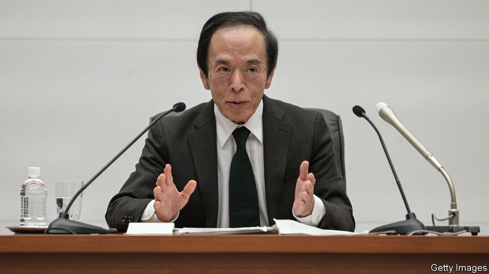
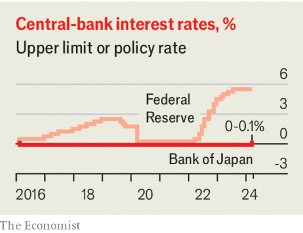

###### Japan today, Japan tomorrow

# Why Japan’s economy remains a warning to others 

##### Low real rates, low growth and high debts are not going away 

 

> Mar 19th 2024 

For most of this century it has looked as if the world’s economy was turning Japanese, with low growth, below-target inflation and rock-bottom interest rates. Today the question is how much Japan will come to look like the rest of the world. On March 19th the Bank of Japan  for the first time since 2007, after inflation seemed at last to have become entrenched. The interest-rate target for overnight loans, previously between minus 0.1% and 0%, will rise by a tenth of a percentage point. The central bank also scrapped its policy of yield-curve control, which capped long-term bond yields at 1%. Having kept monetary policy ultra-loose for years, Japan has now begun to follow the course set by other economies since widespread inflation took hold.

It is a remarkable moment. Before 2022 annual inflation had been above 2% for only 12 of the previous 120 months; today it has been above that level for 22 consecutive months. Japan’s biggest firms recently agreed to increase wages by 5.3%, a level that would have been unthinkable before the global inflation breakout. There is a sense that change is here to stay. Stocks have been booming—the Nikkei 225 recently passed the record it set in December 1989—and investors are optimistic about the economy.

 


Yet it would be wrong to conclude that Japan is de-Japanifying. More important than an economy’s nominal attributes such as inflation, headline interest rates and stockmarket growth are its real, structural features. If you look at the fundamentals, even the rise in interest rates is not quite what it seems. The 2% inflation target which the Bank of Japan believes is now in sight is 1.4 percentage points higher than the average inflation rate over the ten years to the end of 2021. This 1.4-point rise in projected inflation towers over the 0.1-point rise in interest rates, which in real terms have therefore fallen, not risen. Moreover, the bank made clear in its statement on March 19th that it expected to maintain “accommodative” financial conditions and would keep buying some bonds.

Rock-bottom real rates reflect the fact that Japan has abundant savings, partly because its population is so old—30% are over 65. Firms struggle to put these to productive use, because an economy with a shrinking population has less appetite for capital investment. Japan’s demography and reluctance to admit immigrants also constrain its growth. The IMF expects gdp to rise by only 0.5% annually over the next four years, compared with 2% in America. That is respectable given the lack of workers—growth in output per worker has been healthy. But it is hardly a resurgence.

A final factor is Japan’s enduring public indebtedness. The debt-to-GDP ratio is 255% in gross terms, or 159% after netting off the government’s financial assets; both measures are the highest in the rich world. Even with low interest rates, nearly 9% of the government budget is spent on debt interest. Japan could not withstand a monetary tightening anything like as severe as the one in America, where rates have reached 5.25-5.5%. 

Long before they got to such levels in Japan, the government would have to reduce its deficit, which was 5.6% of GDP in 2023. The economy would cool from fiscal belt-tightening, not higher rates. With monetary policy, as with growth, there remains only one path by which Japan will cease to be exceptional: if the rest of the world comes to resemble it. ■

