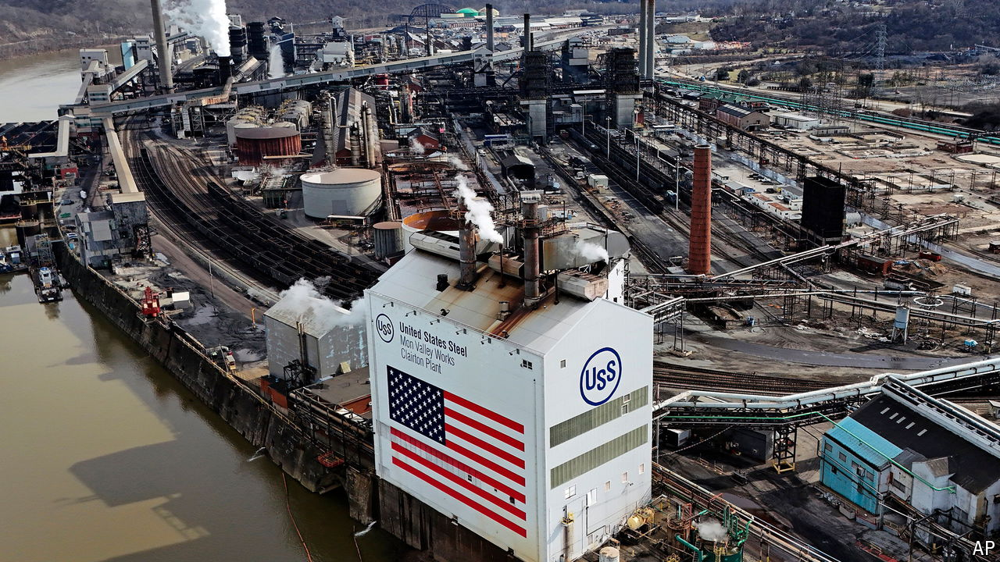

###### Steel men

# Why Joe Biden was wrong to oppose a Japanese takeover of US Steel 

##### Uncertain political benefits do not justify a bad policy 

 

> Mar 21st 2024 

Ever since news broke in December of the acquisition of US Steel, an iconic industrial firm, by Nippon Steel, a Japanese competitor, opponents have lined up to condemn the deal. On March 14th Joe Biden joined the chorus, saying that it was “vital” for the business to be domestically owned. “I told our steelworkers I have their backs,” he said, “and I meant it.” Others, including trade unions, see American ownership as the best way to preserve local jobs and investment. Free-traders rightly dispute such claims, but even they might accept an economically unsound idea for political reasons. If blocking the deal helps Mr Biden win crucial swing states and thus keeps Donald Trump from returning to the White House, surely that would be better for America and the world?

Consider the stakes. Mr Trump has strongly hinted that he would abandon Ukraine to its Russian invaders, betraying a democracy and undermining the security of the West. He refused to accept electoral defeat in 2020, and has threatened “retribution” against his enemies at home. He is also much more protectionist than Mr Biden. He ruled out the Nippon deal in January, and has proposed a 10% blanket tariff on all imports. Mr Biden’s policy will probably win him votes in close races in Pennsylvania, where US Steel is based, or in Michigan, where he campaigned on the day he denounced the deal. It could even be the difference between victory and defeat. 

On the face of it, that presents an ironclad case for blocking the steel merger. Take a step back, though, and the argument is less clear. The costs are greater than the deal-blockers imagine and the benefits are more uncertain. What is more, in a knife-edge campaign similar claims about ends and means can be used to justify pretty much any policy, however bad. 

The costs of blocking the steel deal are stiff. Curbing the free flow of capital means less efficient steel production and ultimately higher prices for consumers. Moreover, Nippon has promised not to cut jobs and plans to increase investment. If so, concerns about the local economy are misplaced. The deal could even end up making US Steel stronger.

Worse, the way in which Mr Biden reached his decision was arbitrary. He had promised to guard a “small yard” with a “high fence”, with clear rules to let foreign investors know what sorts of assets are off-limits for reasons of national security, while allowing free markets to operate everywhere else. Yet he commented on the steel deal even as the Committee on Foreign Investment in the United States (cfius) was still mulling whether it posed a security risk. By doing so, he signalled that the rules are there to be broken. Foreign investors will fear that there is little to stop that small yard getting bigger. Many more American firms will demand protection.

Far from bolstering national security, Mr Biden has undermined it. Only days before the deal was announced, lawmakers were proposing to add Japan to a whitelist that bypasses the most stringent CFIUS rules. Now America looks high-handed and fickle. US Steel is nothing like TikTok, which the House of Representatives voted last week to ban in America unless its Chinese owner sells up. One is a media giant open to influence from a hostile power. The other is a medium-sized manufacturer that is being bought by one of America’s closest allies.

Even if you fully count these costs—and, given his increasingly protectionist rhetoric, there is every reason to doubt that Mr Biden has—banning a steel acquisition might make sense because the political benefits are so clear. The trouble is that they are hard to game out. Any number of factors could affect the election. Third parties may gain more prominence. More voters may notice how well America’s economy is doing, and warm to Mr Biden. In a very close race with so much uncertainty, it is anyone’s guess whether any single intervention will be enough to yield him the decisive electoral benefit he craves. That’s why one intervention leads to the next.

Doing bad things for good reasons is the oldest trap in politics. How many more arbitrary and unwise policies will Mr Biden adopt in the hope of winning over this or that group of swing-state voters? Every industry and its workers would like more handouts and new rules to hobble their rivals. Every time the costs mount and the precedents multiply. Mr Biden should beware lest he end up poisoning his own victory. ■

