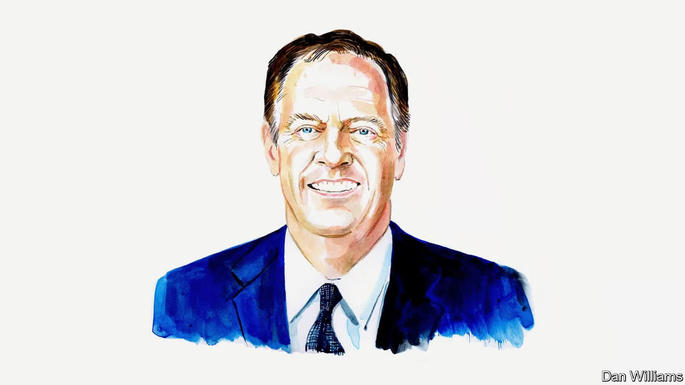
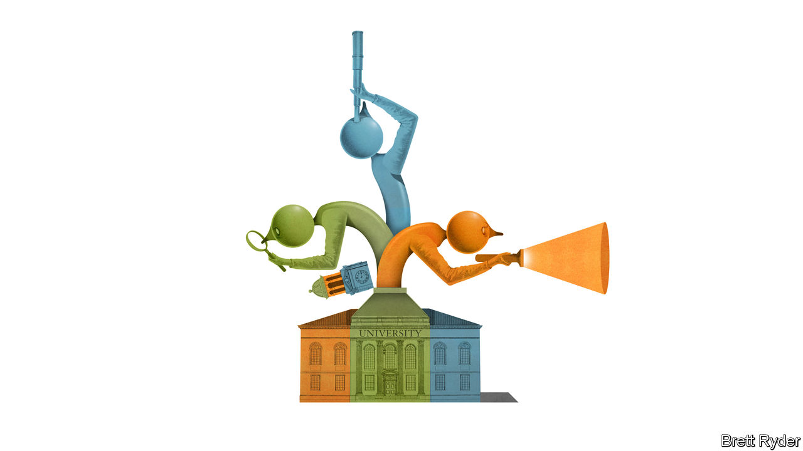
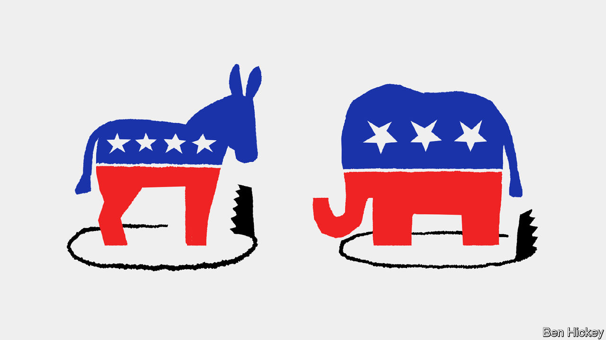
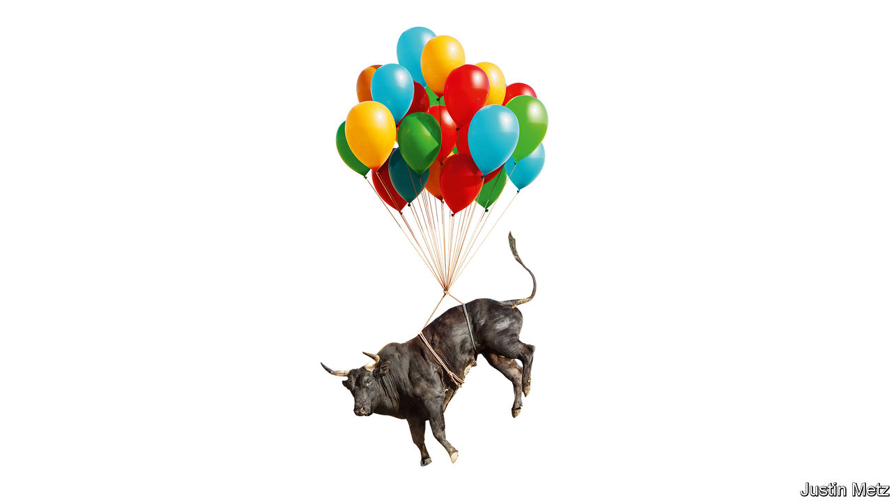

###### On American trade policy, universities, anger, Al Gore, artificial intelligence, the middle ages, markets

# Letters to the editor 

##### A selection of correspondence 

 

> Mar 21st 2024 


Trading arguments

The case made by Robert Lighthizer, America’s trade representative under Donald Trump, for protective tariffs is full of logical, factual and economic fallacies , March 8th). First, Mr Lighthizer slays a straw man. The economic case against tariff increases is that they worsen the economy’s performance and not, as he claims, that they “destroy capitalism”. The survival of America’s market-oriented economy in the wake of Mr Trump’s tariffs, therefore, does nothing to discredit the case for free trade.

Second, Mr Lighthizer insists that the past several decades have left America in dire need of “reindustrialisation”. In fact, industrial output in America rose rather steadily from the end of the second world war until the Great Recession of 2008 and 2009, and then slowly rose again until the pandemic, after which it once again increased. It hit its all-time high in September 2018 and is today only 1.5% below that record level. As for America’s industrial capacity, today it is a mere 0.4% below the historic peak it reached in December 2016, the month before Mr Trump took office.

Third, it is simply untrue that increases in a country’s imports to match any increases in its exports is “how trade is supposed to work”. Trade can work in this way. But it can also work when a country uses its export earnings, not to import more, but to invest abroad, thus potentially increasing the amount of capital available in destination countries. This has happened in America in every year since 1975, when it last ran a trade surplus.

Phil Gramm

Non-resident senior fellow at the American Enterprise Institute


Donald Boudreaux

Mercatus Centre

George Mason University


 


Education and social justice

wrote about how universities are “torn between their responsibilities to learning and social justice” (February 24th). This tension underlies the crisis in higher education. Learning and knowledge have been central to universities since the Middle Ages, but the idea that they have a mission to further social justice is new and it is a misunderstanding. Although the definition of knowledge (justified true belief) has remained remarkably constant and is not political, interpretations of what constitutes justice vary widely and are fundamentally political and cultural. 

These interpretations range from Plato’s “Republic” to Augustine’s city of God, Edmund Burke, Karl Marx and John Rawls. Even the Hindu caste system can be considered an expression of justice, based on a metaphysical worldview that involves reincarnation and a soul receiving a just incarnation based on behaviour in previous lives. 

The pursuit of knowledge can unite diverse cultures and political views, but any push for social justice is, by nature, culturally and politically narrow. Universities can resolve many of their woes by returning to a core mission based on knowledge.

David Bertioli

College of Agricultural and Environmental Sciences 

University of Georgia


Is running a top university really America’s hardest job, or has university leadership just finally arrived in the real world? The average tenure of a Fortune 500 chief executive is seven years, according to Spencer Stuart, a consulting firm, so the average tenure of a university president of six years doesn’t look too surprising. Leaders should understand real-world complexities and be comfortable stepping out of the ivory bubble, building bridges between academia and the industries and communities they study. Like their corporate peers, university presidents have to manage the tensions created between the needs of multiple groups in their ecosystem strategically. 

In short, what we need are entrepreneurial leaders. Good luck telling that to university bureaucrats.

DR MARTIN IHRIG

Associate dean 

New York University School of Professional Studies

The new president of Dartmouth, Sian Beilock, has won widespread acclaim for her secret sauce of keeping the academic space academic. A perfect example is the university’s Israel-Palestine course, which is co-taught by the Jewish and Middle Eastern studies departments. The professors lead by example. They disagree, sometimes vehemently, but the conversation never stops and the discourse always stays civil. 

Asking questions and listening to answers, even if you don’t agree with them, might be all it takes to be a good university president. Oh, and don’t build your résumé on plagiarised papers, that would probably help too. 

Evan Kelmar

 

 


It’s time to get angry

Reading on channelling anger at work (March 2nd) I was reminded of the comment by Russell Baker, a Pulitzer prizewinner, that “What we need is not another volume on How To Make Love but some foolproof advice on How to Make Anger.” I agree. 

Of the many people who have sought my help with “anger issues” over the years, very few were there of their own prompting. Rather, they were court-ordered, or their wife thought they ought to, or the dean of students said their staying in school depended on it. This suggests the anger part feels pretty good; it’s the whole “consequences” thing that muddles it up.

Kurt Ela

Clinical associate professor of psychiatry

Georgetown University Hospital

 

 


Could have done better

The first sentence in “” (March 9th) mentioned Al Gore narrowly losing the presidency in 2000 by failing to carry Florida against George W. Bush, which some blamed on a third-party candidate taking some of Mr Gore’s vote. All the post-election hullabaloo in the Sunshine State (hanging chads, butterfly ballots, third-party candidates, the role of Governor Jeb Bush, and more) conveniently masked the great embarrassment to Mr Gore and the Democrats that he had failed to carry his home state of Tennessee. Had he won there, a not unreasonable expectation for a presidential candidate, he would have beaten Mr Bush in the electoral college by 277-260, and the extremely close Florida result would have been reduced to a footnote.

Chase Untermeyer

Professor of practice

Hobby School of Public Affairs

University of Houston

Bias in generative AI

Of course Google’s Gemini models are biased, whether through the transitive properties of our own bias, intentional counter-weighting of that bias, or safety (“”, March 2nd). ChatGPT behaves like an absurdly prudish, liberal-leaning pedant that has been hiding from pop culture its whole life. Gemini’s behaviour doesn’t raise some core issue at Google. Instead it speaks to one of many fundamental differences between a generative model and a general intelligence: self doubt. 

Intelligence is about more than a mathematical likelihood, and these models will probably always be too biased to trust absolutely.

Adam Nelson


 


Great minds think alike

In his “History of Western Philosophy” Bertrand Russell said that “The thirteenth century had brought to completion a great synthesis, philosophical, theological, political, and social, which had been slowly built up by the combination of many elements.” It seems he would agree that the medieval period was greatly misconstrued (“”, February 24th).

Mark Yeomans


 


Onwards and upwards?

 “”, you ask (March 2nd). One thing is clear. When we see books at airports with titles like “Dow 100,000” or perhaps even “Dow 250,000”, it will be time to sell (the Dow index is currently just below the 39,000 mark).

Avinash Dixit

Professor of economics emeritus

Princeton University


