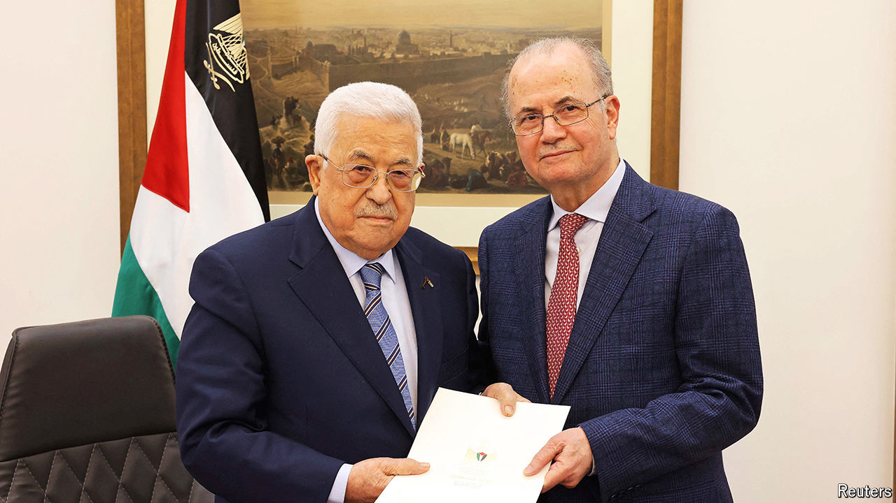

###### A new prime minister for Palestine

# A new leader offers little hope for Palestinians 

##### They fear Mohammad Mustafa will serve the president, not the people 

 

> Mar 21st 2024 

The revitalisation of the Palestinian Authority (pa) is one of the watchwords of the plans—insofar as any exist—for a post-war Gaza. After Mohammed Shtayyeh, the prime minister, resigned in February, America and others urged the Palestinians to pick a replacement who could unite Gaza and the West Bank and rescue them from the sclerotic leadership of President Mahmoud Abbas, who is 19 years into a four-year term and whom 88% Palestinians think should resign. Instead, Mr Abbas and his cronies, worried about losing power, appointed one of their own.

For years Mohammad Mustafa has been Mr Abbas’s economic adviser, head of the sovereign-wealth Palestinian Investment Fund (pif) and sometime minister of national economy. He has said he wants “justice, freedom, security, peace and prosperity”. “He’ll keep money and power with the president,” counters a businessman in Ramallah, the Palestinian seat of government. Mr Mustafa has the support neither of what remains of Hamas in Gaza nor of the pa’s civil service, run by Fatah, the nationalist party in the West Bank.


He has faced allegations of corruption. WikiLeaks revealed that in 2006 America’s consul in Jerusalem said that his appointment to the pif was designed to put the fund “more securely in the hands of President Abbas”. The Panama Papers, a trove of documents leaked in 2016, revealed that the pif had put millions of dollars into a firm, the Arab Palestinian Investment Company (apic), which has invested in businesses in which Tareq Abbas, one of the president’s sons, has an interest. Until 2022 he also sat on apic’s board. Tareq and his brother, Yasser, have insisted that their businesses receive no preferential treatment and deny allegations of corruption. And a pif official says that apic is just one of more than 70 firms in which the fund has invested. Still, fear of contagion has led several Palestinians to decline Mr Mustafa’s offer of government posts. They include Jihad al-Wazir, a Gazan now at the imf who is also a respected former head of the pa’s quasi-central bank.

Donors are wary, too. Their support is vital to rebuild Gaza and keep the Palestinian economy afloat. Western diplomats are hesitant. Mr Mustafa, says one, has “a lot of connections to Yasser and Tareq”. Direct American aid to the pa has tumbled from nearly $1bn annually to zero since 2009.

Still, Mr Mustafa has won the respect of Palestinians who work with him. They highlight his record at both the World Bank and the pif. “He’s a good manager,” says a former colleague. They point out that under him the pif maintained its assets of almost $1bn while also paying more than $1bn into state coffers. He also increased its share of assets held locally from 15% to over 90%, according to a pif official. And if he seems like a technocrat, that may be no bad thing. “After Hamas, I need boring,” says a political analyst.

If he actually begins fixing the Palestinians’ myriad problems, he might yet win some support. But legitimacy and revitalisation will come from the ballot box. Mr Mustafa has promised to prepare for elections. He has, however, notably shied away from setting a date. ■

