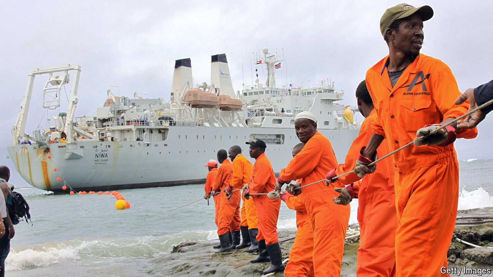
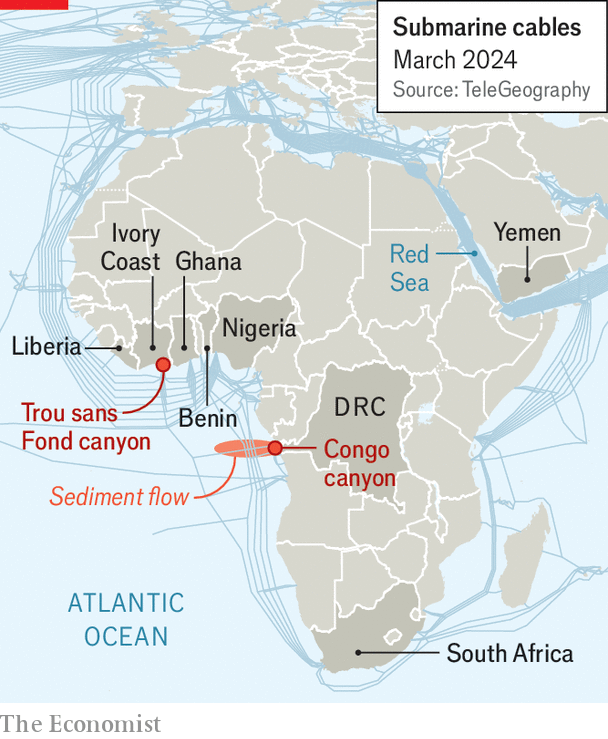

###### Africa unplugged

# Damage to undersea cables is disrupting internet access across Africa 

##### The continent is wedged between two cable-hazard hotspots 

 

> Mar 21st 2024 

ACROSS LARGE parts of Africa people have been staring at blank screens and cursing their computers of late. On March 14th Ghana’s stock exchange closed an hour later than usual, after internet problems disrupted trading. Connection issues forced a Nigerian cement company to cancel an earnings call. Data connectivity in Liberia and Benin fell below 20% of ordinary levels, according to NetBlocks, a digital-research firm. In Ivory Coast it plunged to 3%. Though some traffic has been restored, Wi-Fi remains dodgy in perhaps a dozen countries. 

The reason for all the trouble is that four of the major undersea data cables serving Africa, including the West African Cable System (WACS), were badly damaged somewhere near Ivory Coast just weeks after another was severed near Yemen. MainOne, which operates one of the west African cables, says it has ruled out human causes (such as fishing) and thinks the damage was from seismic activity on the seabed. Ghana’s National Communications Authority reckons the problem will take at least five weeks to fix. 

 


Submarine cables carry 99% of the world’s intercontinental internet traffic, a flow of data as vital to economies as coal or steel once were. Yet Africa is particularly vulnerable to having these vital digital global links severed. In many other parts of the world the network has a comfortable level of redundancy. If, for instance, a cable connecting North America with Europe suffers damage, traffic can easily be rerouted among about two dozen others. African countries “have less room for error”, says Paul Brodsky of TeleGeography, an American research firm. Just five submarine cables (including one under construction) run up Africa’s west coast between South Africa and Nigeria. Three of these were knocked offline on March 14th. 

Africa also depends more heavily on its few submarine cables than might otherwise be the case. That is partly because it has fewer data centres than it needs, which means that local websites are often hosted on distant servers. There is also a dearth of cables criss-crossing the continent, so lots more traffic must be zipped around it under the ocean instead.

Africa’s precious subsea cables are also unusually vulnerable. Many of the cables along the Atlantic coastline have to pass through the Congo canyon, one of the world’s largest submarine trenches. Major floods in Congo over the past few years have sent a series of enormous underwater avalanches tumbling down the canyon. These avalanches have broken submarine cables on seven separate occasions since 2020, according to Peter Talling, a geologist at Durham University, who is leading a research project in the region. 

The most recent damage to the four cables in west Africa appears to have taken place farther north, within a different subsea trough near Ivory Coast. Though the exact cause is not clear, Mr Talling suspects it may be related to an underwater landslide in the Trou sans Fond submarine canyon, near Ivory Coast.

The Atlantic coastline, however, is not the only source of Africa’s internet woes. In late February the Houthis, a rebel group in Yemen, fired missiles at a cargo ship in the Red Sea. An anchor dropped by the ship is thought to have broken three submarine cables there. These included the Seacom cable that connects east Africa to Europe and India. This was not an immediate crisis as some of the traffic that would usually have been handled by Seacom was rerouted via WACS. That is, until WACS was itself damaged off Ivory Coast. ■

