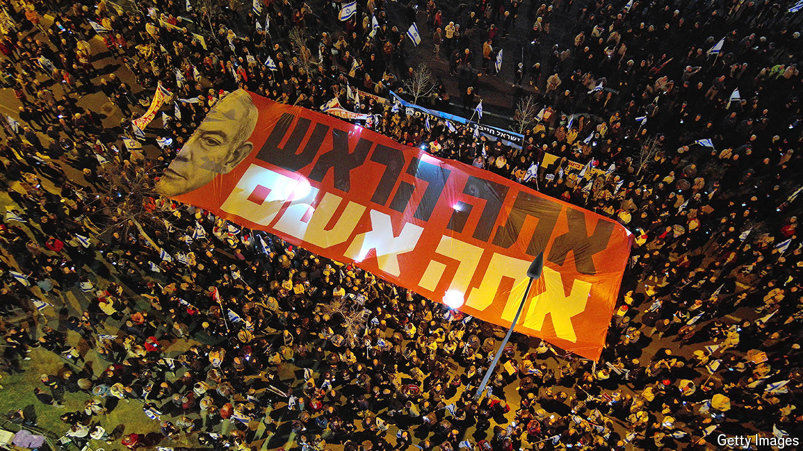

###### Israel and America

# Deposing Israel’s king 

##### America wants Binyamin Netanyahu out. But his exit is fraught with dangers 

 

> Mar 17th 2024 

After weeks of Israel flouting America’s advice on making greater provision for civilians in , on March 14th something snapped. , the Senate majority leader and one of Israel’s staunchest supporters in the Democratic Party, accused the country’s prime minister, Binyamin Netanyahu, of having “lost his way” and being “too willing to tolerate the civilian toll in Gaza, which is pushing support for Israel worldwide to historic lows”. Crucially, Mr Schumer, who is Jewish, called for early elections in Israel. Shortly after, Joe Biden endorsed this message, calling the remarks “a good speech”.

American presidents have had blazing rows with Israeli prime ministers before (see Lexington column). But it is hard to think of a time when the occupant of the Oval Office has come so close to publicly endorsing the deposing of Israel’s elected leader. On March 17th Mr Netanyahu struck back, saying Mr Schumer’s comments were “totally inappropriate” and that an election would “paralyse the country for at least six months”.


At first glance the objective of deposing Mr Netanyahu might seem straightforward. According to one recent survey, over 70% of Israelis want elections brought forward from their scheduled date in late 2026. Rivals to Mr Netanyahu, including Benny Gantz, a member of his war cabinet, are on active manoeuvres, notably by talking directly to America’s government.

But the mechanics of a change of leadership in Israel are fraught. In the most likely scenario they open up the danger of a three-month transitional period when Mr Netanyahu would still be in charge and even less constrained by coalition partners and pragmatic members of the current war cabinet. Given that this three-month window would coincide with anarchy in Gaza, a possible invasion of Rafah in southern Gaza, and perhaps also an upsurge of violence with Hizbullah in the north and with Palestinians in the West Bank, it should give pause for thought. 

There are three main ways for an Israeli government to be replaced. First, by the prime minister’s resignation. Despite having led Israel into one of its most dismal episodes, Mr Netanyahu has no intention of resigning and no inclination to call an early election either. Second, the Knesset, or parliament, can replace the prime minister through a “constructive” no-confidence motion. It would not be enough for a majority of Knesset members to vote against the prime minister; they would also have to vote in favour of his replacement. At the last election, in November 2022, the bloc of parties now supporting Mr Netanyahu won 64 seats in the 120-member chamber. There may be five potential rebels who would vote to depose Mr Netanyahu but the chance that they, along with the entire opposition, would coalesce around an agreed candidate is nil.

The most likely option is that a number of defectors from the coalition join the opposition in a vote to dissolve the Knesset and hold early elections. The catch is that Mr Netanyahu would still be a caretaker prime minister for perhaps three more months, the shortest time the law allows for an election campaign. 

With that in mind, what is likely to happen next? One threat to Mr Netanyahu, paradoxically, comes from the more extreme elements of his coalition. Ultra-Orthodox parties are a pillar of his government and are anxious to perpetuate the exemption from conscription for students of religious seminaries, which is under threat. Unless the Knesset can come up with legislation, unlikely at a time of war, the students will be liable for the draft and their government funding will be cut off by a court order. Their representatives may well then leave the coalition. Meanwhile, Mr Netanyahu’s far-right nationalist partners have warned that a hostage-release deal which included a long truce with Hamas in Gaza, or a scenario in which Israel handed control of parts of Gaza to a security force aligned with the Palestinian Authority (pa), would cross “red lines” for them.

The other threat comes from the centrists, who insist on prioritising the hostages’ release. Along with the security establishment, they favour more provision for civilians in Gaza and exploring PA participation there. Mr Gantz and his small party, National Unity, rushed to join an emergency government under Mr Netanyahu immediately after the Hamas attack on October 7th that triggered the war in Gaza. Now he is openly flouting Mr Netanyahu’s authority. He recently flew to Washington and London for high-level meetings, against Mr Netanyahu’s express wishes. Yoav Gallant, the defence minister and a member of the centre-right Likud Party (which Mr Netanyahu leads), has recently convened meetings of the security chiefs to formulate an independent position on a possible truce and hostage deal in Gaza. 

The risks for both men—and for Israel—are high. Mr Gantz, according to most polls, would, after an election, be the leader of the largest party in the Knesset and in a position to form a new governing coalition. Yet if he pushed for an early election, he and his colleagues would almost certainly be fired by Mr Netanyahu. Were the prime minister able to evict his powerful centrist rivals, including Mr Gantz, from the government just before any Knesset vote, the result could be a cabinet entirely dominated by Mr Netanyahu backed by right-wing parties. In other words, before any redeeming change of government Israel could take a temporary lurch even further to the hard right.

During one of Israel’s biggest crises since the country’s creation, three months of exclusive rule by a hard-right government without Mr Gantz and other pragmatists would be alarming. In the worst case it could lead to an even more reckless approach to aid reaching Gaza; further clampdowns in the West Bank; escalation on the northern front with Hizbullah and a full-throttle invasion of Rafah with another round of civilian deaths. That might break Israel’s relationship with America and strain the country’s constitution if members of the more centrist security establishment refused to co-operate.

As a result, the opposition to Mr Netanyahu is divided over the best timing for a strike against him; and since the Knesset’s winter session is set to end on April 7th, no serious movement on the matter can be expected until it reconvenes in late May. “This is the most awful government Israel has ever had,” says a senior member of Mr Gantz’s party. “But it would be even worse if we left now.” ■

