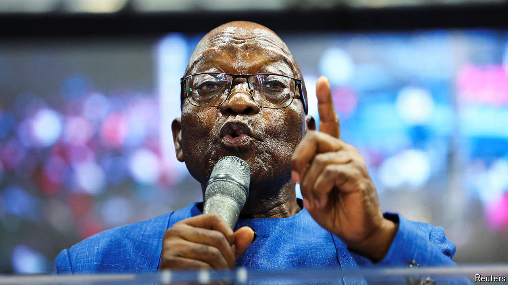
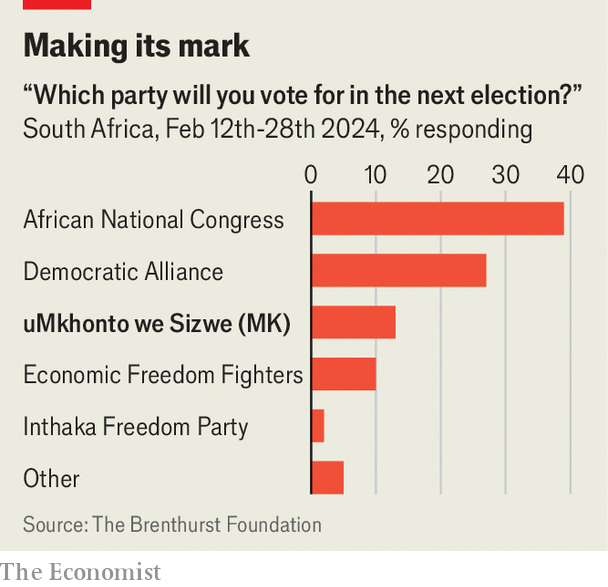

###### Game on

# Jacob Zuma’s new party could swing South Africa’s election 

##### If it stays on the ballot it will make a coalition government much more likely 

 

> Mar 21st 2024 

Jacob Zuma once said that the African National Congress (ANC) would rule South Africa “until Jesus comes back”. But it is the second coming of the former president that could have a pivotal impact on the country’s election on May 29th. Should it survive a legal challenge to keep it off the ballot, his new party, uMkhonto we Sizwe (mk), will help make the vote the most consequential since the end of apartheid.

By taking away support from the ANC it would probably ensure the ruling party needs a coalition to stay in power. Cyril Ramaphosa, South Africa’s president, may be faced with a crucial choice for himself and the country. Does he try to build a coalition of pragmatists? Or does he turn to ex-ANC figures, like Mr Zuma, and take South Africa in an even more populist and anti-Western direction? 

 At the end of apartheid in 1994, the ANC won power after promising voters “a better life for all”, a slogan it has again trotted out ahead of the poll in May. The ANC’s electoral peak came in 2004, when it won 69.7% of the national vote under Thabo Mbeki as president. Since then its share of the vote has fallen in every general election; in 2019 it won 57.5%.

But until a month or so ago many analysts expected the ANC to still win around 50% of the national vote. For all its faults, voters give it credit for its role in fighting apartheid and for building a welfare state, albeit a minimal one. Over the years the party has had to deal with more offshoots than an arborist, but most have fared poorly. The only exception is the Economic Freedom Fighters (EFF), a hard-left outfit founded by Julius Malema that generally polls at around 10-12%. 

Then came the . In September the MK party was registered, to little fanfare. That changed in December when Mr Zuma (pictured) announced he would campaign for it, rather than the ANC. The move was the culmination of six years of plotting against Mr Ramaphosa, who replaced Mr Zuma as president in 2018, having defeated his predecessor’s ex-wife for the leadership of the party. In 2021, after Mr Zuma was sent to prison for contempt of court, his supporters encouraged the worst riots since apartheid. 

The new party is a vehicle for Mr Zuma’s grievances. But it can pull on two powerful strands of public sentiment. The first is the idea that the ANC has lost its way and must regain its “revolutionary” purpose—a notion also promoted by the EFF. MK takes its name (meaning “spear of the nation”) from the armed wing of the ANC during apartheid. It calls itself a “true liberation movement”. Yet, as an extensive judge-led commission of inquiry into “state capture” during Mr Zuma’s presidency found, the only thing that was liberated in that period was public funds. Mr Zuma has denied any wrongdoing.

The second is ethno-nationalism. Zulus are South Africa’s largest ethnic group. Many retain an affiliation with traditional institutions, such as the Zulu monarchy and its political allies, the Inkatha Freedom Party (IFP). But under Mr Zuma, who lives like a chief in a homestead in the province of KwaZulu-Natal, the ANC won hundreds of thousands of Zulu supporters. His conservative views appeal to those who feel that modern South Africa has eroded traditional culture. In campaign stops for MK he has questioned liberal tenets such as gay marriage: “Who made the law that a man can date another man? Who will women be left with?” 

His allies in the party have threatened violence should the ANC win a case, brought on March 19th before an electoral court, in which it claims that MK did not follow the rules in registering with the electoral commission. (The court said it would give its verdict at an unspecified date.) “If they stop MK, there will be anarchy in this country,” said a senior member of the party. “There will be riots like you have never seen.”

 


The ANC’s court case is a sign of its concern. In a poll last month the Social Research Foundation, a think-tank, found that MK could win more than 20% of the vote in KwaZulu-Natal. That might give it about 5% nationally. Two other polls since then have recorded support for MK at over 10% of the national vote (see chart) which would drag the ANC down to around 40%.

South Africa has a complex formula to work out who takes up the 400 seats in its national assembly. But the key feature of its proportional-representation system is that there is no pre-set minimum threshold; parties can win a seat with a fraction of 1% of the vote. This is an incentive for political entrepreneurs to set up small parties. Until MK came along, the ANC assumed that if it won just under 50% it could get the majority it needed in parliament by giving out a few junior ministerial jobs. 

That approach is much harder if it gets around 40%. To stay in power Mr Ramaphosa may need to do a deal with at least one of the larger parties: the Democratic Alliance, the liberal official opposition that polls at around 20-25%; the IFP; EFF or even MK. Some in his party want to “bring home” the EFF and MK, which both want Soviet-style economic policies, such as land expropriation without compensation, and admire Vladimir Putin. Mr Ramaphosa’s supporters suggest he would prefer a government of national unity, which could be an echo of the one Nelson Mandela formed in 1994. Three decades on from the end of apartheid, the government could once again look like a political version of a South African  (“barbecue”), where everyone is invited. ■

