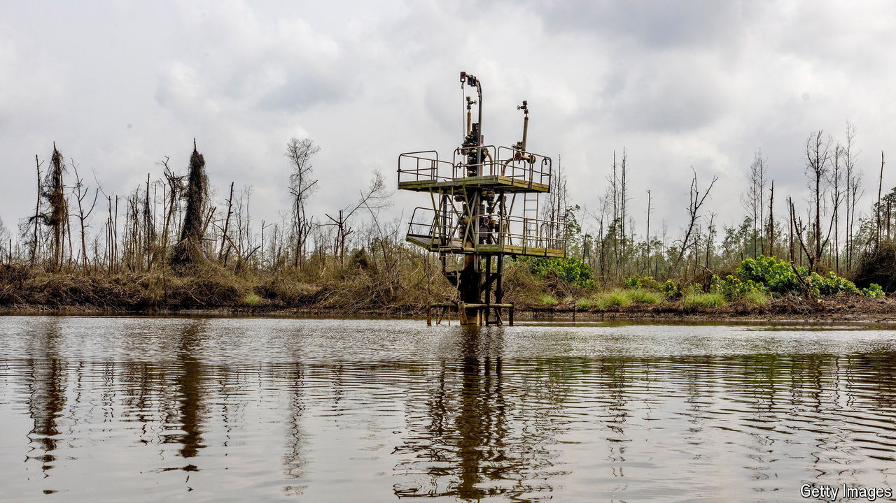

###### When the wells run dry

# Nigeria’s high-cost oil industry is in decline 

##### That will leave a gaping hole in exports and public finances 

 

> Mar 21st 2024 

A chief economist at Shell once described Nigeria as the “jewel in the crown” of the oil major’s empire. Yet in recent years the jewel has lost its lustre. Early this year Shell, which has been pumping oil in Nigeria for nearly seven decades, agreed to sell its onshore subsidiary to a consortium of mostly local companies.

Other oil firms are packing up too. In February TotalEnergies, a French group, said it also planned to offload its own stake in Shell’s Nigerian subsidiary. It joined a long list of firms, including Chevron, ExxonMobil, Eni and Equinor that have shed Nigerian assets in the past couple of years (Exxon’s deal is yet to receive regulatory approval). If Shell’s divestment is finalised, domestic companies will own more oil licences than foreign groups for the first time in Nigeria’s history.

This wave of divestments is giving rise to anxiety in Nigeria that its most vital industry is in terminal decline. For decades Nigeria has been Africa’s biggest oil exporter. Yet production has slumped by nearly 50% from its peak in 2005 because of insecurity onshore and higher costs offshore. It will face further troubles when the green transition reduces global demand for oil. Despite efforts to diversify Nigeria’s economy, oil still accounts for over 80% of exports and roughly 50% of the government budget. What happens if, in the coming decades, that crutch is removed? 

The oil majors say such talk is overblown, and stress that they are not abandoning Nigeria as a whole. Most are pulling out only from the Niger Delta, the southern swamplands that harbour most of Nigeria’s onshore and shallow-water oil rigs. For years the Delta has been plagued by kidnappers, thieves, saboteurs and collapsing infrastructure. Operating there, the majors argue, is simply not worth the risk. Most of Nigeria’s oil production has moved offshore in recent years, where the majors still have large operations. Shell and Total could soon add to their existing investments there. Chevron took a stake in a new deepwater project in January.

In theory, getting a barrel of Nigerian oil out of the ground should cost about $15 on average, according to Rystad Energy, a consultancy. But that is not the case. Insecurity in the Delta has driven up costs and pushed investment into offshore waters, where production costs are higher. As a result, it costs $25-40 to pump a barrel of oil in Nigeria. That will make it hard to keep up with producers such as Saudi Arabia, where costs are below $5 a barrel, when .

The pace of Nigeria’s decline will depend partly on how rapidly the world moves away from oil. If it does so quickly with the aim of limiting global warming to 1.9°C, Nigeria’s oil production could fall by a further 70% by 2040, reckons Pranav Joshi, an analyst at Rystad.

The prospect of such a massive shock makes adaptation essential. Nigeria is trying to expand other areas of its economy, like farming and manufacturing, which struggled to compete with cheap imports during the many years when Nigeria’s currency was buoyed up by oil revenues. But this sort of diversification will probably take time. In the shorter term, some think Nigeria can pivot from oil to natural gas, which accounts for just 10% of Nigeria’s exports. Not only does the country have Africa’s largest reserves of gas, global demand for the fuel is booming. 

Much of the gas that is traded internationally is transported as liquefied natural gas (LNG), global demand for which is likely to rise by 50% by 2040, Shell reckons. Bumping up Nigeria’s exports would require a big expansion of the facilities needed to cool and liquefy gas. Nigeria LNG—a joint venture between Shell, Total, Eni and the Nigerian government—is expanding its capacity by one-third to around 41.3bn cubic metres a year, or the equivalent of about 8% of internationally traded LNG last year. That sounds impressive, but the facility is working at less than half its existing capacity and LNG exports have plunged by 35% since 2020 because of supply disruptions and Nigeria’s habit of flaring (or burning) vast quantities of gas that is a by-product of oil extraction.

In the longer run Nigeria will also have to grapple with the environmental damage wrought by the oil industry. The Niger Delta is among the most polluted places on Earth and is littered with derelict pipelines and abandoned wellheads. Much needs to be done if Nigeria is to avoid becoming a fossil-fuel mausoleum. ■

