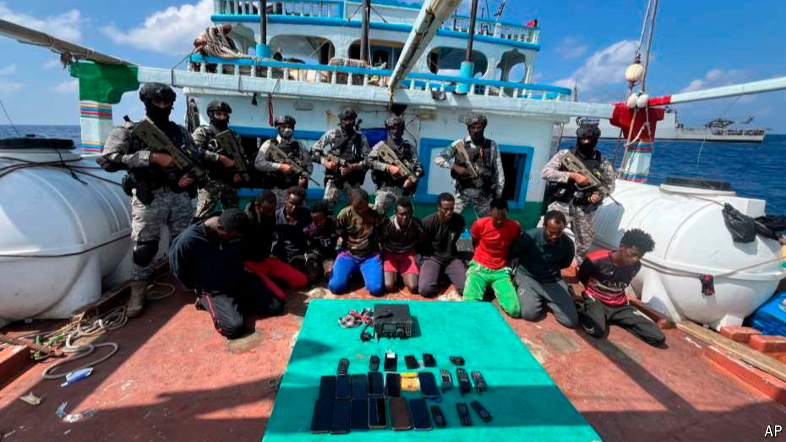
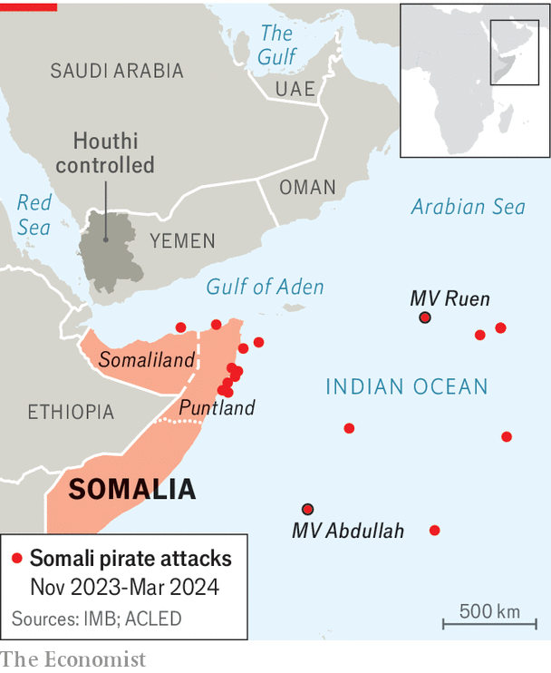

###### Trouble on the high seas

# Somali pirates are staging a comeback 

##### But attacks are still far from their peak 

 

> Mar 21st 2024 

Even as Houthi forces in Yemen continue to target ships in the Red Sea and Gulf of Aden, another threat is again emerging in the Indian Ocean. Somali pirates are back in action. On March 12th around 20 armed men hijacked the , a Bangladesh-flagged vessel carrying coal from Mozambique to the United Arab Emirates (UAE), while it was sailing more than 1,000km east of Somalia. Its crew of 23 is still being held hostage.

The incident was the latest in a string of attacks that are unsettling mariners plying the seas around the Horn of Africa. Many recall the situation just over a decade ago, when the waters around Somalia were the most dangerous in the world. It also coincides with the crisis in the Red Sea, a short chug around the Horn of Africa, which is taking the attention of Western navies. “Somali pirates are trying to make hay while the sun shines,” says Cyrus Mody of the International Maritime Bureau, a non-profit group that monitors piracy. 

 


The EU’s naval force in the Horn of Africa, which has been fighting piracy since 2008, has recorded a “notable surge” of pirate activity since November. That includes three attacks on merchant ships and the hijacking of up to 18 dhows, smaller boats that can be used as floating bases from which to stage assaults on bigger ships. The Indian Ocean Commission, a grouping of five island states, and Safe Seas, a research network registered in Denmark, have warned that pirates “might no longer be successfully suppressed”. 

Until a few months ago, the threat of Somali piracy seemed to have been crushed by armed guards, naval patrols, and prison sentences for captured pirates. In 2022 the UN Security Council let lapse a resolution allowing international anti-piracy operations in Somalia’s territorial waters. Later that year six shipping-industry bodies said they would no longer designate the seas off the Somali coast a high-risk area. An attack on the Maltese-flagged   last December was the first successful hijacking of a merchant vessel by Somali pirates since 2017, according to Ambrey, a British maritime-security firm. 

Although Western navies have been distracted by the Houthis, some of the slack is being taken up by India, which has at least a dozen warships in the region (the EU operation has two). Its navy is “making a statement” that it can respond to crises and provide security in the western Indian Ocean, says Abhijit Singh, a former naval officer now at the Observer Research Foundation, a think-tank in New Delhi. In January Indian commandos thwarted an attempted hijacking of a merchant ship. This month they stormed the , rescuing its crew after three months of captivity. 

The deeper causes of piracy lie in Somalia itself. “Piracy never stopped, it was overpowered,” says Abdinasir Yusuf of the Puntland Development and Research Centre, a think-tank in the semi-autonomous Somali state from which many of the pirates hail. He thinks that one factor behind the recent attacks was political strife before the state elections in January, which distracted local security forces. Another may be illegal fishing by foreign vessels, from Iran and other Asian countries, which is undermining the livelihoods of Somali fisherfolk and providing criminal gangs with ready recruits.

The recent attacks are barely a ripple compared with the wave of piracy that peaked in 2011, when there were 212 attempted attacks off the Somali coast and more than 1,200 seafarers were held hostage, of whom 35 died. In their heyday Somali pirates were raking in $53m of ransom payments and imposing $18bn of trade costs on the world economy every year, reckons the World Bank.

A return of piracy on that scale seems unlikely. The window of opportunity opened by the Houthis will close in time. In any case, says Mr Yusuf, most people in Puntland do not want to go back to the troubles of old. But while it lasts, the rise in attacks is giving navies and shipping companies yet another headache. Because of the Houthis, large numbers of oil tankers and cargo ships are avoiding the Suez canal and taking the long route around Africa. This has pushed up the cost of shipping containers between Asia and Europe by almost 300% since October. With pirates now attacking far out in the Indian Ocean, shipping companies will need to give Somalia a wide berth, too. ■

