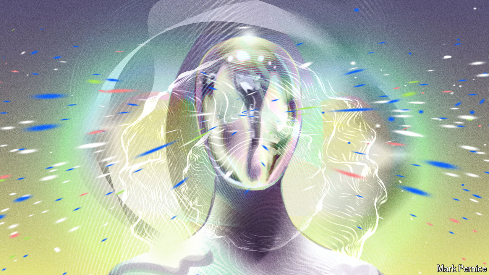

###### AI got rhythm

# A new generation of music-making algorithms is here 

##### Their most useful application may lie in helping human composers 

 

> Mar 21st 2024 

IN THE dystopia of George Orwell’s novel “1984”, Big Brother numbs the masses with the help of a “versificator”, a machine designed to automatically generate the lyrics to popular tunes, thereby ridding society of human creativity. Today, numerous artificial-intelligence (AI) models churn out, some free of charge, the music itself. Unsurprisingly, many fear a world flooded with generic and emotionally barren tunes, with human musicians edged out in the process. Yet there are brighter signs, too, that AI may well drive a boom in musical creativity.

AI music-making is nothing new. The first, so-called “rules-based”, models date to the 1950s. These were built by painstakingly translating principles of music theory into algorithmic instructions and probability tables to determine note and chord progressions. The outputs were musically sound but creatively limited. Ed Newton-Rex, an industry veteran who designed one such model for Jukedeck, a London firm he founded in 2012, describes that approach as good for the day but irrelevant now.

The clearest demonstration that times have changed came in August 2023. That is when Meta, a social-media giant, released the source code for AudioCraft, a suite of large “generative” music models built using machine learning. AI outfits worldwide promptly set about using Meta’s software to train new music generators, many with additional code folded in. One AudioCraft model, MusicGen, analysed patterns in some 400,000 recordings with a collective duration of almost 28 months to come up with 3.3bn “parameters”, or variables, that enables the algorithm to generate patterns of sounds in response to prompts. The space this creates for genuinely new AI compositions is unprecedented.

Such models are also getting easier to use. In September Stability AI, a firm based in London at which Mr Newton-Rex worked until recently, released a model, Stable Audio, trained on some 800,000 tracks. Users guide it by entering text and audio clips. This makes it easy to upload, say, a guitar solo and have it recomposed in jazzy piano, perhaps with a vinyl playback feel. Audio prompts are a big deal for two reasons, says Oliver Bown of Australia’s University of New South Wales. First, even skilled musicians struggle to put music into words. Second, because most musical training data are only cursorily tagged, even a large model may not understand a request for, say, a four-bar bridge in ragtime progression (the style familiar from Scott Joplin’s “The Entertainer”).

The potential, clearly, is vast. But many in the industry remain sceptical. One widespread sentiment is that AI will never produce true music. That’s because, as a musician friend recently told Yossef Adi, an engineer at Meta’s AI lab in Tel Aviv, “no one broke its heart”. That may be true, but some AI firms reckon that they have found a way to retain and reproduce the “unique musical fingerprint” of their musician users, as LifeScore, a company founded near London, puts it. LifeScore’s AI limits itself to recomposing the elements of a user’s original recordings in ways that maintain the music’s feel, rather than turning them into something radically new.

It takes about a day to plug into LifeScore’s model the dozens of individually recorded vocal and instrumental microphone tracks, or stems, that go into producing an original song. Once that’s done, however, the software, developed at a cost of some $10m, can rework each stem into a new tempo, key or genre within a couple of seconds. The song’s artists, present during the process, choose which remixes to keep. Manually remixing a hit track has traditionally taken one or more highly paid specialists weeks.

LifeScore, says Tom Gruber, a co-founder, is “literally swamped with requests” from clients including Sony Music, Universal Music Group and Warner Music Group. An original release is typically turned into anywhere from a handful to a dozen remixes. But one client aims to release a dizzying 6,000 or so AI versions of an original track, each targeting a different market. Artists including Pink Floyd’s David Gilmour and Tom Gaebel, a German pop singer, use LifeScore’s AI to power websites that allow fans to generate, with a few clicks, new remixes adapted to personal tastes.

The beat of a different drum

If this seems like dizzying progress, it’s worth noting that AI’s impact on music is still in its early days. Legal uncertainties over the use of copyrighted recordings to train models have slowed development. Outfits that have coughed up for licensing fees note that this can get expensive. To save on that cost, MusicGen’s training set mostly sidestepped hits, says Dr Adi. Though output is pretty good, he adds, the model is not yet “artistic enough” to generate narratively complete songs. Harmonic misalignments are common. OpenAI, a San Francisco firm, for its part, says its MuseNet model struggles to pull off “odd pairings”, such as a Chopin style that incorporates bass and drums.

In time, bigger training sets of better music will largely overcome such shortcomings, developers reckon. A Stability AI spokesperson says that while Stable Audio’s top duration for coherently structured music—“intro, development and outro”—is now about 90 seconds, upgrades will produce longer pieces with “full musicality”. But judging music AI by its ability to crank out polished tracks mostly misses the point. The technology’s greatest promise, for now at least, lies elsewhere.

Part of it is the empowerment of amateurs. AI handles technical tasks beyond many people’s capabilities and means. As a result, AI is drawing legions of newbies into music-making. This is a boon for experimentation by what Simon Cross, head of products at Native Instruments, a firm based in Berlin, calls “bedroom producers”.

Consider RX, a Native Instruments AI “assistant” that corrects errors in things like pitch and timing. For the latter, software time-shifts notes by cutting out or inserting slivers of sound with matching timbre, a process called “dynamic time-warping”. The company’s AI also determines what mixing and mastering processes were performed on a song of a user’s choosing. It then replicates, or at least approximates, the same expensive processing on the user’s own creations. Boomy, an online “music automation” platform for what Alex Mitchell, its ceo, describes as “low-friction” song production with text prompts, has more than 2m users. The company, based in Berkeley, California, uploads users’ (vetted) creations to streaming services and collects a cut of revenues.

AI serves professionals, too. The soundtracks to “Barbie” and “Oppenheimer” were cleaned up in post-production with RX, for example. Another application area is “style transfer”, in which models transform music recorded with one instrument into sounds that seem to come from a different one, often with a twist or two requested by the user. Style transfers are also used for voice. A model developed by a startup in London called Voice-Swap slices up sounds sung by (remunerated) professional singers and rearranges the slivers into lyrics written by the service’s users, who pay licensing fees for the rights to sell the resulting tracks. And AI tools already exist to recreate singers’ voices in other languages. Vocaloid, a voice-synthesising tool from Yamaha, a Japanese instrument manufacturer, is one of many that can use a translation sung by a native speaker as a template for an AI to imitate as it rearranges, modifies and stitches together tiny snippets of the original singer’s voice.

Accomplished musicians now widely tap MusicGen and its competitors as sources of “infinite inspirations”, the better to alight upon promising composition ideas, says Meta’s Dr Adi. Whether such inspiration pays off will, ultimately, be up to the listener to decide. ■


