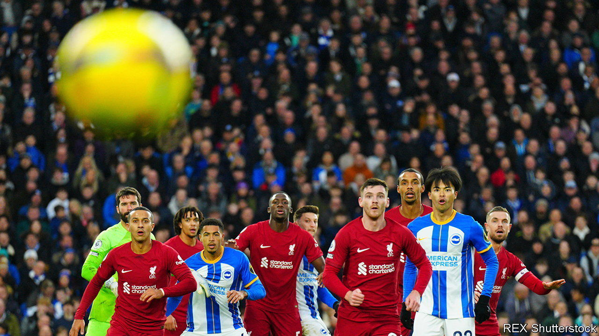

###### Back of the neural net

# AI models can improve corner-kick tactics 

##### Football coaches should pay attention 

 

> Mar 19th 2024 

TO ZHE WANG at , an artificial-intelligence (AI) company, corner kicks are like games of chess. Partly because both feature opposing sides poised to react to a single imminent move. But also, no doubt, because they too may be revolutionised by AI.

AI models . Football more than satisfies this requirement. Elite players wear vests that measure heart rate, position, speed and force exerted; team analysts watch hours of footage to tally possession percentages and numbers of passes, shots and goals. In a paper published on March 19th in , Mr Wang and his colleagues worked with staff at Liverpool Football Club to feed this data into a statistical model known as a graph neural network (GNN). They then were able to use this model to predict which on-field player would wind up making first contact with the ball with levels of accuracy similar to human experts.

Coaches around the world should be pacing in front of their dugouts in excitement at the news. During a football match’s standard 90 minutes, it is rare to encounter the same situation twice. But corner kicks, which are eminently repeatable, are the focus of hours of specialist training. And doing well in them pays off. Arsenal, sitting at the top of the Premier League when this research paper was published, have scored 13 goals from corners out of a season total of 70. Small advantages in this part of the game can make a big difference.

DeepMind’s GNN works by establishing statistical relationships between data collected from all 22 players during 7,176 corner kicks. Each corner routine was eventually represented as a vector in a 352-dimensional space: impossible for a human to visualise, but easy for a computer to process. Corners that unfolded similarly wound up close together in that space, allowing the model to make predictions about new set pieces.

The model was also capable of using this analysis to suggest new tactics. And, based on ratings given by five experts from Liverpool, AI-generated corner-kick tactics were just as good as those suggested by human coaches. In fact, shown 50 pairs of corners, one real and one with an AI-suggested improvement, 90% of the AI suggestions found favour with the majority of judges.

Mr Wang, who confesses he is “no football fan”, says that the sport offers a safe and controllable test-bed to develop helpful AI technologies that might one day be used in health care or defence. After all, football is not a matter of life and death. It is, as Bill Shankly, a former Liverpool manager, once observed, much more important than that.■


