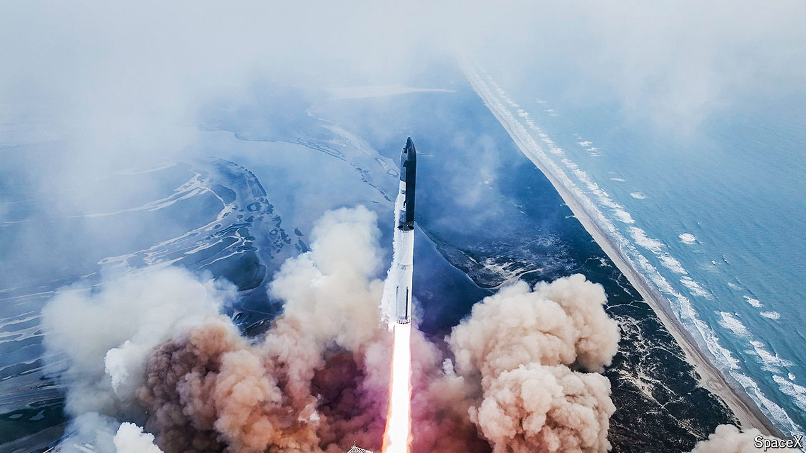

###### Third time lucky—ish

# Elon Musk’s Starship reaches orbit on its third attempt 

##### Though it failed to return to Earth, it’s a step nearer to the stars 

 

> Mar 14th 2024 

THE WORLD’s largest rocket has flown again, and its uncrewed test flight on March 14th, like the two previous ones, ended in “rapid unscheduled disassembly” (ie, catastrophic explosions). But the upper stage of Starship, built by SpaceX, Elon Musk’s rocket company, reached orbit for the first time and completed several test operations before being destroyed while re-entering Earth’s atmosphere. In , the social network formerly known as Twitter, Mr Musk insisted that “Starship will make life multiplanetary.” Perhaps. This latest flight was at least another small step in that direction. 

Starship is in fact two vehicles: the Super Heavy booster stage, a behemoth 71 metres tall with 33 engines, and the 50-metre Starship upper stage, which separates from the booster at an altitude of around 70km (44 miles) to proceed to orbit. The combined vehicle’s first test flight, in April 2023, ended roughly four minutes after lift-off, with the self-destruction of the entire spacecraft, after stage-separation failed and the rocket began to corkscrew erratically. During the second test flight, in November, the Starship upper stage successfully separated from the booster around three minutes into the flight, and continued to fly for another eight minutes, reaching an altitude of 149km. But both vehicles then suffered failures that led to their rapid unscheduled disassembly.

The third flight, once again from SpaceX’s Starbase near Boca Chica in Texas, also led to the loss of both vehicles. But this time the upper stage reached orbit, at an altitude of 230km. SpaceX’s aim is that both vehicles should eventually be fully reusable, flying back to Earth to land, as its Falcon 9 boosters already do. For these initial test flights, however, its plan has been for the Super Heavy booster to practise a “soft” splashdown at sea, slowing its descent using rocket engines before slipping beneath the waves, while the Starship swoops halfway around the Earth, re-enters the atmosphere and makes a “hard” splashdown (ie, crashes into the sea from a great height).

Yet even these more limited goals have so far proved overambitious. During the test flight in November, the Super Heavy booster exploded when it attempted to reignite its engines in preparation for splashdown. This time round, it successfully completed its “boostback burn”, which carried it to its intended splashdown point in the Gulf of Mexico. But when it reignited its engines for its landing burn, to slow its descent velocity to almost zero, something went wrong, causing the vehicle to explode a few hundred metres above the water.

The Starship, however, reached a low-Earth orbit that took it across southern Africa. While in this so-called coast phase, it carried out a series of test operations: opening and closing its payload door (Starship will ultimately be able to carry as much as 150 tonnes of payload into orbit); transferring propellant between two on-board tanks (a warm-up for future Starship-to-Starship refuelling in orbit, a requirement for missions to the Moon and Mars); and, finally, attempting a controlled re-entry. On-board cameras showed the glowing pink plasma expected of a spacecraft re-entering the atmosphere. 

But contact was lost soon afterwards, and SpaceX announced that the vehicle had disintegrated. (Whether this was because of a failure of its heat-shielding tiles, loss of control of the Starship or some other reason remains unclear.)

SpaceX has been mocked for the tendency of its test flights to end in expensive firework shows, but such criticism misunderstands the company’s approach to rocket development. It prefers to iterate quickly and learn from failure, rather than painstakingly plan for a perfect launch—which, in the rocket industry, almost never happens (as the loss of the Kairos rocket launched by Space One, a Japanese firm, on its inaugural flight on March 13th, demonstrated). And a successful maiden flight is particularly unlikely for a system as complex as Starship, the largest rocket ever built, which is intended to carry humans to other worlds. In a statement before the launch, SpaceX said that each of these flight tests continues to be just that: a test. They may not be occurring in a lab, the company added, but are about getting information nonetheless. 

This less risk-averse approach has undoubtedly enabled SpaceX to outpace its rivals in the industry; last year its Falcon 9 rockets flew more missions and launched more mass into orbit than did those of any other company or space agency. A more valid criticism of SpaceX is that it has cut corners in areas such as environmental protection. The Starbase facility is surrounded by the Lower Rio Grande Valley national wildlife refuge, which is home to an endangered species of ocelot, and the piping plover, a threatened bird species, among other things. The first Starship test flight, last April, caused extensive damage to its launching pad, scattering debris over a wide area, and prompting the Federal Aviation Authority, which regulates rocket launches, to conduct a safety review. SpaceX has since upgraded its launching pad with a “flame deflector” system that sprays water beneath the rocket as it takes off, to reduce noise, heat and damage. But environmentalists continue to worry about the impact of its activities. 

And while SpaceX may be making rapid progress by spacefaring standards, Starship development is taking longer than expected. The work is partly funded by NASA, America’s space agency, and is critical to its plans to return humans to the Moon later this decade. A lunar landing by astronauts in a Starship vehicle, as part of the Artemis programme, once planned for 2025, has been delayed to 2026. And even that looks a stretch given that Starship has yet to fly successfully, let alone with humans on board. 

Mr Musk has said that he hopes Starship will make “at least six more flights this year”. That is just about plausible, even allowing for his infamous over-confidence. But Mr Musk also says that before Starship carries astronauts, he wants it to have completed “hundreds” of uncrewed launches, carrying additional satellites for its Starlink network, which provides high-speed internet access, into orbit. Starship can launch these satellites in larger batches than the Falcon 9, which has a smaller cargo capacity. The paradox of SpaceX’s approach to rocket development is that it is both faster than any of its competitors, and also slower than NASA needs. But whatever its speed of travel, SpaceX has just taken its next step towards the stars. ■


